# ENAS
Here is an introduction of the paper: [Efficient Neural Architecture Search via Parameter Sharing](https://arxiv.org/pdf/1802.03268.pdf), accepted by ICML 2018.

## 1. Architecture Search Space
### 1.1 Entire Structure Model
Below is an example of entire convolutional network with 4 computational nodes. On the left is a directed acyclic graph (DAG) to describe the connection relationship between these nodes, red arrows denote the active computational paths. On the right is the complete network,  dotted arrows denote skip connections.

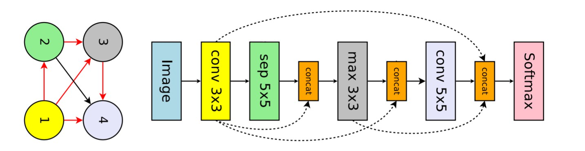

The 6 available computation operations are: 1) convolutions with kernel size 3x3 and 5x5, 2) depthwise separable convolutions with kernel size 3x3 and 5x5, and 3) max pooling and average pooling of kernel size 3x3.

Suppose there are $L$ nodes in a network, then the possible structures of the network are $6^L \times 2^{L(L-1)/2}$.

However, there are some disadvantages to this type of architecture. The search space is usually very large, which requires a lot of time and computing resources to find the best architecture. And the final generated architecture is short of transferability, which means that the architecture generated on a small dataset is hard to fit on a larger dataset, hence we can only regenerate a new deeper model on the larger dataset.

### 1.2 Cell-based Structure Model
Here are two types of convolutional cells: 1) cells return a feature map of the same dimension, called **Normal Cell**, and 2) cells return a feature map whose height and width are reduced by a factor of two, by making the initial operation applied to the cell's inputs have a stride of two, called **Reduction Cell**.

Below is an example cell-based convolutional network with 4 nodes (2 blocks). Node 1 and 2 are treated as the cell’s inputs, which are the outputs of two previous cells in the final network. Therefore, only node 3 and 4 need to be predicted, which are the blocks of the cell.

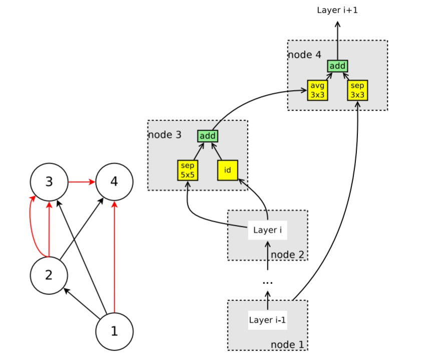

The prediction for each node consists of 5 steps:  
**Step 1.** Select a hidden state from the outputs of previous nodes.  
**Step 2.** Select a second hidden state from the outputs of previous nodes.  
**Step 3.** Select an operation to apply to the hidden state selected in Step 1.  
**Step 4.** Select an operation to apply to the hidden state selected in Step 2.  
**Step 5.** Element-wise add up the outputs of Step 3 and 4 to create a new hidden state.

The 5 available operations are: 1) identity, 2) depthwise separable convolutions with kernel size 3x3 and 5x5, and 3) max pooling and average pooling with kernel size 3x3.

Suppose there are $L$ nodes ($L-2$ blocks) in a cell, then the possible structures of the cell are $[(L-2+1)! \times 5^{(L-2)}]^2$.

The hidden states not connected by other nodes are concatenated together to be the cell's output. All the cells can then be stacked in series as below:

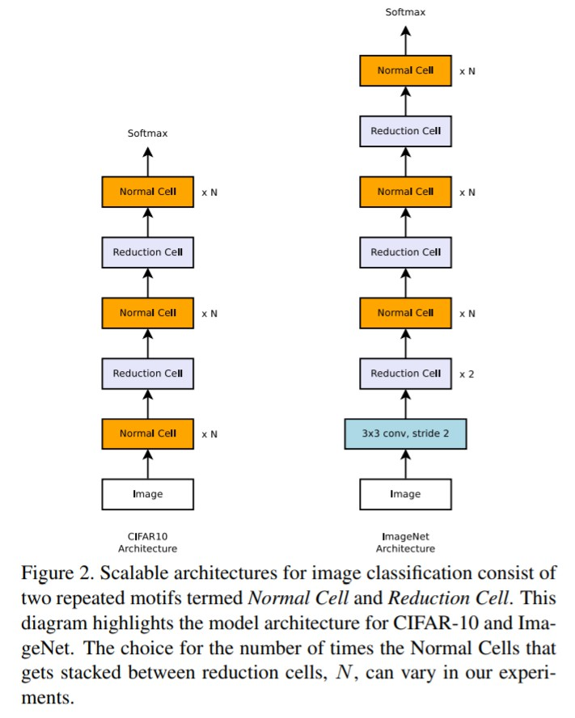

### 1.3 Depthwise Separable Convolution
In neural networks, we commonly use something called a depthwise separable convolution. This will perform a spatial convolution while keeping the channels separate and then follow with a depthwise convolution. In my opinion, it can be best understood with an example.  

Let’s say we have a 3x3 convolutional layer on 16 input channels and 32 output channels. What happens in detail is that every of the 16 channels is traversed by 32 3x3 kernels resulting in 512 (16x32) feature maps. Next, we merge 1 feature map out of every input channel by adding them up. Since we can do that 32 times, we get the 32 output channels we wanted.  

For a depthwise separable convolution on the same example, we traverse the 16 channels with 1 3x3 kernel each, giving us 16 feature maps. Now, before merging anything, we traverse these 16 feature maps with 32 1x1 convolutions each and only then start to them add together. This results in 656 (16x3x3 + 16x32x1x1) parameters opposed to the 4608 (16x32x3x3) parameters from above.

## 2. Architecture Search Method
They both use reinforcement learning method, below is the overview.

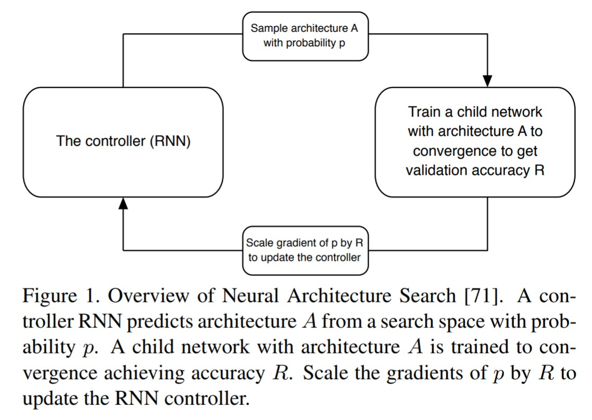

The controller architecture and prediction process for each node are shown below.

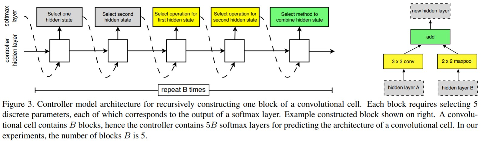

As for the training progress, there are two sets of learnable parameters: 1) the parameters of the controller LSTM, $\theta$, and 2) the parameters of the child models, $w$. **The first phase** trains $w$, we fix the controller's policy and perform stochastic gradient descent (SGD) on $w$ to minimize the expected loss function (cross-entropy loss). **The second phase** trains $\theta$, we fix $w$ and update the policy parameters $\theta$ to maximize the expected reward. The reward is computed on the validation set, and the reward function is the accuracy on a minibatch of validation images. These two phases alternated during the training progress.

---

*Ref.*   
*1. [Learning Transferable Architectures for Scalable Image Recognition, CVPR2018. (NASNet)](https://arxiv.org/pdf/1707.07012.pdf)*  
*2. [An Introduction to different Types of Convolutions in Deep Learning.](https://towardsdatascience.com/types-of-convolutions-in-deep-learning-717013397f4d)*


# DARTS
Here is an introduction of the paper: [DARTS: DIFFERENTIABLE ARCHITECTURE SEARCH](https://arxiv.org/pdf/1806.09055.pdf), accepted by ICLR 2019.

## 1. Search Space
DARTS uses normal and reduction cells as the model structure. Different with ENAS, the output of each cell is the concatenate of all the intermediate nodes' outputs, and the inputs of each intermediate node are from **different predecessors**, as shown below:

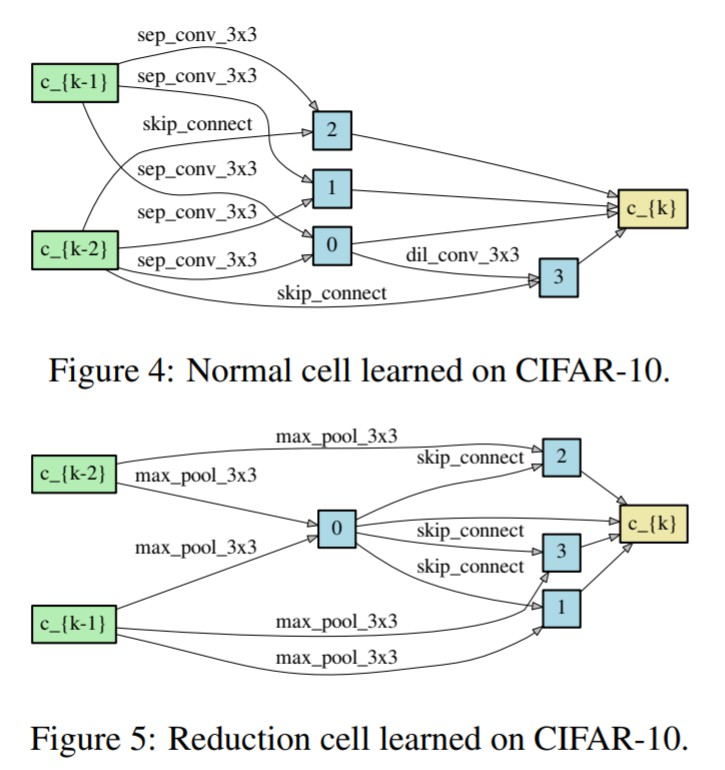

## 2. Continuous Relaxation
Any two nodes in a cell have an edge between each other in the training process. On each edge, DARTS places a mixture of candidate operations. It uses softmax values out of a set of continuous variables $\alpha$ to represent the path weights and all the candidate operation weights on each path. For each node in the final architecture cell, only the paths with top 2 largest weights and the operation with the largest weight on each path are selected. Below is an overview:

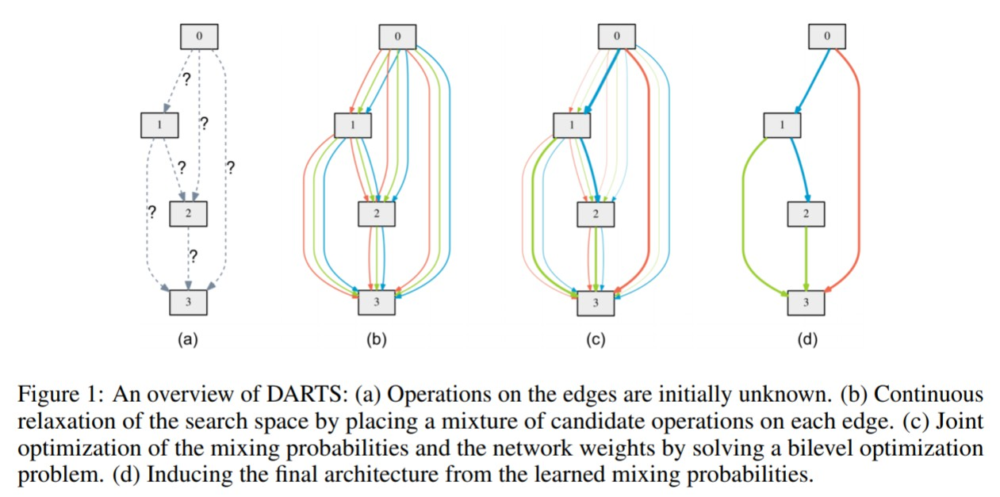

The output of a node is the sum of all its edge outputs, each edge output is the weighted sum of the features obtained by applying all candidate operations to the previous output.

## 3. Optimization
The goal for optimization is to jointly learn the architecture $\alpha$, and the weights $w$. This implies a bilevel optimization problem, which can be expressed as:

$$
\min _{\alpha}  {L_{val}(w^{*}(\alpha), \alpha)} \\
\qquad \qquad \qquad \ \text{ s. t. } w^{*}(\alpha)=\operatorname{argmin}_w L_{train}(w, \alpha)
$$

The iterative optimization procedure is outlined as below:

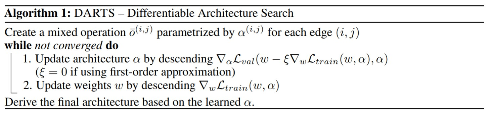

### Approximate Architecture Gradient
Let $w^{\prime} = w-\xi \nabla_{w} L_{train}(w, \alpha)$, then

$$
\begin{array}{cl}
&\nabla_{\alpha}L_{val}(w-\xi \nabla_{w}L_{train}(w, \alpha), \alpha) \\ \\
&=\nabla_{\alpha}L_{val}(w^{\prime}, \alpha) \\ \\
& = \frac{\partial L_{val}(w^{\prime}, \alpha)}{\partial w^{\prime}} \cdot \frac{dw^{\prime}}{d\alpha}+\frac{\partial L_{val}(w^{\prime}, \alpha)}{\partial \alpha} \cdot \frac{d\alpha}{d\alpha} \\ \\ 
&=\nabla_{w^{\prime}}L_{val}(w^{\prime}, \alpha) \cdot \frac{d(w-\xi \nabla_{w}L_{train}(w, \alpha))}{d\alpha} + \nabla_{\alpha}L_{val}(w^{\prime}, \alpha) \\ \\
&= \nabla_{\alpha}L_{val}(w^{\prime}, \alpha) - \xi \nabla_{\alpha, w}^2 L_{train}(w, \alpha) \nabla_{w^{\prime}}L_{val}(w^{\prime}, \alpha)
\end{array}
$$

The expression above contains an expensive matrix-vector product in its second term, which can be substantially reduced using the finite difference approximation. Let $\epsilon$ be a small scalar and $w^{\pm} = w \pm \epsilon \nabla_{w^{\prime}}L_{val}(w^{\prime}, \alpha)$, then:

$$
\begin{array}{cl}
&\nabla_{\alpha, w}^{2} L_{train}(w, \alpha) \nabla_{w^{\prime}} L_{val}(w^{\prime}, \alpha) \\ \\
&\approx \frac{\nabla_{\alpha} L_{train}(w^+, \alpha) - \nabla_{\alpha} L_{train}(w^-, \alpha)}{2 (w^+ - w^-)} \nabla_{w^{\prime}} L_{val}(w^{\prime}, \alpha) \\ \\
&= \frac{\nabla_{\alpha} L_{train}(w^{+}, \alpha)-\nabla_{\alpha} L_{train}(w^{-}, \alpha)}{2 \epsilon}
\end{array}
$$

Finally, the architecture $\alpha$ can be updated by:

$$
\begin{array}{cl}
\alpha &= \alpha - \xi \nabla_{\alpha}L_{val}(w-\xi \nabla_{w}L_{train}(w, \alpha), \alpha) \\ \\ 
&=\alpha - \xi  [\nabla_{\alpha}L_{val}(w^{\prime}, \alpha) - \xi \nabla_{\alpha, w}^2 L_{train}(w, \alpha) \nabla_{w^{\prime}}L_{val}(w^{\prime}, \alpha)] \\ \\ 
&\approx \alpha - \xi [\nabla_{\alpha}L_{val}(w^{\prime}, \alpha) - \xi \frac{\nabla_{\alpha} L_{train}(w^{+}, \alpha)\nabla_{\alpha} L_{train}(w^{-}, \alpha)}{2 \epsilon}]
\end{array}
$$

In the experiment, the architecture $\alpha$ is optimized by Adam, and the weights $w$ are optimized by SGD.

---

*Ref.*  
*1. [https://github.com/quark0/darts.](https://github.com/quark0/darts)*


# FBNet
Here is an introduction of the paper: [FBNet: Hardware-Aware Efficient ConvNet Design](https://arxiv.org/pdf/1812.03443.pdf), accepted by CVPR 2019.

## 1. Search Space
A fixed layer-wise macro-architecture is constructed first, and FBNet only searches for the structure of each layer. The candidate layer structures are based on the block structures in MobileNetV2, which contains a point-wise (1x1) convolution, a K-by-K depthwise convolution where K denotes the kernel size, and another 1x1 convolution. ReLU function follows the first 1x1 convolution and the depthwise convolution, but not follows the last 1x1 convolution. **If the output dimension (width, height and depth) stays the same as the input dimension, a skip connection will be used to add the input to the output.** Details of the macro-architecure and the block structure are shown below:

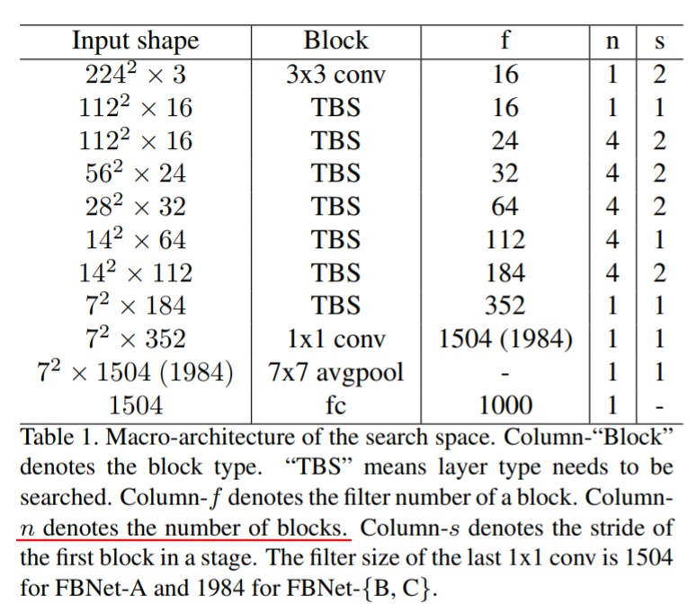

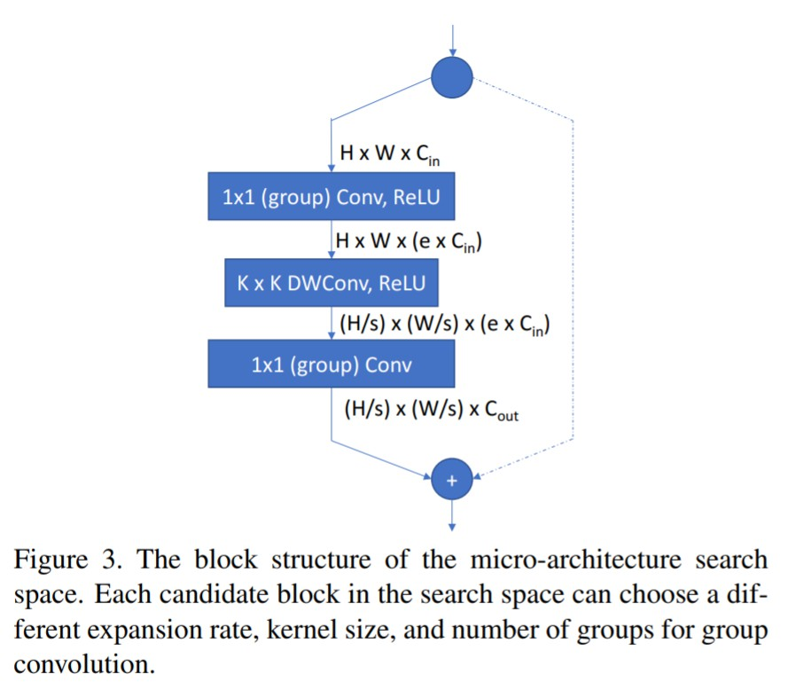

The search parameters of a block are: expansion ration $e$, kernel size for depthwise convolution $K$, and number of groups for 1x1 convolutions. All the candidate types of blocks are shown below:

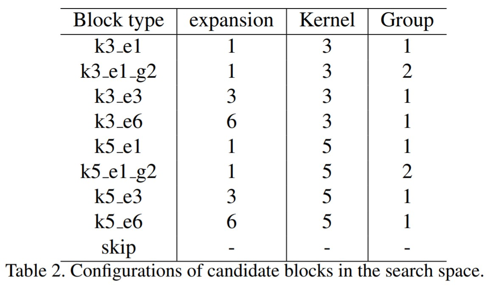

## 2. Latency-Aware Loss Function
To reduce the latency on target hardware, FBNet defines the following loss function:

$$
L(w_{\theta}, \theta) = CE(w_{\theta}, \theta) \cdot \alpha log(LAT(\theta))^{\beta}
$$

where $CE(w_{\theta}, \theta)$ denotes the cross-entropy loss of operator weights $w_{\theta}$ with architecture probability parameter $\theta$. The value of constant $LAT(\theta)$ is found in a latency lookup table, which is obtained by estimating the overall latency of a network based on the runtime of each operator on a given hardware.

## 3. Search Algorithm
The gradient-based search algorithm of DARTS exists a problem: due to the pervasive non-linearity in neural operations, it introduces untractable bias to the loss function, which causes inconsistency between the performance of derived child networks and converged parent networks. Therefore, FBNet approximately samples one type of architecture for each training epoch, rather than equally training all candidate architectures at the same time.

During the training of the super net, only one candidate block is sampled for each layer, and is executed with the sampling probability of:

$$
P_{\boldsymbol{\theta_l}}(b_l = b_{l, i}) = \operatorname{softmax}(\theta_{l, i}; \boldsymbol{\theta_l}) = \frac{exp(\theta_{l, i})}{\sum_i exp(\theta_{l, i})}
$$

And the output of layer-$l$ can be expressed as:

$$
x_{l+1} = \sum_i m_{l, i} \cdot b_{l, i}(x_l)
$$

where $m_{l, i}$ is a random variable in {0, 1} and is evaluated to 1 if block $b_{l, i}$ is sampled.

Since the sampling operation is not differentiable, FBNet uses a reparameterization trick, gumbel-max, to make this process differentiable. Then $m_{l, i}$ can be expressed by:

$$
m_{l, i} = \left\{\begin{array}{l} {1, i = \operatorname{argmax}_l(\log(p_l) + g_l)} \\ {0, \text{otherwise}}\end{array}\right.
$$

The cumulative distribution function of gumbel distribution is $F(x; \mu) = e^{-e^{-(x-\mu)}}$, and when $\mu = 0$, it is regarded as standard gumbel distribution. Therefore, $g_l$ above can be expressed by $g_l = -\log(-\log(u_i)), u_i \sim \text{Uniform}(0, 1)$, called the gumbel noise.

However, the argmax function is not differentiable, so we use softmax function to replace it. And $m_{l, i}$ can be finally formulated as:

$$m_{l, i} = \operatorname{softmax}_l(\log(p_{l, i}) + g_{l, i}) = \frac{exp[(\log(p_{l, i}) + g_{l, i}) / \tau]}{\sum_i exp[(\log(p_{l, i}) + g_{l, i}) / \tau]} = \frac{exp[(\theta_{l, i} + g_{l, i}) / \tau]}{\sum_i exp[(\theta_{l, i} + g_{l, i}) / \tau]}$$

where $\tau$ is the temperature parameter. The smaller the $\tau$ is, the more closer $m_{l, i}$ is to the one-hot vector, i.e. the discrete categorical sampling distribution. And as $\tau$ becomes larger, $m_{l, i}$ becomes a continuous random variable. In the experiment, FBNet uses a large initial temperature of 5.0 to make the model easier to converge, and then exponentially anneal it by $exp(-0.045) \approx 0.956$ every epoch.

Some of the searched architectures are shown below:

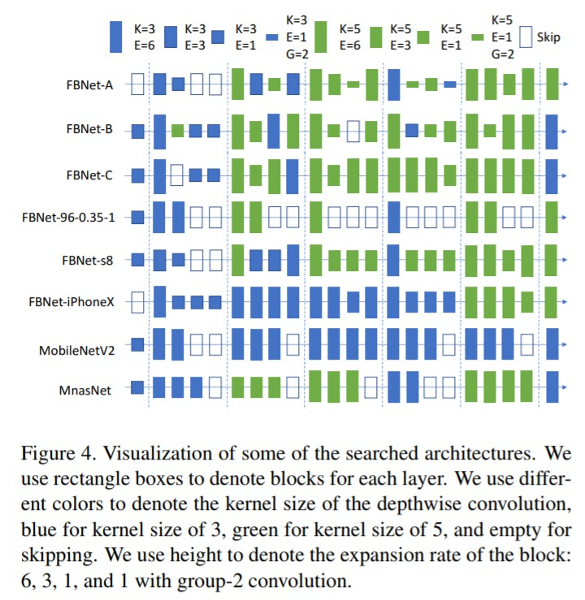

---

*Ref:*  
*1. [https://www.zhihu.com/question/62631725.](https://www.zhihu.com/question/62631725)*  
*2. [https://github.com/JunrQ/NAS/tree/master/fbnet-pytorch.](https://github.com/JunrQ/NAS/tree/master/fbnet-pytorch)*


# GENet
Here is an introduction of the paper: [Genetic CNN](https://arxiv.org/pdf/1703.01513.pdf), accepted by ICCV 2017.

## 1. Search Space
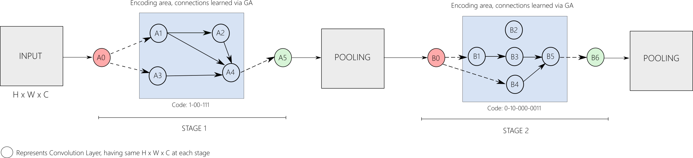

Above is the overview of GeNet's search space. The number of stages and the number of nodes in each stage are initialized first, and each node corresponds to a 5x5 convolution operation, followed by batch normalization and ReLU. Each stage consists of an input node (in red), an output node (in green), and an search area (within blue region). In the code of each search area, the first bit represents the connection between $(v_{s, 1}, v_{s, 2})$, then the following two bits represent the connection between $(v_{s, 1}, v_{s, 3})$ and $(v_{s, 2}, v_{s, 3})$, etc. 

Then, the input node will be connected to the nodes which have no predecessors, and the nodes which have no successors will be connected to the output node. If a node has more than one parent, they will be summed element-wise before feeding as input to that node, and the nodes without connections will be dropped from the graph. Moreover, the pooling layers are added to down-sample the feature at each stage. 

## 2. Search Method
The connection architecture in each search area are learned via Genetic Algorithm. The flowchart of the genetic process is shown below:

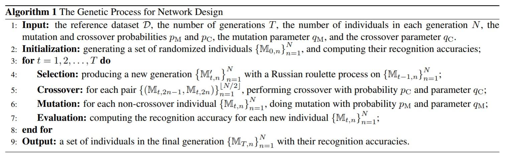

### 2.1 Selection
The selection process is performed at the beginning of every generation to determine which individuals survive, using the Russian roulette process. The sampling possibility of each individual is based on its performance (fitness), and as the number of individuals remains unchanged, each individual in the previous generation may be selected multiple times.

### 2.2 Crossover and Mutation
The crossover process involves exchanging the codes in a certain interval between two individuals with a probability, e.g., 0.4, and the mutation process of an individual involves flipping each bit independently with a little probability, e.g., 0.05.

### 2.3 Evaluation
After the above processes, each individual is first trained on the training dataset from scratch, then evaluated on the test dataset to obtain the fitness function value.

### 2.4 Example Code
```python
import numpy as np
import random


class Individual(object):
    def __init__(self, size):
        self.size = size
        self.init_inds()

    def init_inds(self, prob=0.5):
        size = self.size
        inds = []
        codes = np.random.binomial(1, prob, size)
        fits = [None] * size[0]
        for i in range(size[0]):
            inds.append([codes[i], fits[i]])
        self.inds = inds

    def update_fitness(self, fitness):
        for i, fit in enumerate(fitness):
            self.inds[i][1] = fit

    def select(self, num_sel):
        s_inds = sorted(self.inds, key=lambda inds: inds[1], reverse=True)
        sum_fits = sum([ind[1] for ind in self.inds])

        chosen = []
        for i in range(num_sel):
            u = random.random() * sum_fits
            sum_ = 0
            for code, fit in s_inds:
                sum_ += fit
                if sum_ > u:
                    chosen.append([code.copy(), fit])  # use 'copy' to divide different
                                                       # spaces for the same codes
                    break
        self.inds = chosen

    def mate(self, prob):  # crossover
        size = self.size
        for i in range(1, size[0], 2):
            if random.random() < prob:
                ind1, ind2 = self.inds[i - 1], self.inds[i]
                a, b = random.sample(range(size[1]), 2)
                if a > b: a, b = b, a
                tmp1 = ind1[0].copy()
                ind1[0][a:(b + 1)] = ind2[0][a:(b + 1)]
                ind2[0][a:(b + 1)] = tmp1[a:(b + 1)]
                ind1[1], ind2[1] = [None] * 2

    def mutate(self, mut_prob, flip_prob):
        size = self.size
        for i in range(size[0]):
            if random.random() < mut_prob:
                ind = self.inds[i]
                for j in range(size[1]):
                    if random.random() < flip_prob:
                        ind[0][j] = not ind[0][j]
                ind[1] = None


NUM_POP = 4
NUM_GEN = 3
NUM_NODES = [3, 5]
NUM_PATHS = sum([sum([i for i in range(num_node)]) for num_node in NUM_NODES])

population = Individual((NUM_POP, NUM_PATHS))
model = Model(population)
model.train()
population.update_fitness(model.eval())
for i in range(NUM_GEN):
    population.select(NUM_POP)
    population.mate(0.4)
    population.mutate(0.8, 0.05)
    model.update(population)
    model.train()
    population.update_fitness(model.eval())

```
---

*Ref:*  
*1. [https://github.com/aqibsaeed/Genetic-CNN.](https://github.com/aqibsaeed/Genetic-CNN)*  
*2. [https://github.com/DEAP.](https://github.com/DEAP/)*  


# PNAS
Here is an introduction of the paper: [Progressive Neural Architecture Search](https://arxiv.org/pdf/1712.00559.pdf), accepted by ECCV 2018.

## 1. Search Space
The structure space is the same as the cell-based structure in ENAS, and the operator space contains 8 candidates:  
- depthwise-separable convolution with size 3x3, 5x5, 7x7
- 3x3 dilated convolution
- 1x7 followed by 7x1 convolution  
- 3x3 average pooling; 3x3 max pooling
- identity

## 2. Search Method
PNAS uses a sequential model-based optimization (SMBO) strategy, in which it searches for structures in order of increasing complexity, while simultaneously learning a surrogate model  to guide the search through structure space. 

The overall process of the progressive search is shown below:

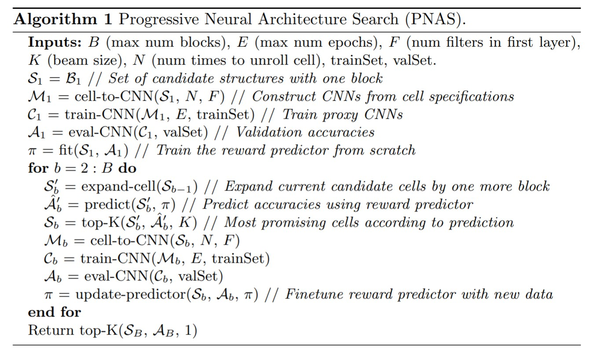

The cell structures are searched in a progressive order, from the number of blocks $b = 1$ in each cell to a sufficient number $B$. In particular, when $b = 1$ in the beginning, all the candidate models are trained and evaluated, and the surrogate model is then trained with the evaluation rewards. Next, in each epoch from $b = 2$ to $B$, PNAS first expands all the cells in each current candidate model by one more block, then it uses the trained surrogate model to predict the performance of all the new candidate models, sorts the models by their performance, and selects the $K$ most promising ones to further training and evaluation. After that, the evaluation rewards of the selected models are used to finetune the surrogate model, and repeat the process. 

Since the length of input strings increases with the increase of $b$, PNAS uses an LSTM to be the surrogate model. The LSTM reads a sequence of length $4b$ (representing $input_1$, $input_2$, $op_1$, $op_2$ for each block), which is a one-hot vector containing a shared embedding for inputs, and another shared embedding for operations. The LSTM hidden state **at the final timestep** goes through a fully-connected layer and sigmoid to regress the validation accuracy. An example code of the LSTM surrogate model is shown below:

```python
class Controller(tf.keras.Model):
    
    def __init__(self, controller_cells, embedding_dim,
                 input_embedding_dim, operator_embedding_dim):
        super(Controller, self).__init__(name='EncoderRNN')

        # Layers
        self.input_embedding = tf.keras.layers.Embedding(input_embedding_dim + 1, embedding_dim)
        self.operators_embedding = tf.keras.layers.Embedding(operator_embedding_dim + 1, 
                                                             output_dim=embedding_dim)
        
        '''
        tf.keras.layers.Embedding(input_dim, output_dim)
        # The largest integer (word index) in the input should be no larger than `input_dim` 
        (vocabulary size). 
        # The shape of input is (batch_size, input_length).
        # The shape of output is (batch_size, input_length, output_dim).
        '''

        if tf.test.is_gpu_available():
            self.rnn = tf.keras.layers.CuDNNLSTM(controller_cells, return_state=True)
        else:
            self.rnn = tf.keras.layers.LSTM(controller_cells, return_state=True)
            
        self.rnn_score = tf.keras.layers.Dense(1, activation='sigmoid')

    def call(self, inputs_operators, states=None):
        inputs, operators = self._get_inputs_and_operators(inputs_operators)  # extract the data

        if states is None:  # initialize the state vectors
            states = self.rnn.get_initial_state(inputs)
            states = [tf.to_float(state) for state in states]
        
        # map the sparse inputs and operators into dense embeddings
        embed_inputs = self.input_embedding(inputs)
        embed_ops = self.operators_embedding(operators)
        
        # concatenate the embeddings
        embed = tf.concat([embed_inputs, embed_ops], axis=-1)  # concatenate the embeddings
        
        # run over the LSTM
        out = self.rnn(embed, initial_state=states)
        out, h, c = out  # unpack the outputs and states
        
        # get the predicted validation accuracy
        score = self.rnn_score(out)

        return [score, [h, c]]

    def _get_inputs_and_operators(self, inputs_operators):
        inputs = inputs_operators[:, 0::2]  # even place data
        operators = inputs_operators[:, 1::2]  # odd place data

        return inputs, operators
```

---

*Ref.*  
*1. [https://github.com/titu1994/progressive-neural-architecture-search.](https://github.com/titu1994/progressive-neural-architecture-search)*  
*2. [https://www.tensorflow.org/versions/r2.0/api_docs/python/tf/keras/layers/Embedding.](https://www.tensorflow.org/versions/r2.0/api_docs/python/tf/keras/layers/Embedding)*


# SPOS
Here is an introduction of the paper: [Single Path One-Shot Neural Architecture Search with Uniform Sampling](https://arXiv.org/pdf/1904.00420.pdf), accepted by ICLR 2020.

## 1. Search Space
### 1.1 Building Blocks
The supernet architecture is similar with FBNet, shown as below:

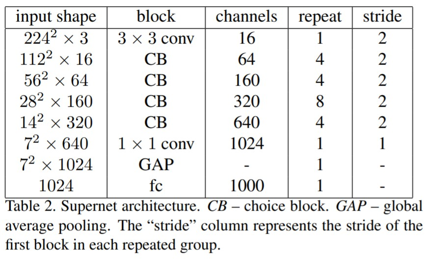

The design of each choice block is inspired by ShuffleNet v2, containing 4 candidates as shown below:

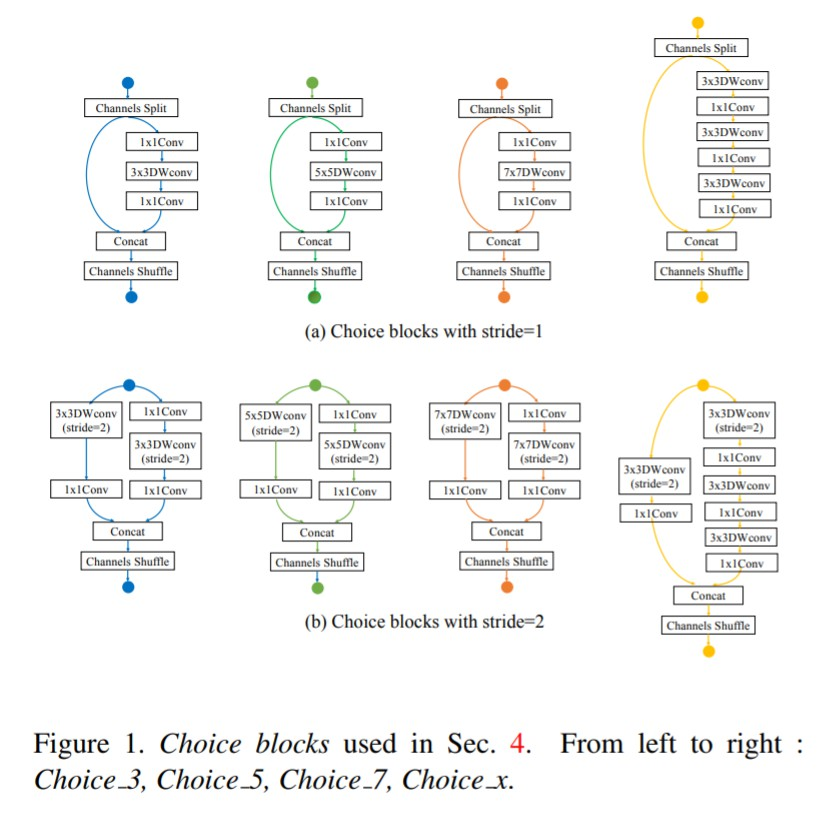

### 1.2 Channels
Convolutional kernels with weights of dimension (max_c_out, max_c_in, ksize) are preallocated. For each choice block in the supernet training, the number of output channels $c_{out}$ is randomly sampled first, then the weights are sliced out with the form $Weights[:c_{out}, :c_{in}, :]$. The optimal number of channels is determined in the evolutionary step. The process is shown below:

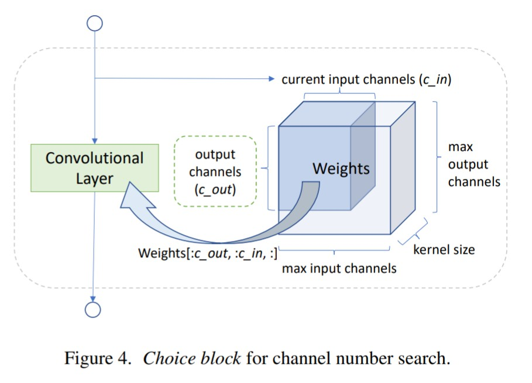

And the structures of searched architectures are shown as follows:

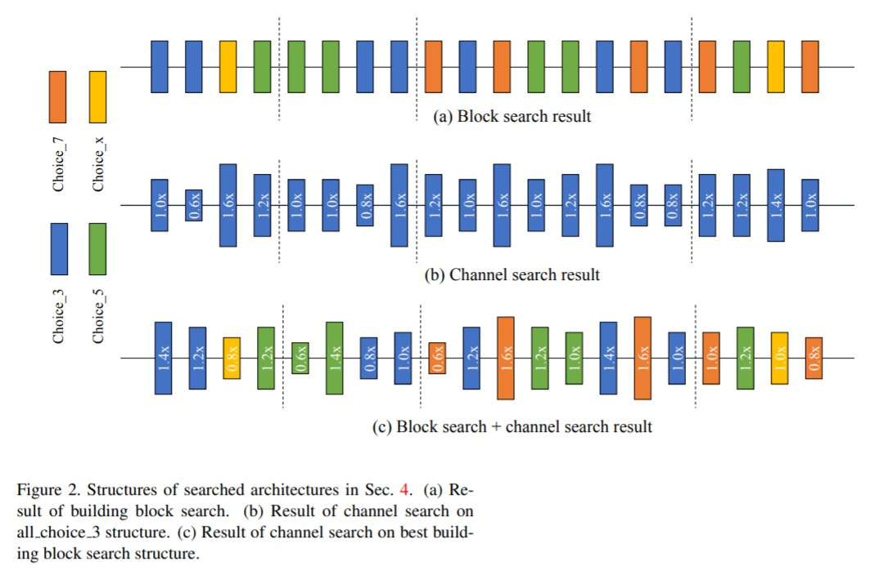

## 2. Search Method
Different with the search method of DARTS, which jointly optimizes the supernet weights and architecture weights, SPOS makes the supernet training and architecture search decoupled. The weights of the supernet are trained to convergence first, then the optimal architecture parameters are searched by evolutionary algorithm without training.

For each training step, the architecture parameters are uniformly sampled, and the trained supernet has a single-path architecture, i.e. only one candidate choice block is activated for each layer. The weights of current choice blocks can be shared by later training steps.

For the architecture search, SPOS uses an evolutionary algorithm rather than random search to make the search more effective. The process is described as below:

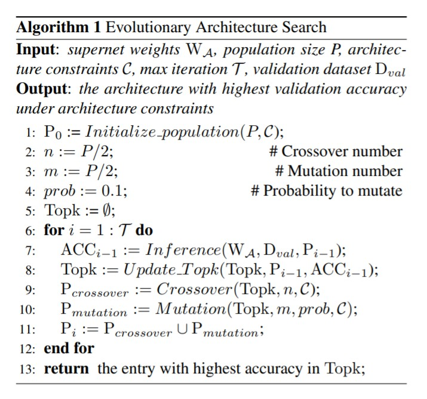

During the evolutionary search, each sampled architecture inherits its weights directly from the trained supernet weights, since all the choice blocks in each supernet layer have been trained. Thus the evaluation of $ACC$ only requires inference without finetuning or retraining. 

Finally, the model with the highest accuracy architecture is retrained and evaluated to get its final performance.

---

*Ref.*  
*1. [https://zhuanlan.zhihu.com/p/72736786.](https://zhuanlan.zhihu.com/p/72736786)*  


# NAO
Here is an introduction of the paper: [Neural Architecture Optimization](https://arxiv.org/pdf/1808.07233.pdf), accepted by NIPS 2018. 

## 1. Search Space 
The structure space of NAO is the same as ENAS, and the operation space contains 5 candidates: identity, 3x3 separable convolution, 5x5 separable convolution, 3x3 average pooling, 3x3 max pooling.

## 2. Search Method
NAO first trains a architecture generator, which contains a seq2seq attention model and an MLP (Multi-Layer Perception) as the performance predictor, and then generates new architectures optimized from input architectures in the inference time. 

### 2.1 Seq2Seq Attention Model
The seq2seq model contains an encoder and a decoder, both of which are LSTM models. The input and the output are both sequences. To increase the accuracy, an attention mechanism is added between the encoder and decoder.

#### LSTM
The overall structure of LSTM is shown below:

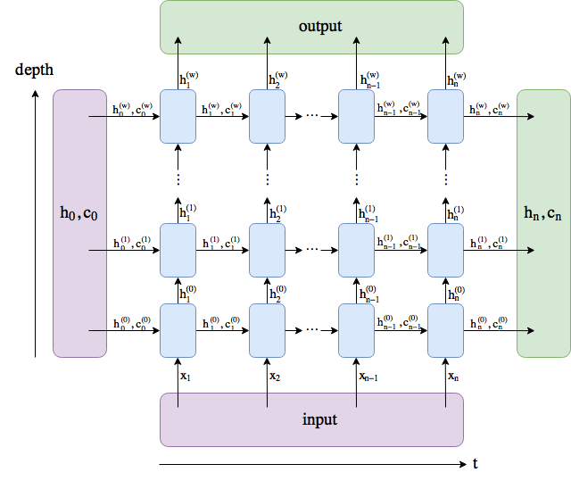

Each blue rectangle above represents an LSTM cell, with details as follows:


#### Seq2Seq Model
Below is an overview of seq2seq model:

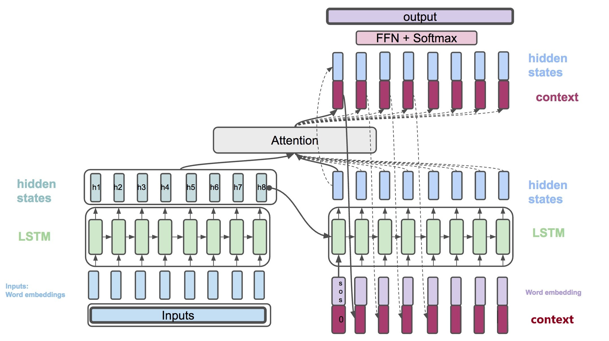

The left and right LSTM are encoder and decoder respectively. First, the mean hidden state of all the encoder timesteps is treated as the input hidden state of the decoder. Then the decoder predicts the classification scores of its input symbol at each timestep one by one, using the hidden state of each symbol embedding. The symbol with the maximum score at a timestep is considered as the input for the next decoder timestep.

#### Attention Mechanism
To increase the recovery accuracy, an attention mechanism is added before the decoder. At each decoder timestep, the current hidden state is sent to the attention mechanism along with the encoder hidden states of all timesteps. Then the output attention feature is combined with current decoder hidden state to perform the classification. The attention mechanism is used to enhance the relationship between the current decoder hidden state and each of the encoder hidden state at different timesteps.

Below is an overview of the attention algorithms:

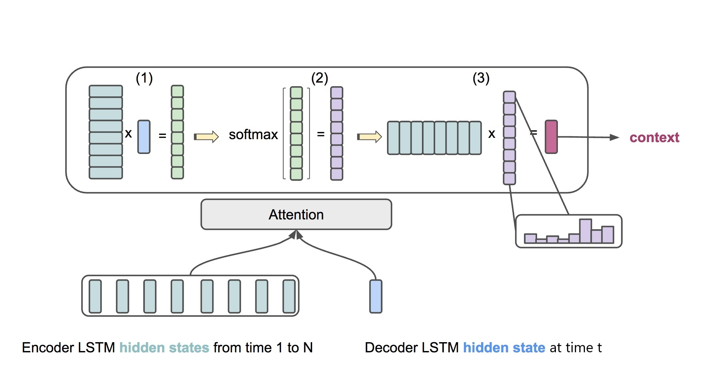

To illustrate the attention algorithms, we show an example pytorch code as below:

```python
class Attention(nn.Module):
    def __init__(self, input_dim, source_dim, output_dim, bias=False):
        super(Attention, self).__init__()
        '''
        Args:
            input_dim: Dim of the decoder hidden states.
            source_dim: Dim of the encoder hidden states.
            output_dim: Dim of the output attention features.
        '''
        self.input_dim = input_dim
        self.source_dim = source_dim
        self.output_dim = output_dim
        self.input_proj = nn.Linear(input_dim, source_dim, bias=bias)
        self.output_proj = nn.Linear(input_dim + source_dim, output_dim, bias=bias)
    
    def forward(self, input, source_hids):
        '''
        Args:
            input: The decoder hidden state at current timestep.
            source_hids: The encoder hidden states of all timesteps.
        '''
        batch_size = input.size(0)
        source_len = source_hids.size(1)

        # (batch, tgt_len, input_dim) -> (batch, tgt_len, source_dim)
        x = self.input_proj(input)

        # (batch, tgt_len, source_dim) * (batch, src_len, source_dim) -> (batch, tgt_len, src_len)
        attn = torch.bmm(x, source_hids.transpose(1, 2))

        attn = F.softmax(attn.view(-1, source_len), dim=1).view(batch_size, -1, source_len)
        
        # (batch, tgt_len, src_len) * (batch, src_len, source_dim) -> (batch, tgt_len, source_dim)
        mix = torch.bmm(attn, source_hids)
        
        # concat -> (batch, tgt_len, source_dim + input_dim)
        combined = torch.cat((mix, input), dim=2)
        # output -> (batch, tgt_len, output_dim)
        output = torch.tanh(self.output_proj(combined.view(-1, self.input_dim + self.source_dim))).view(batch_size, -1, self.output_dim)
        
        return output, attn
```

### 2.2 Training
At each training epoch, the models under multiple randomly sampled architectures are first trained for many child epochs. The sampled architectures and their performance on the val dataset are treated as the input and target respectively to train the encoder and MLP, using the MSE loss. Then the encoder hidden states are fed into the decoder, aiming to generate the same sequence as the sampled architectures. The loss function to train the decoder is the cross entropy loss, calculated between the classification scores and the one-hot target vector at each decoder timestep. The encoder, MLP, and decoder are trained simultaneously and optimized to convergence, the final loss is the weighted sum of the MSE loss and cross entropy loss.

### 2.3 Inference
At the end of each training epoch, NAO uses the top-k old trained architectures with the best performance to generate better architectures. After we get their encoder hidden states and the performance scores predicted by MLP, we perform gradient ascends on the hidden states as follow:

$$
h^{\prime}_t = h_t + \eta \frac{\partial f}{\partial h_t}, \ h^{\prime} = \{ h^{\prime}_1, ..., h^{\prime}_T\}
$$

where $\eta$ is the step size, and $f$ is a linear function that maps from the depth of encoder hidden states to 1 followed by a sigmoid function in MLP. Then the optimized hidden states are sent into the decoder to recover the optimized architectures. These new architectures can be part of the input for the next training step.

---

*Ref.*  
*1. [https://www.jianshu.com/p/043083d114d4.](https://www.jianshu.com/p/043083d114d4)*  
*2. [http://colah.github.io/posts/2015-08-Understanding-LSTMs.](http://colah.github.io/posts/2015-08-Understanding-LSTMs/)*  
*3. [https://zhuanlan.zhihu.com/p/40920384.](https://zhuanlan.zhihu.com/p/40920384)*  
*4. [https://github.com/renqianluo/NAO.](https://github.com/renqianluo/NAO)*
