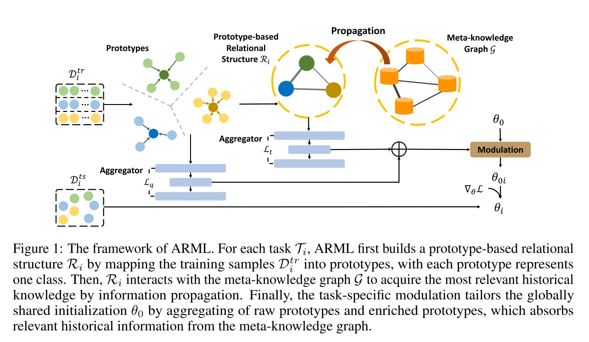
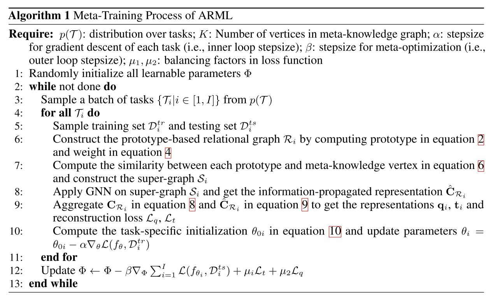
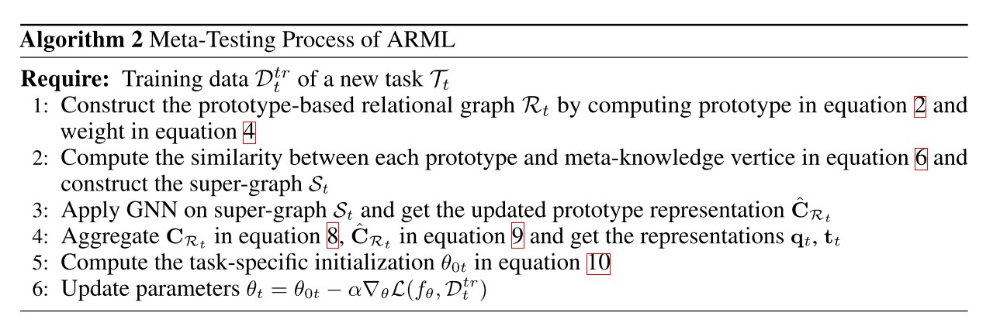

# Automated Relational Meta-learning

## 1. 总览

## 2. 基于Prototype的关系结构(Prototype-based Relational Structure)
作者用不同类别的prototype构建一个prototype关系图，图上不同顶点设置为不同类别的prototype，不同边设置为相邻prototype之间的相似度。这里采用各个类别的prototype而非各个原始采样点构建图，其目的在于减少异常采样点的影响。对于分类问题，其第$i$个任务第$k$类的prototype为：

$$
c_i^k = \frac{1}{N_k^{tr}} \sum_{j = 1}^{N_k^{tr}} \mathcal{E}(x_j)
$$

其中$N_k^{tr}$是训练集中第$k$类的样本总数，$\mathcal{E}$是嵌入函数，将样本点$x_j$进行隐藏空间映射，可以将同类别的样本点在空间中拉近，不同类别的拉远。而对于回归问题，无法直接根据类别信息构建图，作者采用了一个对齐矩阵$P_i \in \mathbb{R}^{K \times N^{tr}}$将不同样本点映射为$K$个类别，其prototype为：

$$
\begin{array}{cl}
&c_i^k = P_i[k]\mathcal{F}(X) \\\\
&P_i = \text{Softmax}(W_p \mathcal{E}^\top(X) + b_p)
\end{array}
$$

其中$P_i[k]$指$P_i$的第$k$行。两个prototype $c_i^j$和$c_i^m$之间的边权$A_{\mathcal{R}_i}(c_i^j, c_i^m)$由它们的相似度决定，用如下公式表示：

$$
A_{\mathcal{R}_i}(c_i^j, c_i^m) = \sigma(W_r (|c_i^j - c_i^m| / \gamma_r) + b_r)
$$

其中$\sigma$为Sigmoid函数。

综上，基于prototype的关系图可表示为$\mathcal{R}\_i = (C\_{\mathcal{R}\_i}, A\_{\mathcal{R}\_i})$，其中$C\_{\mathcal{R}\_i} = \\{c_i^j | \forall j \in [1, K] \\} \in \mathbb{R}^{K \times d}$指图顶点集合，$A\_{\mathcal{R}\_i} = \\{A\_{\mathcal{R}\_i}(c_i^j, c_i^m) | \forall j, m \in [1, K] \\} \in \mathbb{R}^{K \times K}$指prototype之间的相似度邻接矩阵。

## 3. 元知识图(Meta-knowledge Graph)与超级图
元知识图的各个顶点表示训练时的各个任务，顶点特征随机初始化，并在训练时不断学习；顶点特征$h^j$和$h^m$之间的相似度$A_{\mathcal{G}}(h^j, h^m)$可表示为：

$$
A_{\mathcal{G}}(h^j, h^m) = \sigma(W_o(|h^j - h^m| / \gamma_o) + b_o)
$$

之后作者将prototype关系图与元知识图组合成一个超级图，对于每个任务$\mathcal{T}_i$，将prototype关系图$\mathcal{R}\_i$和整个元知识图$\mathcal{G}$相连，得到一个超级图$\mathcal{S}\_i$。在组合时，两个图原始的边按原样保留，接着通过计算当前任务的prototype关系图中各个顶点特征与整个元知识图中各个顶点特征的相似度，将两个图的顶点一一连接起来。具体地，对于prototype $c_i^j$，其与元知识图顶点特征$h^k$的连接权重$A\_{\mathcal{S}}(c_i^j, h^k)$可表示为：

$$
A_{\mathcal{S}}(c_i^j, h^k) = \frac{\text{exp}(-|| (c_i^j - h^k) / \gamma_s ||_2^2 / 2)}{\sum\_{k' = 1}^K \text{exp}(-|| (c_i^j - h^{k'}) / \gamma_s ||_2^2 / 2)}
$$

这样，对于任务$\mathcal{T}\_i$的超级图$\mathcal{S}\_i = (A_i, H_i)$可定义为$A_i = (A\_{\mathcal{R}\_i}, A\_{\mathcal{S}}; A\_{\mathcal{S}}^\top, A\_{\mathcal{G}}) \in \mathbb{R}^{(K + G) \times (K + G)}$，$H_i = (C\_{\mathcal{R}\_i}; H\_{\mathcal{G}}) \in \mathbb{R}^{(K + G) \times d}$

在构建好超级图后，作者通过图神经网络将元知识图中最相关的知识传递给prototype关系图中，第$l + 1$层的GNN特征为：

$$
H_i^{(l +1)} = \text{MP}(A_i, H_i^{(l)}; W^{(l)})
$$

其中$\text{MP}$为信息传递函数(message passing function)。

## 4. 任务感知型元学习器(Task-Specific Meta-Learner)
作者引入了两个自编码器重建模块来学习更好的任务特征，分别对原始prototype特征$C_{\mathcal{R}\_i}$和与元知识图知识融合后的prototype特征$\hat{C}\_{\mathcal{R}\_i}$进行重建，编码器为$\text{AG}^q(\cdot)$，解码器为$\text{AG}\_{dec}^q(\cdot)$。以$C\_{\mathcal{R}_i}$为例，其任务特征$q_i$和重建损失$L_q$为：

$$
\begin{array}{cl}
&q_i = \frac{1}{N^{tr}} \sum_{j = 1}^{N^{tr}}(\text{AG}^q(c_i^j)) \\\\
&L_q = || C_{\mathcal{R}_i} - \text{AG}_{dec}^q(\text{AG}^q(C_{\mathcal{R}_i})) ||_F^2
\end{array}
$$

同理可得$\hat{C}_{\mathcal{R}_i}$的任务特征$t_i$和重建损失$L_t$。则元学习器在任务$\mathcal{T}\_i$下的初始参数$\theta\_{0i}$可由全局共享初始参数$\theta_0$表示为：

$$
\theta_{0i} = \sigma(W_g (t_i \oplus q_i) + b_g) \circ \theta_0
$$

对于每个任务$\mathcal{T}\_i$，作者从$\theta\_{0i}$开始进行梯度下降，直至达到其最优参数。模型整体的训练损失函数为：

$$
\begin{array}{cl}
\min_\Phi L_{all} &= \min_\Phi L + \mu_1 L_t + \mu_2 L_q \\\\
&=\min_\Phi \sum_{i = 1}^I L(f_{\theta_{0i} - \alpha \bigtriangledown_\theta L(f_\theta, \mathcal{D}_i^{tr})}, \mathcal{D}_i^{ts}) + \mu_1 L_t + \mu_2 L_q
\end{array}
$$

元学习器的训练和测试的伪代码如下：

