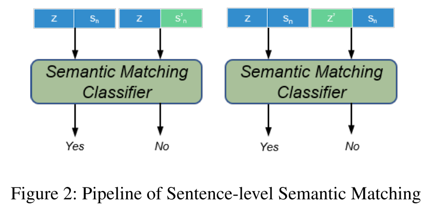

## Paragraph-level Neural Question Generation with Maxout Pointer and Gated Self-attention Networks (EMNLP 2018)

(1) 输入为word embedding ($e_t$) 和answer tagging ($m_t$, 表示当前词是否在答案里) 的组合；送入BiLSTM得到$u_t$；对$u$计算self matching representation得到$s$；送入gated self-attention得到$\hat{u}$；用LSTM with Luong attention解码，得到attention score $r_t$和attentive decoder state $\hat{d}_t$；

(2) 提出一个maxout pointer方法，把原始pointer network里每个词的得分为重复词attention score总和改为最大值，限制输出句子词重复的现象。

---

## Answer-focused and Position-aware Neural Question Generation (EMNLP 2018)

(1) 输入包含word embedding，lexical features (named entity和part-of-speech)，和answer position feature (BIO标记方法)；

(2) 为了让问题中的疑问词类型与答案相似，作者额外建立一个问题词表，通过 (answer embedding, decoder state和context vector) 预测各问题词概率，之后通过 (input word embedding, decoder stage和context vector) 计算$p_{copy}, p_{genv}, p_{genq}$的权重比例，单词总体预测分布为该3个分布的加权和；

(3) 为了让问题中的源输入语句复制词尽量靠近答案，作者将relative word position embeddings加入到原始attention的计算公式中，计算出position-aware attention distribution和position-aware context vector，用来生成新的$p_{copy}$和$p_{genv}$。

---

## Improving Question Generation With to the Point Context (EMNLP 2019)

(1) Relation是用OpenIE提取出的句子中结构化的与答案相关的关系，为n-ary形式，例子如下：

之后作者把每个relation拼接成一个句子送入relation encoder；

(2) decoder中sentence和relation的context vector $c_t^s, c_t^m$通过Luong attention得到，之后二者通过一个gating mechanism得到新的context vector $c_t$，通过当前decoder state $u_t$和$c_t$拼接变换生成新的decoder state $\tilde{h}_t$并据此产生vocabulary distribution；

(3) 通过pointing method (各词attention score之和) 先计算sentence和relation中各词的预测概率$P_S(w), P_M(w)$，之后通过sigmoid和线性变换计算两个gate $g_t^v, g_t^c$，据此将3个预测分布线性相加，即：$P(w) = (1 - g_t^v) P_V(w) + g_t^v g_t^c P_S(w) + g_t^v (1-g_t^c) P_M(w)$。

---

## Let's Ask Again: Refine Network for Automatic Question Generation (EMNLP 2019)

(1) passage特征由word's Glove embedding，character based embedding和positional embedding (与answer span的相对位置) 组成，并通过BiLSTM编码；answer span通过另一个BiLSTM编码；之后段落编码特征与最后一位答案编码特征进行融合，得到refined passage representation；

(2) 先用preliminary decoder生成完整的问题；之后用refinement decoder生成更精细化的问题。在第二个decoder中用到了两个attention，A2是将当前decoder state与encoder输出的各个词特征进行attend操作，A3是将decoder state与第一个decoder预测的各个问题词特征进行attend操作，这两个attention模块的输出特征用于预测下一个问题词。

---

## Multi-Task Learning with Language Modeling for Question Generation (EMNLP 2019 short)

(1) 额外引入一个language modeling预测任务，先将句子用BiLSTM编码，用前向特征(->)预测下一个词，用后向特征(<-)预测上一个词；之后将前向后向特征合并得到的各词特征作为一个低层特征 (LM hidden states)，和其他特征组合送入另一个高层BiLSTM模型中得到预测结果；最终预测损失和LM预测损失联合优化。

---

## Question-type Driven Question Generation (EMNLP 2019 short)

(1) 额外引入一个question type预测任务，将数据集中疑问词根据出现频率划分为8类 (第8类为others)；将句子中的answer span的lexical feature与整个句子该处BiLSTM特征拼接后送入另一个LSTM，用最后一个step特征预测疑问词；之后将该预测疑问词特征作为decoder的初始state；

(2) 在decoder做attention时，把answer span用来预测疑问词的最后一个step特征$h_a^q$也考虑在内，得到的context vector与当前输入词拼接送入decoder预测下一词。

---

## A Multi-Agent Communication Framework for Question-Worthy Phrase Extraction and Question Generation (AAAI 2019)

(1) Local Extraction Agent先用BiLSTM将input sentence编码，之后用含2个timestep的LSTM解码，分别预测question-worthy phrase的起始和结束位置，各选取top-M个结果，起始位置和离它最近的结束位置相匹配来提取phrase；

(2) 之后进入Generation Agent，输入为input sentence和BIO tagging (指示单词是否在question-worthy phrase内)，通过BiLSTM编码后用LSTM解码，生成与question-worthy pharse相对应的M个问题；

(3) 接下来进入Massage Passing，将每个生成的问题首先送入MP Extraction Agent进行phrase extraction任务，之后送入另一个Generation Agent生成问题，该问题也可以继续送入MP Extraction Agent进行更精细的phrase extraction，如此迭代。文中作者只设定1次迭代。

具体地，对于每个送入Message Passing的问题，先用Match-LSTM提取特征，其中问题特征是premise，做self-attention之后的特征与作为hypothesis的input sentence的BiLSTM特征 (即Local Extraction Agent输出) 进行拼接，送入BiLSTM编码，再用一个含2个timestep的LSTM解码，分别生成top-1的phrase起始和终止位置。该位置对应的BIO tagging送入Genration Agent生成对应的问题。

---

## Improving Neural Question Generation using Answer Separation (AAAI2019)

(1) 为了防止生成的问题中带有答案内容，作者将passage中的答案用\<a\> mask住后用BiLSTM编码，答案也用另一个BiLSTM编码；

(2) decoder的initial state为答案最后一词的特征。在解码的每个step，作者引入一个keyword-net从答案中提取关键信息，其中keyword-net包含多层，每层中用前一层的输出向量$o_t^{l-1}$和答案的所有hidden state $h^a$计算matching score。之后normalized matching score和答案hidden state进行weighted sun得到当前层的输出向量$o_t^{l}$。keyword-net的初始层向量$o_t^0$为前一个timestep的decoder hidden state $s_{t-1}$与passage特征$h^p$进行attention后的context vector $c_t$。最后，$s_{t-1}, c_t, o_t^L$和前一个timestep的预测词$y_{t-1}$送入解码LSTM中得到当前timestep的hidden state $s_t$；

(3) 在进行单词预测时，由于传统的seq2seq模型倾向于记忆sentence pattern而非反映word meaning，作者采用了一种retrieval的方式，即从所有单词的分布式表示 (distributed representation) 中进行查询 (query)。具体地，先将$s_t, c_t$拼接后的线性变换特征$q_i$与所有单词表示$e_k$做内积得到relevance score，之后该normalized score即为各个词的生成概率。

---

## PathQG: Neural Question Generation from Facts (EMNLP 2020)

(1) 根据输入文本额外构建知识图谱，将entity和relation交替拼接后构成query path，并将其视为sequence labeling任务与question generation任务联合训练。此外，由于每个entity和relation可能包含多个词，取其average embedding作为模型输入；

(2) query path中每个成员的BiLSTM特征$h_i^s$与input text的所有BiLSTM特征进行attention操作得到加权特征$c_i$。之后将$h_i^s, c_i$拼接后送入FFN和sigmoid得到contribution weight，与原始average embedding进行相乘后得到weighted embedding，送入RSN (recurrent skipping network) 得到query representation。具体地，entity输出特征为BiLSTM特征，relation输出特征为其前后两个entity weighted embedding和自身BiLSTM特征拼接后送入FFN得到；

(3) query representation最后一个entity特征和input text最后一词特征拼接作为decoder的initial hidden state。每次解码时，decoder分别与query representation和context representation做attention操作得到加权特征$d_t^1, d_t^2$，与当前decoder state拼接后送入FFN和softmax得到单词预测，该loss记为$\mathcal{L}_1$；

(4) 作者还引入了一个posterior query learner提高模型效果，其结构和原始query representation learner类似，不同的是额外引入了目标问题文本，其编码方式和input text相同。每个query path成员的BiLSTM特征与问题BiLSTM进行attention操作后得到$q_i$，和$h_i^s, c_i$拼接后计算contribution weight。之后，最小化原始和posteror的query representation分布的KL loss，该loss记为$\mathcal{L}_2$；

(5) 为了保证query representation learner的效果，作者添加了一个contribution weight loss $\mathcal{L}_3$以最大化每个contribution weight。模型总体损失为以上3个loss的加权和。

---

## Improving Question Generation with Sentence-level Semantic Matching and Answer Position Inferring (AAAI 2020)

(1) 对于decoder initial state，作者提出一种Answer-aware Gated Fusion方法，将输入句子最后一词和答案部分第一个词的encoder特征$h_m, h_a$进行拼接，分别送入两个线性网络并计算Sigmoid值，得到二者的gate value并将二者加权求和，得到answer-aware sentence vector $z$；

(2) 对于一个相同的句子，可能会有多种答案，相应也会有多种参考问题。但基准模型在这种情况下通常只会生成一般性的问题。因此，作者额外引入了一个sentence-level semantic matching任务。对于两个三元组：\<sentence, answer1, question1\>, \<sentence, answer2, question2\>，先得到其anwer-aware sentence vector $z, z^{\prime}$和问题最后一词的解码特征$s_n, s_n^{\prime}$。之后作者将其分别以answer-question的形式拼接并送入classifier，预测该answer和question是否匹配。其中$[z, s_n]$为正样本，$[z, s_n^{\prime}], [z^{\prime}, s_n]$为负样本，该损失记为$\mathcal{L}_1$。具体如下图所示：

(3) 基准模型另一个问题是它经常从input sentence复制与答案无关的词。基于此，作者应用了BiDAF中的attention network和输出层，即分别对sentence和question做sentence-to-question attention和question-to-sentence attention，之后送入BiLSTM并预测答案的起始和终止位置，利用真实answer position做监督，该损失记为$\mathcal{L}_2$。具体如下图所示：

以上两个损失$\mathcal{L}_1, \mathcal{L}_2$和问题生成损失联合进行训练。

---

## Capturing Greater Context for Question Generation (AAAI 2020)

(1) 由于提出问题不仅依赖于段落中带答案的句子，还需要其他的句子作为背景，因此作者提出多阶段attention方法关注其他句子中重要的背景信息。在initial stage，段落特征和答案特征做attention并对列维度做max pooling和softmax，与原段落特征做点乘得到contextual representation；在iterative stage，原始段落特征与contextual representation做attention，得到enhanced contextual representation。之后该特征可以重复地与原段落特征做attention；

(2) 为了避免生成问题带有答案，作者采用了answer masking方法，将最终context representation中的答案部分mask住进行解码。

---

## EQG-RACE: Examination-Type Question Generation (AAAI 2021)

(1) 作者基于一个多选题数据集RACE构建了用于问题生成任务的EQG-RACE，其中作者把3个干扰项删除，只留下正确选项作为答案；带有填空的问题或者比较一般性的问题也被删除；

(2) 由于新构建的数据集中答案不是文章中的连续片段，因此作者设计了2种keywords tagging方法。首先是rough answer tagging，作者将passage中和answer相同的词用"A"标记；其次是key sentence tagging，作者用ROUGE找出passage中和answer中最相似的句子，将该句子中的所有词用"S"标记；如果某个词不属于以上两者，则用"O"标记；

(3) 作者额外进入GCN进行推理，图的构建包含3步，如下图所示：

第一步是对段落中的每个句子进行dependency parsing，得到每个句子的dependency parse tree；第二步是将相邻句子的dependency tree通过边界点进行连接，得到passage-level dependency parse graph；第三步是根据是否包含answer中的词移除离群dependency tree，其中最边缘的包含answer词的dependency tree记为$S_B$，其中间的tree记为$S_I$，其外部的tree记为$S_O$并被移除，得到answer-guided graph。之后将该图对应的邻接矩阵送入GCN得到GCN embedding作为输入特征的一部分；

(4) 作者还引入了BERT/ELMo的pre-training embedding作为输入特征；

(5) 作者将答案用另一个BiLSTM显式编码并与passage编码特征融合 (fusion)，即将每个passage词特征与答案特征、以及二者相乘和相加的特征拼接送入线性变换层得到answer-aware passage representation；同时，在解码时，decoder initial state为answer的编码特征以生成与答案更相关的疑问词。

---

## Entity Guided Question Generation with Contextual Structure and Sequence Information Capturing (AAAI 2021)

(1) 对于每个段落句子，作者先进行dependency parsing构建图并送入GCN得到其编码特征；同时每个句子也用一个multi-feature encoder提取特征。最终将二者特征拼接起来得到段落的最终特征；

(2) 将question-type信息引入进来对decoder进行初始化。作者首先用NER对答案进行实体识别，根据实体类型确定其疑问词，具体对应方式如下图所示：

之后将question type和answer用separator $|$ 拼接起来送入AT encoder中编码，并将question type的特征作为decoder的initial state。

