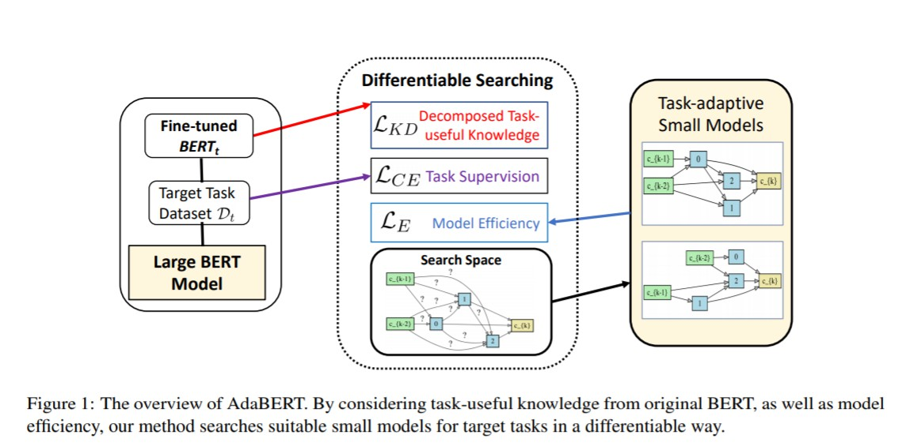
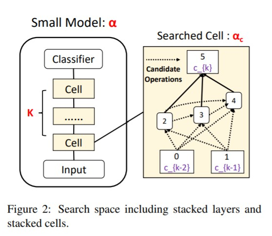

# AdaBERT: Task-Adaptive BERT Compression with Differentiable Neural Architecture Search

## 1. 搜索空间
作者从宏观(macro)和微观(micro)两个方面设计搜索空间，如下图所示：

在微观方面，作者搜索一个模型层/细胞结构并将其重复堆叠，其结构参数为$\alpha_c$；在宏观方面，作者搜索模型层堆叠次数，即整个模型的层数$K \in [1, 2, ..., K_{max}]$。整个搜索空间$\alpha$可表示为：

$$
\begin{array}{cl}
&\alpha = \{K, \alpha_c\}, K < K_{max} \\\\
&\alpha_c = [o_{0, 2}, o_{1, 2}, ..., o_{i, j}, ..., o_{N + 1, N + 2}]
\end{array}
$$

其中$o_{i, j}$表示从节点$i$到$j$的变换操作，$N$表示每个细胞内的中间节点总数。

对于第$k$层($k > 1$)的细胞结构，作者定义了两个输入节点$c_{k - 2}, c_{k - 1}$作为层间输出残差连接，以及该层细胞的输出节点$c_k$，是所有中间节点的特征之和。对于第一层的两个输入节点，其与具体任务相关，对于单句文本任务，二者均为相同的输入句子；对于文本对任务，二者分别为两个不同的输入句子，这样可以使得模型对单句文本任务可以学到自注意信息，而对句子对任务可以学到两个句子间的相互作用信息。

对于操作集合$\mathcal{O}$，其主要包括：一维标准卷积和空洞卷积，卷积核大小为{3, 5, 7}；平均池化和最大池化，卷积核大小为3；跳过(skip)和零(zero)操作，分别用来进行残差连接和舍弃操作。

## 2. 蒸馏方法
作者将每层老师模型层和学生模型层后都各自加了一个softmax分类器，通过软交叉熵损失将老师模型的知识蒸馏到学生模型中。老师模型是J层(J = 12)的BERT-base，则其共有J个softmax分类器。在蒸馏前，作者首先固定老师模型权重，将各层老师模型的分类器进行训练，之后将各层老师模型分类器权重固定，用各层分类器预测结果对学生模型进行蒸馏。第$i$层学生层与第$j$层老师层的蒸馏损失可由下式表示：

$$
L_{KD}^{i, m} = -P_j^T(C_{j, m}^T) \cdot \text{log}(P_i^S(C_{i, m}^S) / T)
$$

其中$m$是一个输入句子，$T$是温度值，$C_{j, m}^T, C_{i, m}^S$是第$j$层老师模型和第$i$层学生模型的隐层特征，$P_j^T, P_i^S$是第$j$层老师模型和第$i$层学生模型的分类器，$i$和$j$的对应关系为$j = \lceil i \times J / K \rceil$。

之后，作者采用了一个层注意力机制，对各个学生模型层的蒸馏损失进行加权求和，得到总蒸馏损失$L_{KD}$：

$$
\begin{array}{cl}
&L_{KD} = \sum_{m = 0}^M \sum_{i = 1}^K w_{i, m} \cdot L_{KD}^{i, m} \\\\
&w_{i, m} = \frac{\text{exp}[y_m \cdot \text{log} P_j^T(C_{j, m}^S)]}{\sum_{i'} \text{exp}[y_m \cdot \text{log} P_{j'}^T(C_{j', m}^S)]}
\end{array}
$$

其中$M$是训练样本总数，$y_m$是样本$m$的标签。该注意力机制作用为，对于预测效果更准确的老师层分类器，其对应的学生层蒸馏损失的权重应该更高。

## 3. 效率感知型损失
作者用模型参数量$\text{SIZE}(\cdot)$和浮点操作数$\text{FLOPs}(\cdot)$来近似模型的实际推理时间，则效率感知损失$L_E$可表示为：

$$
L_E = \frac{K}{K_{max}} \sum_{o_{i, j} \in \alpha_c} \text{SIZE}(o_{i, j}) + \text{FLOPs}(o_{i, j})
$$

则模型的总训练损失$L$为模型自身预测结果与真实标签的交叉熵损失$L_{CE}$、知识蒸馏损失$L_{KD}$与效率感知损失$L_E$之和：

$$
L = (1 - \gamma) L_{CE} + \gamma L_{KD} + \beta L_E
$$

## 4. 搜索方法
作者采用了和DARTS类似的可微分搜索方法，对结构参数$\alpha$和其对应的各个操作的参数$w_{\alpha}$进行交替优化。结构参数分为两部分：所有候选层数$P_K = [\theta_1^K, ..., \theta_{K_{max}}^K]$，和所有单元操作$P_o = [\theta_1^o, ..., \theta_{|\mathcal{O}|}^o]$。在训练时，作者采用了Gumbel Softmax使得结构的采样可以微分，得到连续的采样向量$y^K \in R^{K_{max}}$和$y^o \in R^{|\mathcal{O}|}$：

$$
\begin{array}{cl}
&y_i^K = \frac{\text{exp}[(\text{log}(\theta_i^K) + g_i) / \tau]}{\sum_{j = 1}^{K_{max}} \text{exp}[(\text{log}(\theta_j^K) + g_j) / \tau]} \\\\
&y_i^o = \frac{\text{exp}[(\text{log}(\theta_i^o) + g_i) / \tau]}{\sum_{j = 1}^{|\mathcal{O}|} \text{exp}[(\text{log}(\theta_j^o + g_j) / \tau)]}
\end{array}
$$

其中$g_i$是取自Gumbel(0, 1)分布的随机噪声，$\tau$是温度参数。

训练时，在前向传播阶段，作者用one-hot采样向量$\text{argmax}(y^K)$和$\text{argmax}(y^o)$，使前向传播过程和最终测试时保持一致；而在反向传播阶段，作者用连续的采样向量$y^K$和$y^o$。

