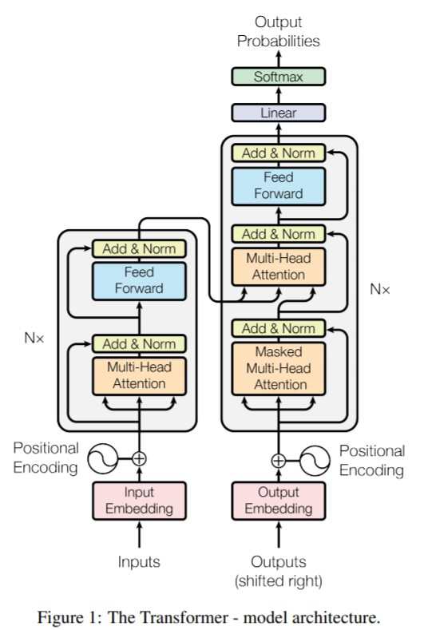
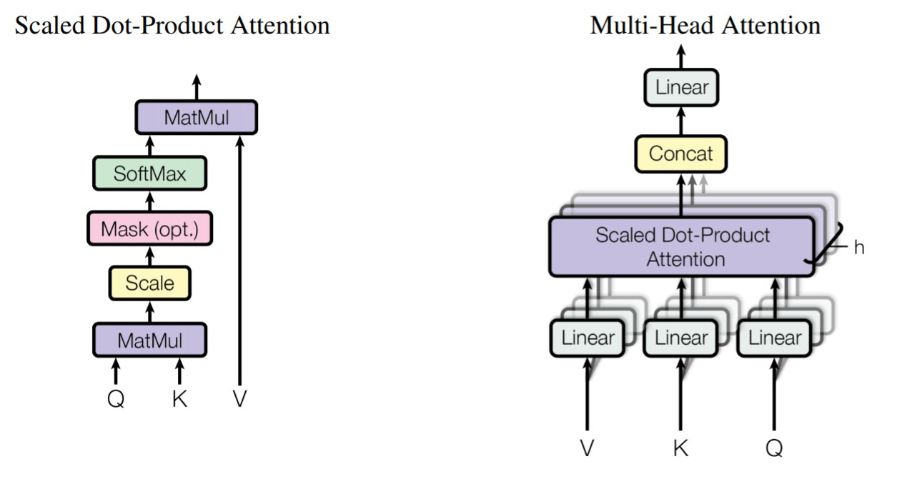
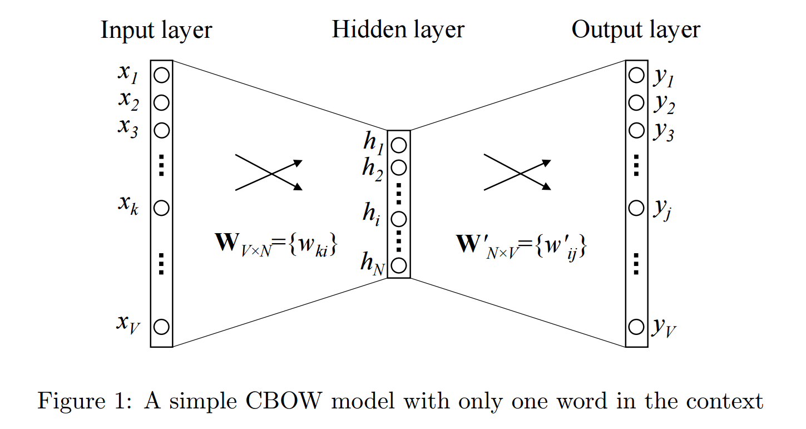
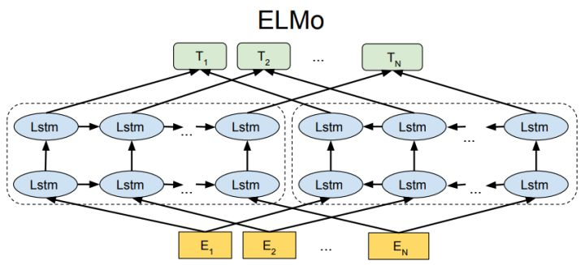
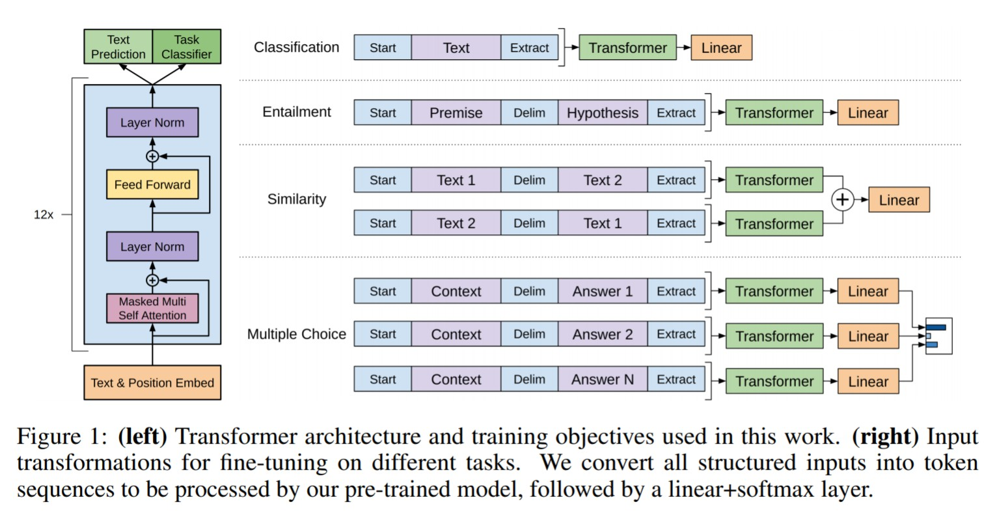
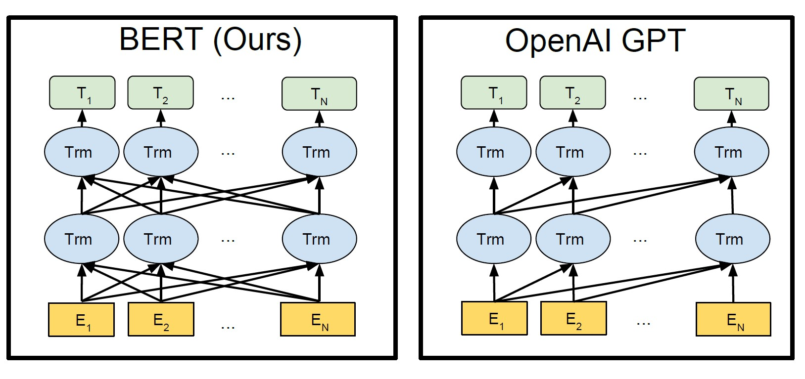
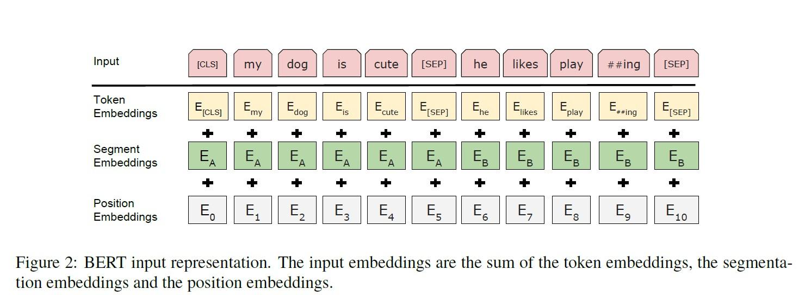
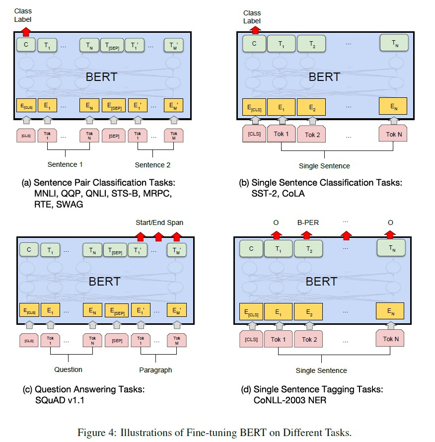

# Transformer
Here is an introduction of the paper: [Attention Is All You Need](https://arxiv.org/pdf/1706.03762.pdf), accepted by NIPS 2017.

In this paper, a new feature extraction model is proposed named *Transformer*, which overcomes the problem of large amount of computation in sequence-aligned RCNNs (e.g. LSTM), and the problem of learning dependencies between distant positions in CNNs. It is similar with the seq2seq model, both aiming at generating a new sentence for each input sentence. 

Here is an overview of the entire structure.

And an example of Transformer containing 2 stacked encoders and decoders is shown below. 

## Self-Attention
## $\circ$ Scaled Dot-Product Attention
Let's discuss how to calculate self-attention by vectors, then proceed to the calculation by matrices. The calculation details by vectors are shown below.

First, for each word, we create a *query* vector, a *key* vector, and a *value* vector by multiplying the embedding of the word with three matrices that we trained during the training process.

Second, for each word, we calculate its relevant scores with other words, which are calculated by multiplying the query vector of the word with the key vectors of other words. The score determines how much focus to place on other parts of the input sentence as we encode a word at a certain position.

Third, we divide the scores by the square root of the dimensions of key vectors (leading to having more stable gradients), and use softmax to normalize the scores.

Finally, we multiply the value vectors of all input words by their corresponding softmax scores, and sum them up to produce the self-attention feature of the current word (e.g. the word 'Thinking').

In practice, the calculation is performed by matrices and can be formulated as below:

$$
\text { Attention }(Q, K, V)=\operatorname{softmax}\left(\frac{Q K^{T}}{\sqrt{d_{k}}}\right) V
$$

### $\circ$ Multi-Head Attention
To improve the performance, we can linearly project the queries, keys and values *h* times with different, learned linear projections from $d_k$, $d_k$ and $d_v$ to $d_k / h$, $d_k / h$ and $d_v / h$. On each of these projected versions of queries, keys and values, we then perform the attention function in parallel, and the results are finally concatenated and once again projected to dimension $d_v$. Details are shown below.

Note that the self-attention layers in the decoder are slightly different with that in the encoder. In the decoder, the self-attention layer is only allowed to attend to earlier positions in the output sequence. This is done by masking future positions (setting them to -inf) before the softmax step in the self-attention calculation. So the self-attention in decoder is called *Masked Multi-Head Attention* in the paper.

## Encoder-Decoder Attention
The encoder-decoder attention layer works just like multi-head self-attention, except it creates its queries matrix from the layer below it, and takes the keys and values matrix from the output of the encoder stack. 

## Feed Forward Network
The feed forward network (FFN) contains two fully connected network with a ReLU activation in between. In the paper, the dimensions of input and output are set to 512, and that of the inner-layers are 2048.

## Residuals
One detail need to mention is that each sub-layer in encoder and decoder has a residual connection around it, followed by a layer normalization step.

## Position Encoding
To give the model a sense of the order of the words, we add positional encoding vectors to the word embeddings, the values of which are calculated by:

$$
PE_{(pos, 2i)} = sin(pos/10000^{2i/d_{model}}) \\\ PE_{(pos, 2i + 1)} = cos(pos/10000^{2i/d_{model}})
$$
where $pos$ is the position and $i$ is the dimension.

## Decoder Side
After finishing the encoding phase, we begin the decoding phase. The predicted output in each decoder time step is fed to the bottom decoder in the next time step. The above process repeat until a special predicted symbol is reached indicating the decoder has completed its output. 

---
*Ref.*  
*1. [The Illustrated Transformer](https://jalammar.github.io/illustrated-transformer/)*  
*2. [The Annotated Transformer - Harvardnlp](http://nlp.seas.harvard.edu/2018/04/03/attention.html)*

# Pretrained Language Models
Here is a review of some significant works on pre-training general language representations, including word2vec, ELMo, GPT and BERT.

## Unsupervised Feature-based Approaches
### 1. Word2vec
Word2vec is a model to generate a word embedding that containing context information for each input word. It is a two fully-connected network without any activations in between, and the input of the model is the one-hot representation of each word. The word embedding will then become the input of downstream models after word2vec is trained. The structure is shown below.

#### Pre-training
There are two methods to train the model: CBOW (continuous bag-of-words) and skip-gram, both of which use sliding window to sample input and output words. CBOW takes the center word in each window as output, and takes the other words in the window as input to predict the output, while skip-gram just performs in an opposite way. **In CBOW, the hidden feature is the word embedding of the output word, and in skip-gram, the hidden feature is the word embedding of the input word.** See their details below. 

In CBOW, there are multiple inputs at a time, and the hidden features of these inputs are mean summed to predict the output, while in skip-gram, there are only one input and output at a time.

#### Negative Sampling
Since the size of vocabulary dictionary is pretty large, using softmax to handle classification scores can cause great computational consumptions, thus *negative sampling* is introduced. It samples predicted scores for the true output along with several negative output each time, and the loss can be formulated as:

$$
-\left[y_{i} * \log \left(\sigma\left(W_{* i}^{\prime} h\right)\right)+\sum_{k}^{S a m p l e s}\left(1-y_{k}\right) * \log \left(1-\sigma\left(W_{* k}^{\prime} h\right)\right)\right]
$$
where $\sigma$ is sigmoid function, the left part is the true output loss, and the right part is the negative output loss.

### 2. ELMo
ELMo (Embedding from Language Models) was proposed in: [Deep Contextualized Word Representations](https://arxiv.org/pdf/1802.05365.pdf), accepted by NAACL 2018 (best paper). 

In word2vec model, each word in the vocabulary dictionary will have a corresponding word embedding after pre-training. Therefore, when coming to the downstream tasks, the trained word2vec model will be discard, and only the embedding outputs of training will be used. The embedding of a word will never change even when it appears with different meanings, thus the word2vec embedding is **context independent**, it lacks of the ability of word sense disambiguation. 

Different with word2vec, ELMo dynamically changes the word embeddings when the word appears in different sentences with stacked bi-LSTMs, called biLMs (bidirectional language models) in the paper. See its structure below.

The ELMo word representations are functions of the entire input sentences, which are computed on top of two-layer biLMs with **character convolutions**, as a linear function of the internal network states, and can handle out of vocabulary words problem.

#### Pre-training
A biLM combines both a forward and backward LM. The training process jointly maximizes the log likelihood target formula of the forward and backward directions as:

$$
\begin{aligned}
\sum_{k=1}^{N} &\left(\log p\left(t_{k} | t_{1}, \ldots, t_{k-1} ; \Theta_{x}, \vec{\Theta}\_{LSTM}, \Theta_{s}\right)\right. \\\ +&\left.\log p\left(t_{k} | t_{k+1}, \ldots, t_{N} ; \Theta_{x}, \overleftarrow{\Theta}\_{LSTM}, \Theta_{s}\right)\right)
\end{aligned}
$$

The log likelihood $p(\cdot;\cdot)$ above can be formulated as:

$$
p_{\Theta}(t_k|t_1, ..., t_{k-1}) = \frac{\operatorname{exp}(h_{\Theta}(t_{1:k-1})^Te(t_k))}{\sum_{t'}\operatorname{exp}(h_\Theta(t_{1:k-1})^Te(t'))}
$$
where $h_{\Theta}(t_{1:k-1})$ is the context representation produced by the biLM, and $e(t)$ denotes the embedding of $t$, both with the shape of $(dim, 1)$.

From the target formula, we can see that the input character vectors $\Theta_{x}$ and model weights $\Theta_{s}$ are shared between forward and backward LM. The forward LM is to predict the future input characters and the backward LM is to predict the previous input characters.

#### Learn a Linear Combination
Intrinsic evaluations have shown that the higher-level LSTM states capture context-dependent aspects of word meaning (e.g., they can be used without modification to perform well on supervised word sense disambiguation tasks), while lower-level LSTM states model aspects of syntax (e.g., they can be used to do part-of-speech tagging). Therefore, we can learn a linear combination of the internal states for each end task, allowing the model selects the type of semi-supervision that are most useful. It can be formulated as:

$$
\text{ELMo}\_{k}^{\text {task}}=E\left(R_{k} ; \Theta^{\text{task}}\right)=\gamma^{\text{task}} \sum_{j=0}^{L} s_{j}^{\text{task}} \mathbf{h}_{k, j}^{LM}
$$

where $s^{task}$ are softmax-normalized weights (sum to 1), $\gamma^{task}$ is a scatter parameter allowing the task model to scale the entire ELMo vector, and $\mathbf{h}_{k, j}^{LM}$ corresponds to the character convolution states, the first and second layer states of biLMs for $j=0, 1, 2$ respectively.  

#### Combine ELMo with Downstream Tasks
Traditionally, there are mainly two parts in a supervised end task model: the input tokens are first encoded into context-independent token representations $x_k$ using pre-trained word or character-based embeddings, then the model forms a context-sensitive representation $h_k$ based on the embeddings, typically using bidirectional RNNs, CNNs, or feed forward networks. 

To add ELMo to the supervised model, we first **freeze** the weights of the biLM, then concatenate the ELMo vector $\text{ELMo}\_{k}^{\text{task}}$ with $x_k$ as $[x_k; \text{ELMo}\_{k}^{\text {task}}]$ and pass it into the task RNN. We can also include ELMo at the output of the task RNN by replacing $h_k$ with $[h_k; \text{ELMo}\_{k}^{\text {task}}]$. 

---
## Unsupervised Fine-tuning Approaches
### 3. GPT
GPT (Generative Pre-Training) was proposed in: [Improving Language Understanding by Generative Pre-Training](https://s3-us-west-2.amazonaws.com/openai-assets/research-covers/language-unsupervised/language_understanding_paper.pdf), a technical report of OpenAI in 2018.

GPT employs a two-stage training procedure: unsupervised pre-training and supervised fine-tuning, and aims at learning a universal representation that transfers with little adaption to a wide range of tasks. First, a language modeling objective is used on the unlabeled data to learn the initial parameters of a neural network model. Then, the pre-trained model is adapt to a target task using the corresponding supervised objective without adding other models.

Here is an overview of GPT.

#### Unsupervised Pre-training
Given an unsupervised corpus of tokens $\mathcal{U}=\{u_{1}, ..., u_{n}\}$, a standard language modeling objective is used to maximize the following likelihood:

$$
L_{1}(\mathcal{U})=\sum_{i} \log P\left(u_{i} | u_{i-k}, \ldots, u_{i-1} ; \Theta\right)
$$
where $k$ is the size of the context window, and the conditional probability $P$ is modeled using a neural network with parameters $\Theta$. These parameters are trained using stochastic gradient descent.

A multi-layer *Transformer decoder* is used for the language model, which is a variant of Transformer.

#### Supervised Fine-tuning
After training the model, the parameters are adapt to the supervised target task. We assume a labeled dataset $\mathcal{C}$, where each instance consists of a sequence of input tokens $x^1, ..., x^m$ with a label $y$. The inputs are passed through our pre-trained model to obtain the final transformer block's activation $h_l^m$, which is then fed into an added linear output layer with parameters $W_y$ to predict $y$:

$$
P(y|x^1, ..., x^m) = \text{softmax}(h_l^m W_y)
$$
This gives us the following objective to maximize:

$$
L_{2}(\mathcal{C})=\sum_{(x, y)} \log P\left(y | x^{1}, \ldots, x^{m}\right)
$$

It is additionally found that including language modeling as an auxiliary objective to the fine-tuning helps learning by: a) improving generalization of the supervised model, and b) accelerating convergence. Therefore, GPT optimizes the following objective (with weight $\lambda$) rather than optimizing $L_2(\mathcal{C})$ only:

$$
L_3(\mathcal{C}) = L_2(\mathcal{C}) + \lambda * L_1(\mathcal{C})
$$

#### Combine GPT with Downstream Tasks
Previous work proposed learning task specific architectures on top of transferred representations, which re-introduces a significant amount of task-specific customization and does not use transfer learning for these additional architectural components. Instead, GPT uses a traversal-style approach, which converts structured inputs into an ordered sequence that the pre-trained model can process. These input transformations allow to avoid making extensive changes to the architecture across tasks. All transformations include adding randomly initialized start and end tokens. Details are shown in the above figure.

- For text classification, we can directly fine-tune the model. 
- For textual entailment, we concatenate the premise and hypothesis token sequences, with a delimiter token in between. 
- For similarity tasks, since there is no inherent ordering of the two sentences being compared, the input sequence is modified to contain both possible sentence orderings. Each input sequence is processed independently to produce two sequence representations, which are finally added element-wise before being fed into the linear output layer.
- For question answering and commonsense reasoning, we are given a context document $z$, a question $q$, and a set of possible answers ${a_k}$. We concatenate the document context and question with each possible answer as $[start; z; q; delim; a_k; extract]$. Each of these sequences are processed independently and then normalized via a softmax layer to produce an output distribution over possible answers.

### 4. BERT
BERT (Bidirectional Encoder Representations from Transformers) was proposed in: [BERT: Pre-training of Deep Bidirectional Transformers for Language Understanding](https://arxiv.org/pdf/1810.04805.pdf), accepted by NAACL 2019 (best long paper).

The model structure of BERT is similar with GPT. The difference is that the BERT Transformer uses bidirectional self-attention, while the GPT Transformer uses constrained self-attention where every token can only attend to context to its left. In other word, the BERT uses *Transformer encoder* as the model while GPT uses variant *Transformer decoder* (without encoder-decoder attention). Below shows their difference vividly.

#### Input/Output Representations
The input can be either a single sentence or a pair of sentences (**a sentence here represents a segment, which can contain multiple natural sentences**). The first token of each input sequence is always a special classification token ($\text{[CLS]})$, which is used for classification tasks, and the sentences are differentiated with a special token ($\text{[SEP]}$).

Additionally, we add two learnable embeddings to each input token: a) the segment embedding to indicate whether it belongs to sentence A or B, and b) the position embedding to indicate the relative distances between input tokens. The final input embeddings are the sum of the token embeddings, the segment embeddings, and the position embeddings. Details are shown below.

#### Pre-training
**#1 Masked LM**  
There is a severe problem for pre-training BERT. The BERT Transformer captures the representations bidirectionally, thus it cannot be used to predict the next inputs so as to avoid "see itself" problem, which means BERT cannot use the same pre-training strategy as in ELMo and GPT. 

Inspired by the *Cloze* task in literature, BERT simply masks some percentage of the input tokens at random, and then predict those masked tokens. But this will mislead the model to concentrate on the predictions only in the $\text{[MASK]}$ positions while ignore other positions, and the $\text{[MASK]}$ token does not appear during fine-tuning. To migrate this, BERT does not replace "masked" words with the actual $\text{[MASK]}$ token. Detailedly, the training data generator chooses 15% of the input tokens as "masked" tokens at random, then for each "masked" token, we replace it with: a) $\text{[MASK]}$ 80% of the time, b) a random token 10% of the time, and c) the unchanged token 10% of the time. 

**#2 Next Sentence Prediction (NSP)**  
For some downstream tasks such as Question Answering (QA) and Natural Language Inference (NLI), it is important to learn the *relationship* between two sentences, which is not directly captured by language modeling. Therefore, a **binarized** next sentence prediction task is additionally pre-trained using the classification token $\text{[CLS]}$. Specifically, when choosing the sentences A and B for each pre-training example, 50% of the time B is the actual next sentence that follows A (labeled as *IsNext*), and 50% of the time it is a random sentence from the corpus (labeled as *NotNext*).

#### Combine BERT with Downstream Tasks
The input can be formed as sentence pairs for each different downstream task, specifically: a) sentence pairs in paraphrasing task, b) hypothesis-premise pairs in entailment task, c) question-passage pairs in question answering task, and d) a degenerate text-$\emptyset$ pair in text classification or sequence tagging. The handling of output for different tasks can be seen below.

---

*Ref:*  
*1. [Wang Zhe - https://zhuanlan.zhihu.com/p/53194407](https://zhuanlan.zhihu.com/p/53194407)*  
*2. [Yida - https://zhuanlan.zhihu.com/p/59396559](https://zhuanlan.zhihu.com/p/59396559)*  
*3. [Ph0en1x - https://zhuanlan.zhihu.com/p/69290203](https://zhuanlan.zhihu.com/p/69290203)*  
*4. [Zhang Junlin - https://zhuanlan.zhihu.com/p/49271699](https://zhuanlan.zhihu.com/p/49271699)*  
*5. [Xixiaoyao - https://zhuanlan.zhihu.com/p/47488095](https://zhuanlan.zhihu.com/p/47488095)*  
*6. [https://www.quora.com/what-are-the-main-differences-between-the-word-embeddings-of-ELMo-BERT-Word2vec-and-GloVe](https://www.quora.com/What-are-the-main-differences-between-the-word-embeddings-of-ELMo-BERT-Word2vec-and-GloVe)*  
