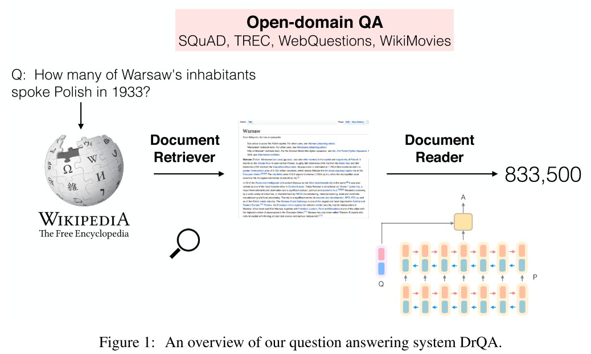
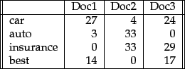
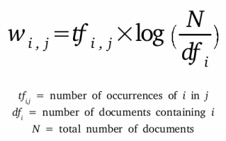
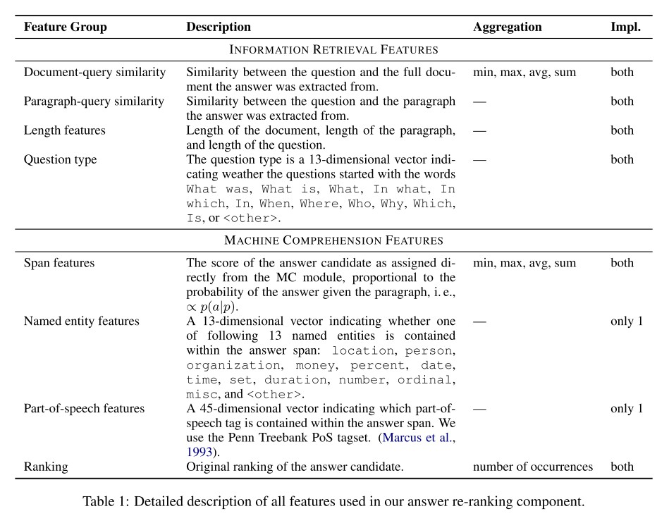
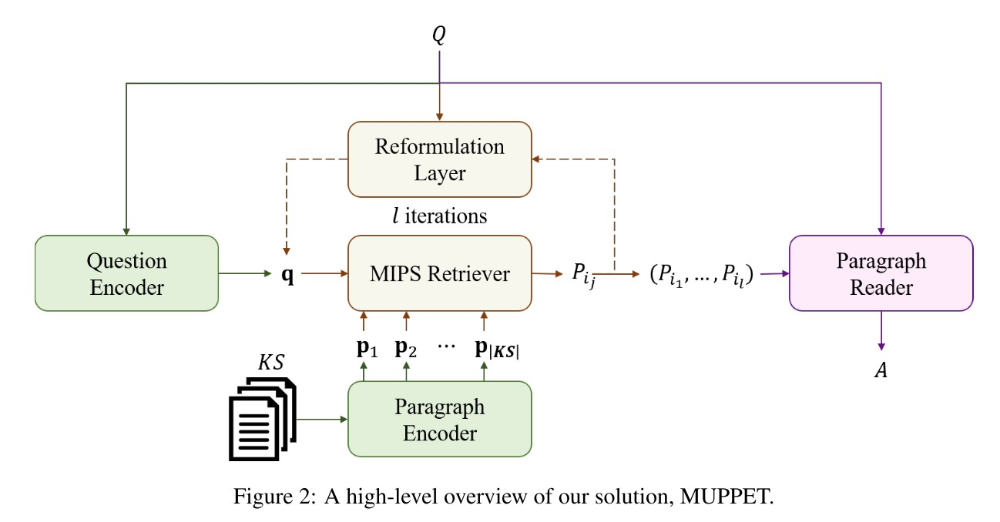
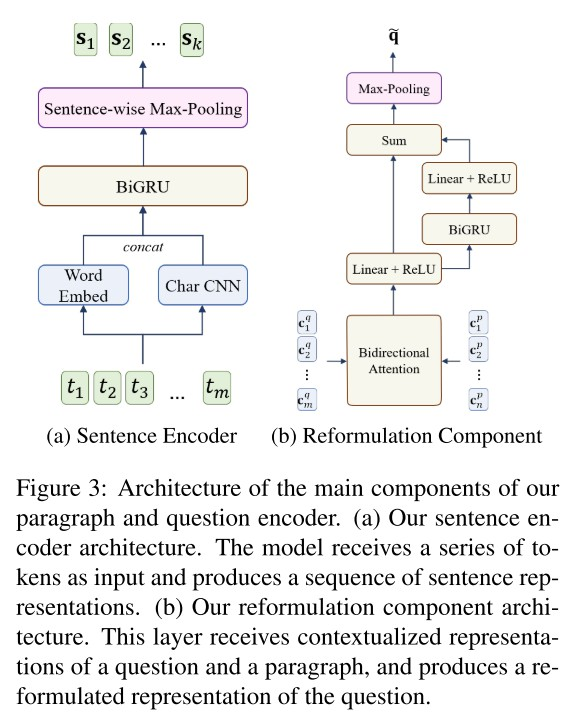

*Open-Domain Question Answering*
---

# (DrQA) Reading Wikipedia to Answer Open-Domain Questions
Danqi Chen, Adam Fisch, Jason Weston, and Antoine Bordes. [Reading Wikipedia to Answer Open-Domain Questions](https://www.aclweb.org/anthology/P17-1171.pdf). ACL 2017.

## 1. 贡献
(1) 作者提出了大规模机器阅读(machine learning at scale)的新任务，包括文档检索与文档阅读两阶段；同时仅用维基百科文本作为知识来源，抛弃知识库、词典、新闻文章、书籍等知识，以减少答案冗余，使得模型预测更为准确；

(2) 实验表明，作者所提的文档检索器(document retriever)效果超过了维基百科内置的搜索引擎，文档阅读器(document reader)在SQuAD数据集上取得了最好的效果；同时，作者采用了远程监督(distant supervision)和多任务学习(multitask learning)的方法，使得整个系统表现有所提升。

## 2. 方法

### 2.1 文档检索器
文章和问题通过TF-IDF加权词袋向量(bag-of-word vectors)、局部词的二元组(bigram)特征的次序进行比对，并用无符号murmur3哈希算法将二元词组映射为$2^{24}$组值之一。对于一个给定的问题，文档检索器返回5个维基百科文章。

**注：词袋向量与TF-IDF算法介绍**  
(1) 词袋向量表征单词在各个文档内出现的频率。通过计算一个单词在各个个文档里面出现的次数，并进行归一化，可以得到该单词对应的词袋向量，如下所示：

可以看到，不同单词对应的词袋向量维度是一致的，均为3。

(2) TF-IDF算法由两部分相乘得到，单词频率(term frequency)与逆文档频率(inverse document frequency)，公式如下：

其中$\text{tf}_{i,j}$表示单词频率，指单词$i$出现在文档$j$的次数；$\text{log}(\frac{N}{\text{df}_i})$表示逆文档频率，由总文档数$N$与包含单词$i$的文档数相除得到。引入逆文档频率的意义在于，像and或the这类词在所有文档都会频繁出现，这些词是要排除掉的，只能保留频繁出现并且有区分度的词作为区分不同文档的标记。每个单词与各个文档的TF-IDF关系值同样要经过归一化处理。

### 2.2 文档阅读器
给定一个问题$q$，其包含$l$个单词$\\{q_1, ..., q_l\\}$，以及一个包含$n$个段落的文档，每个段落$p$包含$m$个单词$\\{p_1, ..., p_m\\}$，作者提出了一个包含3个部分的文档阅读器，分别是段落编码(paragraph encoding)、问题编码(question encoding)和预测(prediction)。

#### 2.2.1 段落编码
首先对于每个段落$p$里面的各个单词$p_i$进行特征组合，之后通过多层双向LSTM(Bi-LSTM)进行编码，即：

$$
\\{p_1, ..., p_m\\} = \text{Bi-LSTM}(\\{\tilde{p}_1, ..., \tilde{p}_m\\})
$$

其中每个单词的特征$\tilde{p}\_i$由4部分组成：词嵌入(word embeddings)、完全匹配(exact match)、单词特征(token features)、以及对齐问题嵌入(aligned question embedding)，具体如下：

(1) **词嵌入**：采用维度为300的Glove预训练词嵌入，并使大部分的预训练词嵌入权重固定，只对1000个最高频的问题单词进行微调，如what, how, which, many，这些词对问答系统会很重要；

(2) **完全匹配**：用3个二元特征表示，指示是否$p_i$和一个$q$里面的问题单词完全匹配，问题单词可以是原始、小写或引理形式，公式为$f_{\text{exact\_match}}(p_i) = \mathbb{I}(p_i \in q)$；

(3) **单词特征**：$f_{token}(p_i) = (\text{POS}(p_i), \text{NER}(p_i), \text{TF}(p_i))$，其中包含3个部分：词性(part-of-speech, POS)，命名实体识别(named entity recognition, NER)，和归一化的单词频率(term frequency, TF)；

(4) **对齐问题嵌入**：$f_{aligned}(p_i) = \sum_j a_{i, j} \text{E}(q_j)$，其中注意力得分$a_{i, j}$捕捉$p_i$和每个问题单词$q_j$的相似度，公式为：

$$
a_{i, j} = \frac{\text{exp}(\alpha(\text{E}(p_i)) \cdot \alpha(\text{E}(q_j)))}{\sum_{j'} \text{exp}(\alpha(\text{E}(p_i)) \cdot \alpha(\text{E}(q_{j'})))}
$$

其中$\alpha$是一个带ReLU的单层全连接网络。与完全匹配相比，这样的特征给词义相似但不一样的词添加软对齐，如car和vehicle。

#### 2.2.2 问题编码  
问题编码较为简单，作者在$q_i$的词嵌入上添加了另一个循环神经网络，并把各个问题单词的最终隐藏层整合起来，即$q = \sum_j b_j q_j$，其中$b_j$为每个问题单词的重要度：

$$
b_j = \frac{\text{exp}(w \cdot q_j)}{\sum_{j'} \text{exp}(w \cdot q_{j'})}
$$

#### 2.2.3 预测  
预测的目标是段落内的单词片段(span)，作者将段落向量$\\{p_1, ..., p_m\\}$和问题向量$q$作为输入，通过双线性项(bilinear term)分别训练2个分类器预测片段的开始与结束位置，即：

$$
\begin{array}{cl}
&P_{start}(i) \propto \text{exp}(p_i W_s q) \\\\
&P_{end}(i) \propto \text{exp}(p_i W_e q)
\end{array}
$$

预测时选择各个段落内$P_{start}(i) \times P_{end}(i')$最大的单词片段$i$至$i'$，且$i \leq i' \leq i + 15$。

### 2.3 远程监督与多任务学习
作者在文中共用到4个数据集：SQuAD、CuratedTREC、WebQuestions和WikiMovies，但后3个数据集只包含问题-答案对，不像SQuAD那样还包含相关的文档或段落，因此不能直接用来训练文档阅读器。作者采用了远程监督的方式，首先对每个问题用文档检索器找到5个最相关的维基百科文章，接着，这些文章里不包含完全匹配答案的段落排除掉，少于25或长于1500字符的段落排除掉。如果在问题中检测到了命名实体(named entity)，不包含这些命名实体的段落排除掉。对于剩下的段落，作者对每一个段落内和答案匹配的句子内各个位置进行打分，用问题和一个20单词长度的窗口间一元组与二元组的重叠情况作为依据，最终找到5个重叠率最高的段落作为远程监督数据。在对各个数据集评测时，作者用多任务学习的方式，在4个数据集上联合训练，使得对应数据集的评测效果有了进一步的提高。

*Ref:*  
*[A Beginner's Guide to Bag of Words & TF-IDF](https://wiki.pathmind.com/bagofwords-tf-idf)*  

---

# Denoising Distantly Supervised Open-Domain Question Answering
Yankai Lin, Haozhe Ji, Zhiyuan Liu, and Maosong Sun. [Denoising Distantly Supervised Open-Domain Question Answering](https://www.aclweb.org/anthology/P18-1161.pdf). ACL 2018.

## 1. 贡献
(1) 对于远程监督问答(distantly supervised open-domain question answering, DS-QA)问题，作者提出了一个由粗到精的去噪模型，使得DS-QA系统可以去除噪声段落，并保持效率；

(2) 实验表明，作者所提出的模型效果在一系列的数据集下取得了显著提升。同时，在选择一小部分段落的情况下依然能取得不错的效果，并极大地提高了整个DS-QA系统的速度。

## 2. 方法

给定一个问题$q = (q^1, q^2, ..., q^{|q|})$，首先检索出$m$个段落$P = \\{p_1, p_2, ..., p_m\\}$，其中$p_i = (p_i^1, p_i^2, ..., p_i^{|p_i|})$是第$i$个检索到的段落。之后将这些段落经过段落选择器(paragraph selector)进行进一步筛选，过滤掉噪声段落，并通过段落阅读器(paragraph reader)进行答案预测。

### 2.1 段落选择器
首先对段落进行编码，可以用多层感知机(multi-layer perceptron, MLP)，或者循环神经网络(recurrent neural network, RNN)。对于RNN，作者选用单层双向LSTM网络，并把各层的隐藏层拼接起来得到$\hat{\textbf{p}}_i^j$。

之后对问题进行编码，同样可以用MLP或RNN。在此之后，作者用了一个自注意力机制得到最终特征，即：

$$
\begin{array}{cl}
&\hat{\textbf{q}} = \sum_j \alpha^j \hat{\textbf{q}}^j \\\\
&\alpha_i = \frac{\text{exp}(w_b \cdot q_i)}{\sum_j \text{exp}(w_b \cdot q_j)}
\end{array}
$$

接下来，作者通过一个最大池化层(max-pooling layer)与softmax层计算每个段落的重要度：

$$
\text{Pr}(p_i | q, P) = \text{softmax}(\max_j(\hat{\textbf{p}}_i^j \textbf{W} \textbf{q}))
$$

### 2.2 段落阅读器
与段落选择器类似，作者首先将段落通过多层双向LSTM编码为$\\{\bar{\textbf{p}}_i^1, ..., \bar{\textbf{p}}_i^{|p_i|}\\}$，将问题通过一个自注意多层双向LSTM编码为$\bar{\textbf{q}}$。则对于段落答案$a$的预测概率可表示为：

$$
\begin{array}{cl}
&\text{Pr}(a|q, p_i) = P_s(a_s) P_e(a_e) \\\\ 
&P_s(j) = \text{softmax}(\bar{\textbf{p}}_i^j \textbf{W}_s \bar{\textbf{q}}) \\\\ 
&P_e(j) = \text{softmax}(\bar{\textbf{p}}_i^j \textbf{W}_e \bar{\textbf{q}})
\end{array}
$$

其中$a_s$和$a_e$表示答案$a$的起始与终止位置。

由于在DS-QA问题中，我们没有手工对答案在段落的起始和终止位置进行标记，因此在一个段落中可能会有很多与正确答案相匹配的单词片段，其起始和终止位置可表示为：$\\{(a_s^1, a_e^1), ..., (a_s^{|a|}, a_e^{|a|})\\}$，则上述的答案预测概率可用2种方式进一步表示：

(1) **最大值**：假定段落内只包含一个正确起止位置，则：

$$
\text{Pr}(a|q, p_i) = \max_j \text{Pr}_s(a_s^j) \text{Pr}_e(a_e^j)
$$

(2) **总和**：假定段落内各个候选片段均与正确答案匹配，则：

$$
\text{Pr}(a|q, p_i) = \sum_j \text{Pr}_s(a_s^j) \text{Pr}_e(a_e^j)
$$

### 2.3 学习与预测
学习目标可以以最大似然估计表示为：

$$
L(\theta) = -\sum_{(\bar{a}, q, P) \in T} \text{log} \text{Pr}(a|q, P) - \alpha R(P)
$$

其中$R(P)$是对段落选择器的正则项，防止其过拟合，其定义为每个文章的重要度$\text{Pr}(p_i|q, P)$与一个概率分布$\mathcal{X}=\frac{1}{cp}$的KL散度，$cp$为所有文章$P$中包含正确答案的数目：

$$
R(P) = \sum_{p_i \in P} \mathcal{X}_i \text{log} \frac{\mathcal{X}_i}{\text{Pr}(p_i|q, P)}
$$

在测试时，预测概率最大的答案$\hat{a}$被提取出来，可表示为：

$$
\begin{array}{cl}
\hat{a} &= \text{argmax}_a \text{Pr}(a|q, P) \\\\ 
&= \text{argmax}_a \sum\_{p_i \in P} \text{Pr}(a|q, p_i) \text{Pr}(p_i|q, P) 
\end{array}
$$

---

# RankQA: Neural Question Answering with Answer Re-Ranking
Bernhard Kratzwald, Anna Eigenmann, and Stefan Feuerriegel. [RankQA: Neural Question Answering with Answer Re-Ranking](https://www.aclweb.org/anthology/P19-1611.pdf). ACL 2019.

## 1. 贡献
(1) 传统的大规模开放域问答系统由两阶段组成，信息检索与机器理解，然而这两阶段相互独立，信息互不相通。本文提出了一个额外的第三阶段，信息重排序，使得前两阶段的信息相互融合；

(2) 本文方法在3个公开数据集上达到了最佳效果，特别是当语料库规模发生变化时，可以高效地弥补由此造成的噪声信息损害。

## 2. 方法

### 2.1 信息检索(information retrieval)
与DrQA类似，信息检索模块首先从内容知识库中检索出前n(n=10)个最相关的文档，之后将这些文章切分成段落，这些段落被送入机器理解模块。

### 2.2 机器理解(machine reading)
机器理解模块从各个段落中提取候选答案并进行打分，之后选取得分最高的前k(k=40)个候选答案，将其送入重排序模块。机器理解模块可以用DrQA的文档阅读器或BERT作为模型。

### 2.3 答案重排序(answer re-ranking)
答案重排序模块从机器理解模块接收到的每个候选答案$c_i, i = 1, ..., k$包括实际答案片段$s_i$和其它元信息如文档ID、段落ID等。答案重排序模块包含3个阶段：特征提取(feature extraction)、答案聚合(answer aggregation)和重排序网络(re-ranking network)。

#### 2.3.1 特征提取
从信息检索模块，我们可以得到5个特征：文档-问题相似度、段落-问题相似度、段落长度、问题长度、以及指示问题起始词的指示符变量(indicator variable)，如what、who、when等。

从机器理解模块，我们可以得到4个特征：原始候选答案得分、原始候选答案排序、答案的词性标签(part-of-speech tag)、以及答案的命名实体特征(named entity feature)。其中后两者只为DrQA提取，通过指示答案片段是否包含命名实体或词性标签的指示符变量进行编码。

具体如下所示：

#### 2.3.2 答案聚合
作者将答案片段一样的候选答案进行合并，保留排序更靠前的特征。此外，还生成4种其它的聚合特征：  
(1) 各个答案片段相同的候选答案出现的次数；  
(2) 第一次出现的名次；  
(3) 相同答案片段得分的总和、均值、最小值与最大值；  
(4) 相同答案片段的文档-问题相似度的总和、均值、最小值与最大值。

#### 2.3.3 重排序网络
每个候选答案重排序得分通过一个两层的前馈网络预测得到，即：

$$
f(x_i) = \text{ReLU}(x_i A^T + b_1) B^T + b_2
$$

### 2.4 损失函数与采样方式
作者发现将所有正负样本采样完毕后，用二分类或回归损失很难对模型进行训练，因此作者提出了新的损失函数与子采样(sub-sampling)方式。

对于损失函数，作者采用了成对排序损失(pair-wise ranking loss) $L_{rank}$和一个正则损失$L_{reg}$。给定一个问题的两个候选答案$i, j, i \neq j$，二元变量$y_i, y_j$指示各个答案是否正确，则成对排序损失表示如下：

$$
L_{rank}(x_i, x_j) = [y_i - \sigma(f(x_i) - f(x_j))]^2
$$

总损失$L$为：

$$
\begin{array}{cl}
&L = L_{rank} + \lambda L_{reg} \\\\ 
&L_{reg} = ||A||_1 + ||B||_1 + ||b_1||_1 + ||b_2||_1
\end{array}
$$

对于采样方式，由于训练时大部分生成的候选答案是错误的，因此作者采用了一种子采样方式。在生成前k个候选答案后，先将排序相邻的每对答案$(x_i, x_j), j = i + 1$进行采样，之后在训练时只训练排序靠前的答案对，如$j<4$。在测试时不进行子采样，对所有候选答案打分后选择得分最高的答案。

---

# Improving Question Answering over Incomplete KBs with Knowledge-Aware Reader
Wenhan Xiong, Mo Yu, Shiyu Chang, Xiaoxiao Guo, and William Yang Wang. [Improving Question Answering over Incomplete KBs with Knowledge-Aware Reader](https://www.aclweb.org/anthology/P19-1417.pdf). ACL 2019.

## 1. 贡献
作者通过将文本信息与不完整的知识图谱相结合，提出了一个端到端模型，提高了事实型问答系统(factoid question answering)的表现，以更高效的方式取得了当前最好的效果。

## 2 问题定义
本文的问答系统需要两部分知识，知识图谱三元组$\mathcal{K} = \\{(e_s, r, e_o)\\}$和检索到的维基百科文档$\mathcal{D}$。为了使系统可拓展性更好，作者采用Personalized PageRank算法从问题中提到的主题实体(topic entity) $\mathcal{E}_0 = \\{e | e \in Q\\}$中检索出一个子图谱(subgraph)。文档$\mathcal{D}$由DrQA的文档检索器检索得到，并通过Lucene index算法进一步排序。同时，文档中的实体也被标记并链接到知识图谱实体上。对于每个问题，模型从所有知识图谱与所有文档的实体中选择一个答案实体。

## 3. 模型

作者所提模型主要包括2个部分，知识图谱阅读器(sub-graph reader, SGR)与知识型文本阅读器(knowledge-aware text reader, KAR)。

### 3.1 知识图谱阅读器
知识图谱阅读器SGR采用图注意力机制将每个图谱上的实体$e$从其相连的各个邻居实体$N_e$积聚知识。对于某个图谱实体，其作用有两点：(1) 其与邻居的关系是否与问题相关；(2) 其邻居实体是否是问题提到的主题实体。具体地，SGR主要包括3个部分：问题-关系匹配(question-relation matching)、对主题实体邻居(topic entity neighbors)额外的注意力机制、以及来自邻居的信息传播(information propagation)。

#### 3.1.1 问题-关系匹配
为了将问题和知识图谱关系在一个同构的潜空间(isomorphic latent space)进行匹配，作者采用了一个权重共享的LSTM对问题$\\{w_1^q, ..., w_{l_q}^q\\}$和关系词$\\{w_1^r, ..., w_{l_r}^r\\}$进行编码，由此可得问题和关系的隐层特征$h^q \in \mathbb{R}^{l_q \times d_h}$和$h^r \in \mathbb{R}^{l_r \times d_h}$。之后，作者首先对各个关系特征进行自注意力编码，得到一个加权关系特征$\vec{r}$，即：

$$
\vec{r} = \sum_i \alpha_i \vec{h_i^r}, \alpha \propto \text{exp}(\vec{w_r} \cdot \vec{h_i^r})
$$

接着，作者将问题与各个关系特征进行注意力编码，并将得到的问题-关系加权特征与上述关系自加权特征$\vec{r}$进行相乘，得到一个更细粒度的匹配得分$s_r$，即：

$$
s_r = \vec{r} \cdot \sum_j \beta_j \vec{h_j^q}, \beta_j \propto \text{exp}(\vec{r} \cdot \vec{h_j^q})
$$

#### 3.1.2 主题实体邻居的注意力机制
如果某个实体$e$的一个邻居实体$(r_i, e_i)$与问题中的一个主题实体相链接，那么对应的三元关系组$(e, r_i, e_i)$与问题的相关度应该比其它非主题实体关系组更高。基于此，作者提出了一个二元指示特征$I[e_i \in \mathcal{E}\_0]$，则每一个邻居实体$(r_i, e_i)$最终的注意力得分$\tilde{s}_{(r_i, e_i)}$可表示为：

$$
\tilde{s}_{(r_i, e_i)} \propto \text{exp}(I[e_i \in \mathcal{E}_0] + s\_{r_i})
$$

#### 3.1.3 来自邻居的信息传播
对于图谱上的任一实体$e$，为了将其邻居实体$e_i$的信息积聚其上，作者定义了一个门控函数，控制该实体与其邻居实体信息的相对重要程度，即：

$$
\begin{array}{cl}
&\vec{e'} = \gamma^e \vec{e} + (1 - \gamma^e) \sum_{(e_i, r_i) \in N_e} \tilde{s}\_{(r_i, e_i)} \sigma (W_e [\vec{r_i}; \vec{e_i}]) \\\\
&\gamma^e = g(\vec{e}, \sum_{(e_i, r_i) \in N_e} \tilde{s}_{(r_i, e_i)} \sigma (W_e [\vec{r_i}; \vec{e_i}])) \\\\
&g(x, y) = \text{sigmoid}(W[x; y])
\end{array}
$$

其中$\sigma$是激活函数，$\gamma^e$是线性门控系数。

### 3.2 知识型文本阅读器
知识型文本阅读器KAR是在DrQA所提的阅读理解模型的基础上进行了一定的改进，使其可以学习更多的知识图谱知识，主要包括3个部分：潜空间的问题重构(query reformulation)、知识型段落信息增强(knowledge-aware passage enhancement)、以及来自文本阅读的实体信息聚合(entity info aggregation)。

#### 3.2.1 潜空间的问题重构
该部分通过将问题内的主题实体对应的知识图谱特征整合进问题特征中，使得阅读器可以区分文本匹配外的相关信息。首先对问题特征$h^q$进行自注意力编码，可得$\vec{q} = \sum_i b_i \vec{h_i^q}$；之后收集问题中主题实体的知识图谱特征，可得$\vec{e^q} = \sum_{e \in \mathcal{E}_0} \vec{e'} / |\mathcal{E}_0|$；接下来，作者采用门控函数得到最终的问题特征，即：

$$
\begin{array}{cl}
&\vec{q'} = \gamma^q \vec{q} + (1 - \gamma^q) \text{tanh}(W^q [\vec{q}; \vec{e^q}; \vec{q} - \vec{e^q}]) \\\\
&\gamma^q = \text{sigmoid}(W^{gq} [\vec{q}; \vec{e^q}; \vec{q} - \vec{e^q}])
\end{array}
$$

#### 3.2.2 知识型段落信息增强
该部分通过各个段落内实体链接标注，将各个实体的知识图谱特征融合进来，并采用门控机制得到段落内每个词的特征。给定段落内的一个词$w_i^d$、其词特征$\vec{f_{w_i}^d}$、以及其知识图谱链接实体$e_{w_i}$，则每个词的知识型特征$\vec{i_{w_i}^d}$可由下式得到：

$$
\begin{array}{cl}
&\vec{i_{w_i}^d} = \gamma^d \vec{e'\_{w_i}} + (1 - \gamma^d) \vec{f\_{w_i}^d} \\\\
&\gamma^d = \text{sigmoid}(W^{gd} [\vec{q} \cdot \vec{e'\_{w_i}}; \vec{q} \cdot \vec{f\_{w_i}^d}])
\end{array}
$$

#### 3.2.3 来自文本阅读的实体信息聚合
作者通过一个双向LSTM将知识增强后的词特征$\vec{i_{w_i}^d}$进行编码，得到词最终特征$\vec{h_{w_i}^d}$，并计算各个词与问题的注意力得分$\lambda_i = \vec{q'}^T \vec{h_{w_i}^d}$，以及每个文档的注意力加权特征$\vec{d} = \sum_i \lambda_i \vec{h_{w_i}^d}$。那么，对于对于一个给定的实体$e$和所有包含该实体的文章$\mathcal{D}^e = \\{d | e \in d\\}$，该实体的聚合特征可表示为$\vec{e_d} = \frac{1}{|\mathcal{D}^e|} \sum_{d \in \mathcal{D^e}} \vec{d}$。

### 3.3 答案预测
有了实体特征$\vec{e'}$和$\vec{e^d}$，那么每个实体为真实答案的概率可以表示为$s^e = \sigma_s(\vec{q'}^T W_s [\vec{e'}; \vec{e^d}])$。

---

# (MUPPET) Multi-Hop Paragraph Retrieval for Open-Domain Question Answering
Yair Feldman, and Ran El-Yaniv. [Multi-Hop Paragraph Retrieval for Open-Domain Question Answering](https://www.aclweb.org/anthology/P19-1222.pdf). ACL 2019.

## 1. 贡献
(1) 作者提出了一个新颖的多跳检索(multi-hop retrieval)方法，对解决开放域多跳问答任务很有帮助；

(2) 作者所提方法在单跳和多跳开放域问答数据集上都取得了最好的效果；

(3) 作者提出了用句子特征进行检索的方法，实验表明该方法比用段落特征检索的效果更好。

## 2. 方法

作者所提多跳检索方法的大致思路是，对于一个问题$Q$，首先将其编码为搜索向量$q^s \in \mathbb{R}^d$，用来检索前k个最相关的段落$\\{P_1^Q, ..., P_k^Q\\} \subset \text{KS}$；在随后的检索迭代中，作者用上一次迭代检索到的段落对搜索向量进行调整，得到k个新搜索向量$\\{\tilde{q}_1^s, ..., \tilde{q}_k^s\\}, \tilde{q}_i^s \in \mathbb{R}^d$，再用和之前迭代同样的方法检索出新一轮的前k个段落。该过程可以视为在段落编码空间进行的宽度为k的beam搜索。

### 2.1 段落与问题编码

#### 2.1.1 段落编码
对于段落编码，作者对段落内的每个句子进行分别编码，而非像之前的做法，对整个段落进行整体编码。作者首先对段落内的每个词进行编码，之后利用这些词编码对每个句子进行编码。

对于词编码，作者采用了字符级嵌入(character-level embedding)与词级嵌入(word-level embedding)相结合的方式。在字符级嵌入中，作者先用一个一维卷积神经网络对每个长为$l_t$词的各个字符嵌入$t_i^c$进行编码，之后进行全局最大池化，得到每个词唯一的字符级嵌入$t^c$，即$t^c = \text{max}(\text{CNN}(t_1^c, ..., t_{l_t}^c))$；词级嵌入$t^w$则直接用预训练词嵌入GloVe表达。最终，每个词特征$t$可表示为$t = [t^w; t^c]$。

对于句子编码，作者先用双向GRU模型对词特征编码，得到各个词的语境特征(contextualized representation)：

$$
(c_1, ..., c_m) = \text{BiGRU}(t_1, ..., t_m)
$$

其中$m$为段落内词总数。之后将各个词划分入各自对应的句子组中，并各自进行全局最大池化，即可得到每个句子的特征$s_i$，即$s_i = \text{max}(c_{i_1}, ..., c_{i_l})$，$l$为第$i$个句子的长度。

#### 2.1.2 问题编码
对于第一次检索迭代，问题编码方式与段落编码类似，但不考虑句子层面的信息，而是将问题进行整体编码，即对各个问题词的语境特征进行全局最大池化，得到问题特征$q$。

对于随后的检索迭代，作者将上一次迭代的问题词语境特征$(c_1^q, ..., c_{n_q}^q)$和段落词语境特征$(c_1^p, ..., c_{n_p}^p)$作为输入，生成新一轮迭代的问题特征。首先将这两个语境特征通过一个双向注意力(bidirectional attention)层进行编码。问题词$i$和段落词$j$的注意力可表示为：

$$
a_{ij} = w_1^a \cdot c_i^q + w_2^a \cdot c_j^p + w_3^a \cdot (c_i^q \odot c_j^p)
$$

则每个问题词的注意力特征$a_i^q$为：

$$
\begin{array}{cl}
&a_i^q = \sum_{j=1}^{n_p} \alpha_{ij} c_j^p \\\\
&\alpha_{ij} = \frac{e^{a_{ij}}}{\sum_{j=1}^{n_p} e^{a_{ij}}}
\end{array}
$$

段落对问题的整体注意力特征$a^p$为：

$$
\begin{array}{cl}
&a^p = \sum_{i=1}^{n_q} \beta_i c_i^q \\\\
&\beta_i = \frac{e^{m_i}}{\sum_{i=1}^{n_q} e^{m_i}} \\\\
&m_i = \max_{i \leq j \leq n_p} a_{ij}
\end{array}
$$

之后作者将$c_i^q, a_i^q, c_i^q \odot a_i^q, a^p \odot a_i^q$拼接起来送入一层带ReLU的线性层，同时用一个残差连接将该特征与该特征通过一个双向GRU和一个带ReLU线性层的另一特征进行求和，得到最终的双向注意力向量。最后通过一个全局最大池化，得到新一轮迭代的问题特征$\tilde{q}$。

#### 2.1.3 问题-段落相关得分
给定一个包含$n_k$个句子的段落$P$，其各个句子的特征为$\\{s_1, ..., s_{n_k}\\}$；以及一个问题$Q$，其特征为$q$，则$Q$与$P$的相关度为：

$$
\text{rel}(Q, P) = \max_{i = 1, ..., n_k} \sigma(\begin{bmatrix} s_i \\\ s_i \odot q \\\ s_i \cdot q \\\ q \end{bmatrix}^T \cdot \begin{bmatrix} w_1 \\\ w_2 \\\ w_3 \\\ w_4 \end{bmatrix} + b)
$$

其中，$w_1, w_2, w_4 \in \mathbb{R}^d, w_3, b \in \mathbb{R}$。

#### 2.1.4 训练与损失函数
每一个训练样本包含一个问题和两个段落，$(Q, P^1, P^2)$，其中$P^i$对应第$i$次迭代检索到的段落。各个迭代的损失形式相同，最终的损失是各个迭代损失之和。每个迭代的损失函数包括两部分：二元交叉熵损失(binary cross-entropy loss)和排序损失(ranking loss)，其中交叉熵损失可表示为：

$$
L_{CE} = -\frac{1}{N} \sum_{i = 1}^N y_i \text{log}(\text{rel}(Q_i, P_i)) + (1 - y_i) \text{log} (1 - \text{rel}(Q_i, P_i))
$$

其中$N$表示当前批量的样本数。对于排序损失，首先计算出每个批量内和与问题$Q_i$相对应的所有正负样本的相关度均值$q_i^{pos}$和$q_i^{neg}$，即：

$$
\begin{array}{cl}
&q_i^{pos} = \frac{1}{M_1} \sum_{j=1}^{M_1} \text{rel}(Q_i, P_i) \\\\
&q_i^{neg} = \frac{1}{M_2} \sum_{j=1}^{M_2} \text{rel}(Q_i, P_i)
\end{array}
$$

其中$M_1$和$M_2$是问题$Q_i$对应的正负样本数。则余量(margin)排序损失可定义为：

$$
L_R = \frac{1}{M} \sum_{i = 1}^M \max(0, \gamma - q_i^{pos} + q_i^{neg})
$$

其中$M$是当前批量中不同问题的个数。最终损失为：

$$
L = L_{CE} + \lambda L_R
$$

### 2.2 段落阅读器
该部分模型与问题特征调整模型很相似，首先用和上述同样的方法分别得到问题和段落的词语境特征，并将其送入双向注意力层，但与之前不同的是，问题和段落在公式中的角色互换。之后通过类似的残差网络得到最终注意力特征，但在双向GRU与后面的线性层之间增添一个段落自注意层。最后将该特征送入预测层，首先通过一个双向GRU层和一个线性层预测答案片段起始位置得分；之后将该GRU层输出特征与输入注意力特征进行拼接送入另一个双向GRU层和线性层，预测答案片段结束位置得分。

该阅读器的起始位置损失可由下式表示：

$$
L_{start} = -\text{log}(\frac{\sum_{j \in P^Q} \sum_{k \in A_j} e^{s_{kj}}}{\sum_{j \in P^Q}{\sum_{i=1}^{n_j} e^{s_{ij}}}})
$$

其中，$P^Q$是和同一问题$Q$相匹配的段落集合，$A_j$是第$j$个段落里所有答案片段的起始词集合，$s_{ij}$是第$j$个段落里第$i$个词的预测得分。阅读器的结束位置损失形式与上式一致。则阅读器最终的损失为$L_{span} = L_{start} + L_{end}$。

---

*Question Generation*
---

# Learning to Ask Questions in Open-domain Conversational Systems with Typed Decoders
Yansen Wang, Chenyi Liu, Minlie Huang, and Liqiang Nie. [Learning to Ask Questions in Open-domain Conversational Systems with Typed Decoders](https://www.aclweb.org/anthology/P18-1204.pdf). ACL 2018.

# Interconnected Question Generation with Coreference Alignment and Conversation Flow Modeling
Yifan Gao, Piji Li, Irwin King, and Michael R. Lyu. [Interconnected Question Generation with Coreference Alignment and Conversation Flow Modeling](https://www.aclweb.org/anthology/P19-1480.pdf). ACL 2019.

# Reinforced Dynamic Reasoning for Conversational Question Generation
Boyuan Pan, Hao Li, Ziyu Yao, Deng Cai, and Huan Sun. [Reinforced Dynamic Reasoning for Conversational Question Generation](https://www.aclweb.org/anthology/P19-1203.pdf). ACL 2019.

---

*Answer Selection & Summarization*
---

# Get To The Point: Summarization with Pointer-Generator Networks
Abigail See, Peter J. Liu, and Christopher D. Manning. [Get To The Point: Summarization with Pointer-Generator Networks](https://www.aclweb.org/anthology/P17-1099.pdf). ACL 2017.

# Knowledge-aware Attentive Neural Network for Ranking Question Answer Pairs
Ying Shen, Yang Deng, Min Yang, Yaliang Li, Nan Du, Wei Fan, and Kai Lei. [Knowledge-aware Attentive Neural Network for Ranking Question Answer Pairs](https://dl.acm.org/doi/10.1145/3209978.3210081). SIGIR 2018.

# Knowledge as A Bridge: Improving Cross-domain Answer Selection with External Knowledge
Yang Deng, Ying Shen, Min Yang, Yaliang Li, Nan Du, Wei Fan, and Kai Lei. [Knowledge as A Bridge: Improving Cross-domain Answer Selection with External Knowledge](https://www.aclweb.org/anthology/C18-1279.pdf). COLING 2018.

# Multi-Task Learning with Multi-View Attention for Answer Selection and Knowledge Base Question Answering
Yang Deng, Yuexiang Xie, Yaliang Li, Min Yang, Nan Du, Wei Fan, Kai Lei, and Ying Shen. [Multi-Task Learning with Multi-View Attention for Answer Selection and Knowledge Base Question Answering](https://arxiv.org/pdf/1812.02354.pdf). AAAI 2019.

# Joint Learning of Answer Selection and Answer Summary Generation in Community Question Answering
Yang Deng, Wai Lam, Yuexiang Xie, Daoyuan Chen, Yaliang Li, Min Yang, and Ying Shen. [Joint Learning of Answer Selection and Answer Summary Generation in Community Question Answering](https://arxiv.org/pdf/1911.09801.pdf). AAAI 2020.

# Bridging Hierarchical and Sequential Context Modeling for Question-driven Extractive Answer Summarization
Yang Deng, Wenxuan Zhang, Yaliang Li, Min Yang, Wai Lam, and Ying Shen. [Bridging Hierarchical and Sequential Context Modeling for Question-driven Extractive Answer Summarization](https://dl.acm.org/doi/abs/10.1145/3397271.3401208). SIGIR 2020.

