## *I. Open-Domain Question Answering*

# (DrQA) Reading Wikipedia to Answer Open-Domain Questions
Danqi Chen, Adam Fisch, Jason Weston, and Antoine Bordes. [Reading Wikipedia to Answer Open-Domain Questions](https://www.aclweb.org/anthology/P17-1171.pdf). ACL 2017.

## 1. 贡献
(1) 作者提出了大规模机器阅读(machine learning at scale)的新任务，包括文档检索与文档阅读两阶段；同时仅用维基百科文本作为知识来源，抛弃知识库、词典、新闻文章、书籍等知识，以减少答案冗余，使得模型预测更为准确；

(2) 实验表明，作者所提的文档检索器(document retriever)效果超过了维基百科内置的搜索引擎，文档阅读器(document reader)在SQuAD数据集上取得了最好的效果；同时，作者采用了远程监督(distant supervision)和多任务学习(multitask learning)的方法，使得整个系统表现有所提升。

## 2. 方法
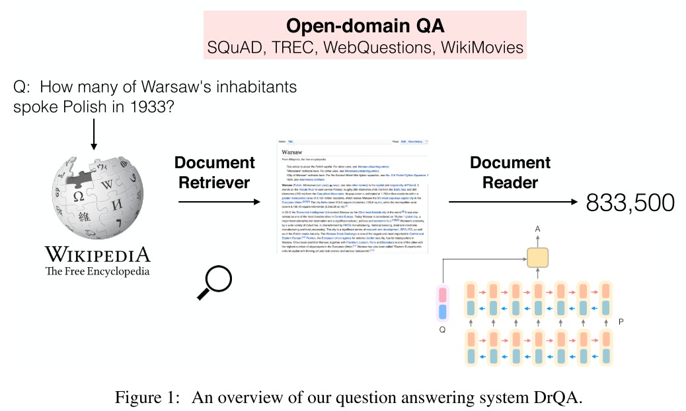

### 2.1 文档检索器
文章和问题通过TF-IDF加权词袋向量(bag-of-word vectors)进行比对，并通过二元文法特征(bigram feature)将局部词的顺序考虑在内以提高效果。同时用无符号murmur3哈希算法将二元词组映射为$2^{24}$组值之一。对于一个给定的问题，文档检索器返回5个维基百科文章。

**注：词袋向量与TF-IDF算法介绍**  
(1) 词袋向量表征单词在各个文档内出现的频率。通过计算一个单词在各个个文档里面出现的次数，并进行归一化，可以得到该单词对应的词袋向量，如下所示：

可以看到，不同单词对应的词袋向量维度是一致的，均为3。

(2) TF-IDF算法由两部分相乘得到，单词频率(term frequency)与逆文档频率(inverse document frequency)，公式如下：

其中$\text{tf}_{i,j}$表示单词频率，指单词$i$出现在文档$j$的次数；$\text{log}(\frac{N}{\text{df}_i})$表示逆文档频率，由总文档数$N$与包含单词$i$的文档数相除得到。引入逆文档频率的意义在于，像and或the这类词在所有文档都会频繁出现，这些词是要排除掉的，只能保留频繁出现并且有区分度的词作为区分不同文档的标记。每个单词与各个文档的TF-IDF关系值同样要经过归一化处理。

### 2.2 文档阅读器
给定一个问题$q$，其包含$l$个单词$\\{q_1, ..., q_l\\}$，以及一个包含$n$个段落的文档，每个段落$p$包含$m$个单词$\\{p_1, ..., p_m\\}$，作者提出了一个包含3个部分的文档阅读器，分别是段落编码(paragraph encoding)、问题编码(question encoding)和预测(prediction)。

#### 2.2.1 段落编码
首先对于每个段落$p$里面的各个单词$p_i$进行特征组合，之后通过多层双向LSTM(Bi-LSTM)进行编码，即：

$$
\\{p_1, ..., p_m\\} = \text{Bi-LSTM}(\\{\tilde{p}_1, ..., \tilde{p}_m\\})
$$

其中每个单词的特征$\tilde{p}\_i$由4部分组成：词嵌入(word embeddings)、完全匹配(exact match)、单词特征(token features)、以及对齐问题嵌入(aligned question embedding)，具体如下：

(1) **词嵌入**：采用维度为300的Glove预训练词嵌入，并使大部分的预训练词嵌入权重固定，只对1000个最高频的问题单词进行微调，如what, how, which, many，这些词对问答系统会很重要；

(2) **完全匹配**：用3个简单的二元特征表示，指示是否$p_i$和一个$q$里面的问题单词完全匹配，问题单词可以是原始、小写或引理形式，公式为$f_{\text{exact\_match}}(p_i) = \mathbb{I}(p_i \in q)$；

(3) **单词特征**：$f_{token}(p_i) = (\text{POS}(p_i), \text{NER}(p_i), \text{TF}(p_i))$，其中包含3个部分：词性(part-of-speech, POS)，命名实体识别(named entity recognition, NER)，和归一化的单词频率(term frequency, TF)；

(4) **对齐问题嵌入**：$f_{aligned}(p_i) = \sum_j a_{i, j} \text{E}(q_j)$，其中注意力得分$a_{i, j}$捕捉$p_i$和每个问题单词$q_j$的相似度，公式为：

$$
a_{i, j} = \frac{\text{exp}(\alpha(\text{E}(p_i)) \cdot \alpha(\text{E}(q_j)))}{\sum_{j'} \text{exp}(\alpha(\text{E}(p_i)) \cdot \alpha(\text{E}(q_{j'})))}
$$

其中$\alpha$是一个带ReLU的单层全连接网络。与完全匹配相比，这样的特征给词义相似但不一样的词添加软对齐，如car和vehicle。

#### 2.2.2 问题编码  
问题编码较为简单，作者在$q_i$的词嵌入上添加了另一个循环神经网络，并把各个问题单词的最终隐藏层整合起来，即$q = \sum_j b_j q_j$，其中$b_j$为每个问题单词的重要度：

$$
b_j = \frac{\text{exp}(w \cdot q_j)}{\sum_{j'} \text{exp}(w \cdot q_{j'})}
$$

#### 2.2.3 预测  
预测的目标是段落内的单词片段(span)，作者将段落向量$\\{p_1, ..., p_m\\}$和问题向量$q$作为输入，通过双线性项(bilinear term)分别训练2个分类器预测片段的开始与结束位置，即：

$$
\begin{array}{cl}
&P_{start}(i) \propto \text{exp}(p_i W_s q) \\\\
&P_{end}(i) \propto \text{exp}(p_i W_e q)
\end{array}
$$

预测时选择各个段落内$P_{start}(i) \times P_{end}(i')$最大的单词片段$i$至$i'$，且$i \leq i' \leq i + 15$。

### 2.3 远程监督与多任务学习
作者在文中共用到4个数据集：SQuAD、CuratedTREC、WebQuestions和WikiMovies，但后3个数据集只包含问题-答案对，不像SQuAD那样还包含相关的文档或段落，因此不能直接用来训练文档阅读器。作者采用了远程监督的方式，首先对每个问题用文档检索器找到5个最相关的维基百科文章，接着，这些文章里不包含完全匹配答案的段落排除掉，少于25或长于1500字符的段落排除掉。如果在问题中检测到了命名实体(named entity)，不包含这些命名实体的段落排除掉。对于剩下的段落，作者对每一个段落内和答案匹配的句子内各个位置进行打分，用问题和一个20单词长度的窗口间一元词组与二元词组的重叠度作为依据，最终找到5个重叠率最高的段落作为远程监督数据。在对各个数据集评测时，作者用多任务学习的方式，在4个数据集上联合训练，使得对应数据集的评测效果有了进一步的提高。

*Ref:*  
*[A Beginner's Guide to Bag of Words & TF-IDF](https://wiki.pathmind.com/bagofwords-tf-idf)*  

---

# Denoising Distantly Supervised Open-Domain Question Answering
Yankai Lin, Haozhe Ji, Zhiyuan Liu, and Maosong Sun. [Denoising Distantly Supervised Open-Domain Question Answering](https://www.aclweb.org/anthology/P18-1161.pdf). ACL 2018.

## 1. 贡献
(1) 对于远程监督问答(distantly supervised open-domain question answering, DS-QA)问题，作者提出了一个由粗到精的去噪模型，使得DS-QA系统可以去除噪声段落，并保持效率；

(2) 实验表明，作者所提出的模型效果在一系列的数据集下取得了显著提升。同时，在选择一小部分段落的情况下依然能取得不错的效果，并极大地提高了整个DS-QA系统的速度。

## 2. 方法
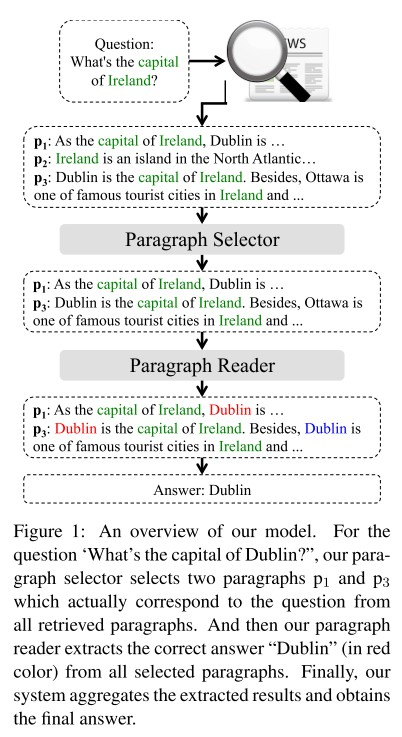

给定一个问题$q = (q^1, q^2, ..., q^{|q|})$，首先检索出$m$个段落$P = \\{p_1, p_2, ..., p_m\\}$，其中$p_i = (p_i^1, p_i^2, ..., p_i^{|p_i|})$是第$i$个检索到的段落。之后将这些段落经过段落选择器(paragraph selector)进行进一步筛选，过滤掉噪声段落，并通过段落阅读器(paragraph reader)进行答案预测。

### 2.1 段落选择器
首先对段落进行编码，可以用多层感知机(multi-layer perceptron, MLP)，或者循环神经网络(recurrent neural network, RNN)。对于RNN，作者选用单层双向LSTM网络，并把各层的隐藏层拼接起来得到$\hat{\textbf{p}}_i^j$。

之后对问题进行编码，同样可以用MLP或RNN。在此之后，作者用了一个自注意力机制得到最终特征，即：

$$
\begin{array}{cl}
&\hat{\textbf{q}} = \sum_j \alpha^j \hat{\textbf{q}}^j \\\\
&\alpha_i = \frac{\text{exp}(w_b \cdot q_i)}{\sum_j \text{exp}(w_b \cdot q_j)}
\end{array}
$$

接下来，作者通过一个最大池化层(max-pooling layer)与softmax层计算每个段落的重要度：

$$
\text{Pr}(p_i | q, P) = \text{softmax}(\max_j(\hat{\textbf{p}}_i^j \textbf{W} \textbf{q}))
$$

### 2.2 段落阅读器
与段落选择器类似，作者首先将段落通过多层双向LSTM编码为$\\{\bar{\textbf{p}}_i^1, ..., \bar{\textbf{p}}_i^{|p_i|}\\}$，将问题通过一个自注意多层双向LSTM编码为$\bar{\textbf{q}}$。则对于段落答案$a$的预测概率可表示为：

$$
\begin{array}{cl}
&\text{Pr}(a|q, p_i) = P_s(a_s) P_e(a_e) \\\\ 
&P_s(j) = \text{softmax}(\bar{\textbf{p}}_i^j \textbf{W}_s \bar{\textbf{q}}) \\\\ 
&P_e(j) = \text{softmax}(\bar{\textbf{p}}_i^j \textbf{W}_e \bar{\textbf{q}})
\end{array}
$$

其中$a_s$和$a_e$表示答案$a$的起始与终止位置。

由于在DS-QA问题中，我们没有手工对答案在段落的起始和终止位置进行标记，因此在一个段落中可能会有很多与正确答案相匹配的单词片段，其起始和终止位置可表示为：$\\{(a_s^1, a_e^1), ..., (a_s^{|a|}, a_e^{|a|})\\}$，则上述的答案预测概率可用2种方式进一步表示：

(1) **最大值**：假定段落内只包含一个正确起止位置，则：

$$
\text{Pr}(a|q, p_i) = \max_j \text{Pr}_s(a_s^j) \text{Pr}_e(a_e^j)
$$

(2) **总和**：假定段落内各个候选片段均与正确答案匹配，则：

$$
\text{Pr}(a|q, p_i) = \sum_j \text{Pr}_s(a_s^j) \text{Pr}_e(a_e^j)
$$

### 2.3 学习与预测
学习目标可以以最大似然估计表示为：

$$
L(\theta) = -\sum_{(\bar{a}, q, P) \in T} \text{log} \text{Pr}(a|q, P) - \alpha R(P)
$$

其中$R(P)$是对段落选择器的正则项，防止其过拟合，其定义为每个文章的重要度$\text{Pr}(p_i|q, P)$与一个概率分布$\mathcal{X}=\frac{1}{cp}$的KL散度，$cp$为所有文章$P$中包含正确答案的数目：

$$
R(P) = \sum_{p_i \in P} \mathcal{X}_i \text{log} \frac{\mathcal{X}_i}{\text{Pr}(p_i|q, P)}
$$

在测试时，预测概率最大的答案$\hat{a}$被提取出来，可表示为：

$$
\begin{array}{cl}
\hat{a} &= \text{argmax}_a \text{Pr}(a|q, P) \\\\ 
&= \text{argmax}_a \sum\_{p_i \in P} \text{Pr}(a|q, p_i) \text{Pr}(p_i|q, P) 
\end{array}
$$

---

# RankQA: Neural Question Answering with Answer Re-Ranking
Bernhard Kratzwald, Anna Eigenmann, and Stefan Feuerriegel. [RankQA: Neural Question Answering with Answer Re-Ranking](https://www.aclweb.org/anthology/P19-1611.pdf). ACL 2019.

## 1. 贡献
(1) 传统的大规模开放域问答系统由两阶段组成，信息检索与机器理解，然而这两阶段相互独立，信息互不相通。本文提出了一个额外的第三阶段，信息重排序，使得前两阶段的信息相互融合；

(2) 本文方法在3个公开数据集上达到了最佳效果，特别是当语料库规模发生变化时，可以高效地弥补由此造成的噪声信息损害。

## 2. 方法
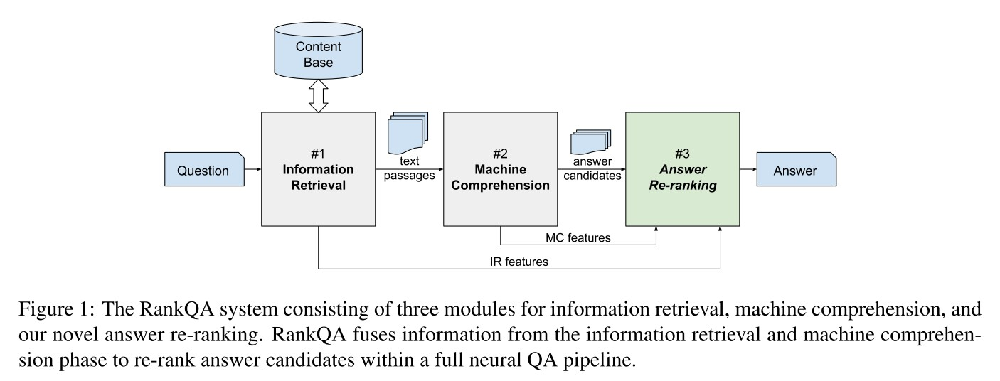

### 2.1 信息检索(information retrieval)
与DrQA类似，信息检索模块首先从内容知识库中检索出前n(n=10)个最相关的文档，之后将这些文章切分成段落，这些段落被送入机器理解模块。

### 2.2 机器理解(machine reading)
机器理解模块从各个段落中提取候选答案并进行打分，之后选取得分最高的前k(k=40)个候选答案，将其送入重排序模块。机器理解模块可以用DrQA的文档阅读器或BERT作为模型。

### 2.3 答案重排序(answer re-ranking)
答案重排序模块从机器理解模块接收到的每个候选答案$c_i, i = 1, ..., k$包括实际答案片段$s_i$和其它元信息如文档ID、段落ID等。答案重排序模块包含3个阶段：特征提取(feature extraction)、答案聚合(answer aggregation)和重排序网络(re-ranking network)。

#### 2.3.1 特征提取
从信息检索模块，我们可以得到5个特征：文档-问题相似度、段落-问题相似度、段落长度、问题长度、以及指示问题起始词的指示符变量(indicator variable)，如what、who、when等。

从机器理解模块，我们可以得到4个特征：原始候选答案得分、原始候选答案排序、答案的词性标签(part-of-speech tag)、以及答案的命名实体特征(named entity feature)。其中后两者只为DrQA提取，通过指示答案片段是否包含命名实体或词性标签的指示符变量进行编码。

具体如下所示：
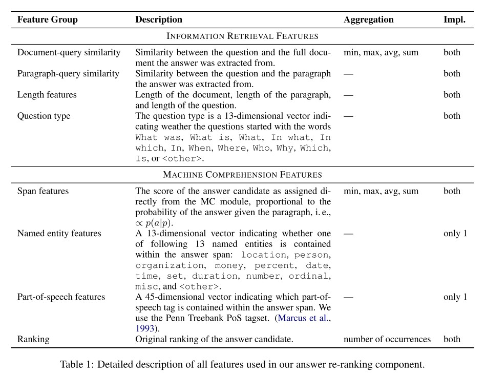

#### 2.3.2 答案聚合
作者将答案片段一样的候选答案进行合并，保留排序更靠前的特征。此外，还生成4种其它的聚合特征：  
(1) 各个答案片段相同的候选答案出现的次数；  
(2) 第一次出现的名次；  
(3) 相同答案片段得分的总和、均值、最小值与最大值；  
(4) 相同答案片段的文档-问题相似度的总和、均值、最小值与最大值。

#### 2.3.3 重排序网络
每个候选答案重排序得分通过一个两层的前馈网络预测得到，即：

$$
f(x_i) = \text{ReLU}(x_i A^T + b_1) B^T + b_2
$$

### 2.4 损失函数与采样方式
作者发现将所有正负样本采样完毕后，用二分类或回归损失很难对模型进行训练，因此作者提出了新的损失函数与子采样(sub-sampling)方式。

对于损失函数，作者采用了成对排序损失(pair-wise ranking loss) $L_{rank}$和一个正则损失$L_{reg}$。给定一个问题的两个候选答案$i, j, i \neq j$，二元变量$y_i, y_j$指示各个答案是否正确，则成对排序损失表示如下：

$$
L_{rank}(x_i, x_j) = [y_i - \sigma(f(x_i) - f(x_j))]^2
$$

总损失$L$为：

$$
\begin{array}{cl}
&L = L_{rank} + \lambda L_{reg} \\\\ 
&L_{reg} = ||A||_1 + ||B||_1 + ||b_1||_1 + ||b_2||_1
\end{array}
$$

对于采样方式，由于训练时大部分生成的候选答案是错误的，因此作者采用了一种子采样方式。在生成前k个候选答案后，先将排序相邻的每对答案$(x_i, x_j), j = i + 1$进行采样，之后在训练时只训练排序靠前的答案对，如$j<4$。在测试时不进行子采样，对所有候选答案打分后选择得分最高的答案。

---

# Improving Question Answering over Incomplete KBs with Knowledge-Aware Reader
Wenhan Xiong, Mo Yu, Shiyu Chang, Xiaoxiao Guo, and William Yang Wang. [Improving Question Answering over Incomplete KBs with Knowledge-Aware Reader](https://www.aclweb.org/anthology/P19-1417.pdf). ACL 2019.

## 1. 贡献
作者通过将文本信息与不完整的知识图谱相结合，提出了一个端到端模型，提高了事实型问答系统(factoid question answering)的表现，以更高效的方式取得了当前最好的效果。

## 2 问题定义
本文的问答系统需要两部分知识，知识图谱三元组$\mathcal{K} = \\{(e_s, r, e_o)\\}$和检索到的维基百科文档$\mathcal{D}$。为了使系统可拓展性更好，作者采用Personalized PageRank算法从问题中提到的主题实体(topic entity) $\mathcal{E}_0 = \\{e | e \in Q\\}$中检索出一个子图谱(subgraph)。文档$\mathcal{D}$由DrQA的文档检索器检索得到，并通过Lucene index算法进一步排序。同时，文档中的实体也被标记并链接到知识图谱实体上。对于每个问题，模型从所有知识图谱与所有文档的实体中选择一个答案实体。

## 3. 方法
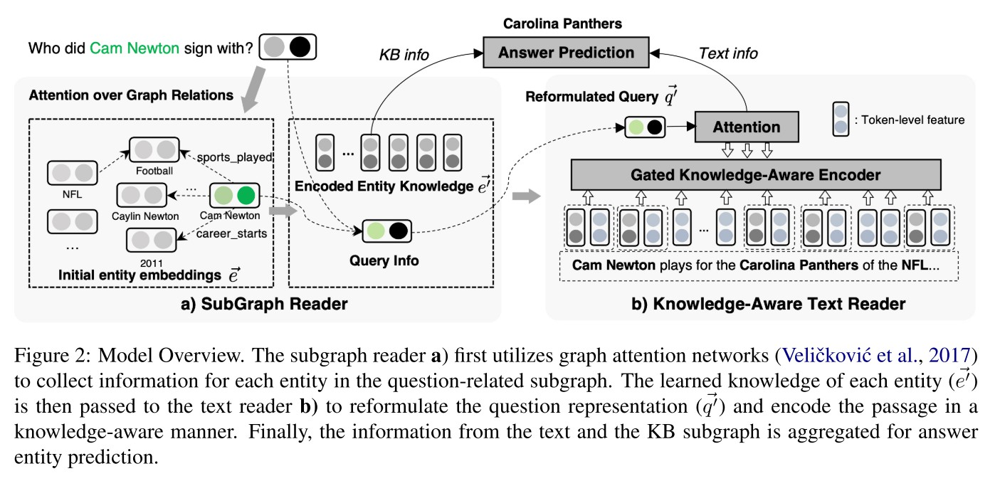

作者所提模型主要包括2个部分，知识图谱阅读器(sub-graph reader, SGR)与知识感知型文本阅读器(knowledge-aware text reader, KAR)。

### 3.1 知识图谱阅读器
知识图谱阅读器SGR采用图注意力机制将每个图谱上的实体$e$从其相连的各个邻居实体$N_e$积聚知识。对于某个图谱实体，其作用有两点：(1) 其与邻居的关系是否与问题相关；(2) 其邻居实体是否是问题提到的主题实体。具体地，SGR主要包括3个部分：问题-关系匹配(question-relation matching)、对主题实体邻居(topic entity neighbors)额外的注意力机制、以及来自邻居的信息传播(information propagation)。

#### 3.1.1 问题-关系匹配
为了将问题和知识图谱关系在一个同构的潜空间(isomorphic latent space)进行匹配，作者采用了一个权重共享的LSTM对问题$\\{w_1^q, ..., w_{l_q}^q\\}$和关系词$\\{w_1^r, ..., w_{l_r}^r\\}$进行编码，由此可得问题和关系的隐层特征$h^q \in \mathbb{R}^{l_q \times d_h}$和$h^r \in \mathbb{R}^{l_r \times d_h}$。之后，作者首先对各个关系特征进行自注意力编码，得到一个加权关系特征$\vec{r}$，即：

$$
\vec{r} = \sum_i \alpha_i \vec{h_i^r}, \alpha \propto \text{exp}(\vec{w_r} \cdot \vec{h_i^r})
$$

接着，作者将问题与各个关系特征进行注意力编码，并将得到的问题-关系加权特征与上述关系自加权特征$\vec{r}$进行相乘，得到一个更细粒度的匹配得分$s_r$，即：

$$
s_r = \vec{r} \cdot \sum_j \beta_j \vec{h_j^q}, \beta_j \propto \text{exp}(\vec{r} \cdot \vec{h_j^q})
$$

#### 3.1.2 主题实体邻居的注意力机制
如果某个实体$e$的一个邻居实体$(r_i, e_i)$与问题中的一个主题实体相链接，那么对应的三元关系组$(e, r_i, e_i)$与问题的相关度应该比其它非主题实体关系组更高。基于此，作者提出了一个二元指示特征$I[e_i \in \mathcal{E}\_0]$，则每一个邻居实体$(r_i, e_i)$最终的注意力得分$\tilde{s}_{(r_i, e_i)}$可表示为：

$$
\tilde{s}_{(r_i, e_i)} \propto \text{exp}(I[e_i \in \mathcal{E}_0] + s\_{r_i})
$$

#### 3.1.3 来自邻居的信息传播
对于图谱上的任一实体$e$，为了将其邻居实体$e_i$的信息积聚其上，作者定义了一个门控函数，控制该实体与其邻居实体信息的相对重要程度，积聚邻居信息后的实体特征$e'$由下式可得：

$$
\begin{array}{cl}
&\vec{e'} = \gamma^e \vec{e} + (1 - \gamma^e) \sum_{(e_i, r_i) \in N_e} \tilde{s}\_{(r_i, e_i)} \sigma (W_e [\vec{r_i}; \vec{e_i}]) \\\\
&\gamma^e = g(\vec{e}, \sum_{(e_i, r_i) \in N_e} \tilde{s}_{(r_i, e_i)} \sigma (W_e [\vec{r_i}; \vec{e_i}])) \\\\
&g(x, y) = \text{sigmoid}(W[x; y])
\end{array}
$$

其中$\sigma$是激活函数，$\gamma^e$是线性门控系数。

### 3.2 知识感知型文本阅读器
知识感知型文本阅读器KAR是在DrQA所提的阅读理解模型的基础上进行了一定的改进，使其可以学习更多的知识图谱知识，主要包括3个部分：潜空间的问题重构(query reformulation)、知识感知段落信息增强(knowledge-aware passage enhancement)、以及来自文本阅读的实体信息聚合(entity info aggregation)。

#### 3.2.1 潜空间的问题重构
该部分通过将问题内的主题实体对应的知识图谱特征整合进问题特征中，使得阅读器可以区分文本匹配外的相关信息。首先对问题特征$h^q$进行自注意力编码，可得$\vec{q} = \sum_i b_i \vec{h_i^q}$；之后收集问题中主题实体的知识图谱特征，可得$\vec{e^q} = \sum_{e \in \mathcal{E}_0} \vec{e'} / |\mathcal{E}_0|$；接下来，作者采用门控函数得到最终的问题特征$\vec{q'}$，即：

$$
\begin{array}{cl}
&\vec{q'} = \gamma^q \vec{q} + (1 - \gamma^q) \text{tanh}(W^q [\vec{q}; \vec{e^q}; \vec{q} - \vec{e^q}]) \\\\
&\gamma^q = \text{sigmoid}(W^{gq} [\vec{q}; \vec{e^q}; \vec{q} - \vec{e^q}])
\end{array}
$$

#### 3.2.2 知识感知段落信息增强
该部分通过各个段落内实体链接标注，将各个实体的知识图谱特征融合进来，并采用门控机制得到段落内每个词的特征。给定段落内的一个词$w_i^d$、其词特征$\vec{f_{w_i}^d}$、以及其知识图谱链接实体$e_{w_i}$，则每个词的知识感知特征$\vec{i_{w_i}^d}$可由下式得到：

$$
\begin{array}{cl}
&\vec{i_{w_i}^d} = \gamma^d \vec{e'\_{w_i}} + (1 - \gamma^d) \vec{f\_{w_i}^d} \\\\
&\gamma^d = \text{sigmoid}(W^{gd} [\vec{q} \cdot \vec{e'\_{w_i}}; \vec{q} \cdot \vec{f\_{w_i}^d}])
\end{array}
$$

#### 3.2.3 来自文本阅读的实体信息聚合
作者通过一个双向LSTM将知识增强后的词特征$\vec{i_{w_i}^d}$进行编码，得到词最终特征$\vec{h_{w_i}^d}$，并计算各个词与问题的注意力得分$\lambda_i = \vec{q'}^T \vec{h_{w_i}^d}$，以及每个文档的注意力加权特征$\vec{d} = \sum_i \lambda_i \vec{h_{w_i}^d}$。那么，对于对于一个给定的实体$e$和所有包含该实体的文章$\mathcal{D}^e = \\{d | e \in d\\}$，该实体的聚合特征可表示为$\vec{e_d} = \frac{1}{|\mathcal{D}^e|} \sum_{d \in \mathcal{D^e}} \vec{d}$。

### 3.3 答案预测
有了实体特征$\vec{e'}$和$\vec{e^d}$，那么每个实体为真实答案的概率可以表示为$s^e = \sigma_s(\vec{q'}^T W_s [\vec{e'}; \vec{e^d}])$。

---

# (MUPPET) Multi-Hop Paragraph Retrieval for Open-Domain Question Answering
Yair Feldman, and Ran El-Yaniv. [Multi-Hop Paragraph Retrieval for Open-Domain Question Answering](https://www.aclweb.org/anthology/P19-1222.pdf). ACL 2019.

## 1. 贡献
(1) 作者提出了一个新颖的多跳检索(multi-hop retrieval)方法，对解决开放域多跳问答任务很有帮助；

(2) 作者所提方法在单跳和多跳开放域问答数据集上都取得了最好的效果；

(3) 作者提出了用句子特征进行检索的方法，实验表明该方法比用段落特征检索的效果更好。

## 2. 方法
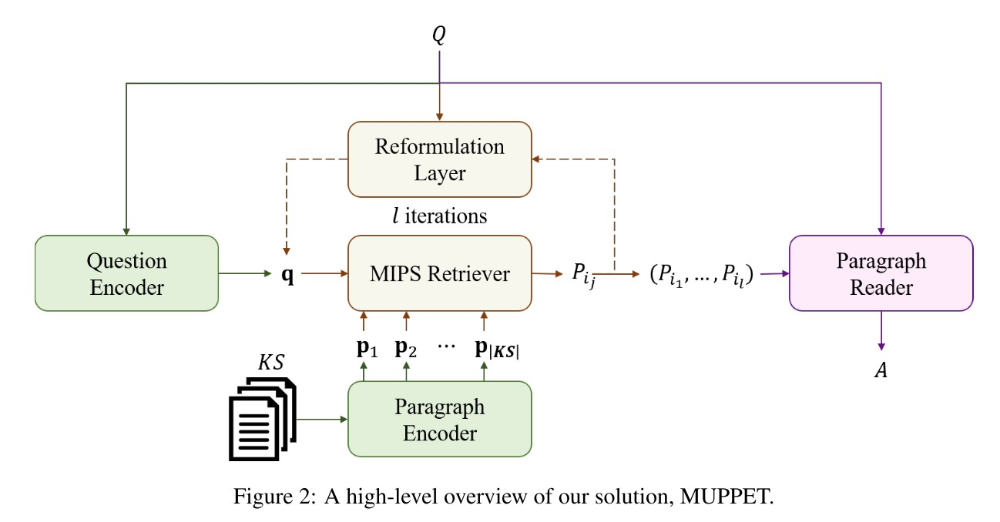

作者所提多跳检索方法的大致思路是，对于一个问题$Q$，首先将其编码为搜索向量$q^s \in \mathbb{R}^d$，用来检索前k个最相关的段落$\\{P_1^Q, ..., P_k^Q\\} \subset \text{KS}$；在随后的检索迭代中，作者用上一次迭代检索到的段落对搜索向量进行调整，得到k个新搜索向量$\\{\tilde{q}_1^s, ..., \tilde{q}_k^s\\}, \tilde{q}_i^s \in \mathbb{R}^d$，再用和之前迭代同样的方法检索出新一轮的前k个段落。该过程可以视为在段落编码空间进行的宽度为k的beam搜索。

### 2.1 段落与问题编码
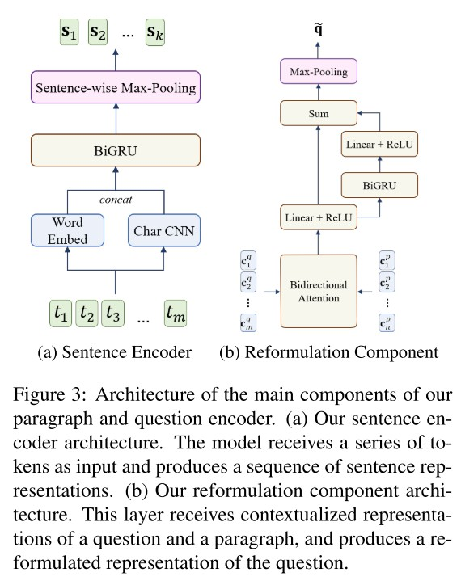

#### 2.1.1 段落编码
对于段落编码，作者对段落内的每个句子进行分别编码，而非像之前的做法，对整个段落进行整体编码。作者首先对段落内的每个词进行编码，之后利用这些词编码对每个句子进行编码。

对于词编码，作者采用了字符级嵌入(character-level embedding)与词级嵌入(word-level embedding)相结合的方式。在字符级嵌入中，作者先用一个一维卷积神经网络对每个长为$l_t$词的各个字符嵌入$t_i^c$进行编码，之后进行全局最大池化，得到每个词唯一的字符级嵌入$t^c$，即$t^c = \text{max}(\text{CNN}(t_1^c, ..., t_{l_t}^c))$；词级嵌入$t^w$则直接用预训练词嵌入GloVe表达。最终，每个词特征$t$可表示为$t = [t^w; t^c]$。

对于句子编码，作者先用双向GRU模型对词特征编码，得到各个词的语境特征(contextualized representation)：

$$
(c_1, ..., c_m) = \text{BiGRU}(t_1, ..., t_m)
$$

其中$m$为段落内词总数。之后将各个词划分入各自对应的句子组中，并各自进行全局最大池化，即可得到每个句子的特征$s_i$，即$s_i = \text{max}(c_{i_1}, ..., c_{i_l})$，$l$为第$i$个句子的长度。

#### 2.1.2 问题编码
对于第一次检索迭代，问题编码方式与段落编码类似，但不考虑句子层面的信息，而是将问题进行整体编码，即对各个问题词的语境特征进行全局最大池化，得到问题特征$q$。

对于随后的检索迭代，作者将上一次迭代的问题词语境特征$(c_1^q, ..., c_{n_q}^q)$和段落词语境特征$(c_1^p, ..., c_{n_p}^p)$作为输入，生成新一轮迭代的问题特征。首先将这两个语境特征通过一个双向注意力(bidirectional attention)层进行编码。问题词$i$和段落词$j$的注意力可表示为：

$$
a_{ij} = w_1^a \cdot c_i^q + w_2^a \cdot c_j^p + w_3^a \cdot (c_i^q \odot c_j^p)
$$

则每个问题词的注意力特征$a_i^q$为：

$$
\begin{array}{cl}
&a_i^q = \sum_{j=1}^{n_p} \alpha_{ij} c_j^p \\\\
&\alpha_{ij} = \frac{e^{a_{ij}}}{\sum_{j=1}^{n_p} e^{a_{ij}}}
\end{array}
$$

段落对问题的整体注意力特征$a^p$为：

$$
\begin{array}{cl}
&a^p = \sum_{i=1}^{n_q} \beta_i c_i^q \\\\
&\beta_i = \frac{e^{m_i}}{\sum_{i=1}^{n_q} e^{m_i}} \\\\
&m_i = \max_{i \leq j \leq n_p} a_{ij}
\end{array}
$$

之后作者将$c_i^q, a_i^q, c_i^q \odot a_i^q, a^p \odot a_i^q$拼接起来送入一层带ReLU的线性层，同时用一个残差连接将该特征与该特征通过一个双向GRU和一个带ReLU线性层的另一特征进行求和，得到最终的双向注意力向量。最后通过一个全局最大池化，得到新一轮迭代的问题特征$\tilde{q}$。

#### 2.1.3 问题-段落相关得分
给定一个包含$n_k$个句子的段落$P$，其各个句子的特征为$\\{s_1, ..., s_{n_k}\\}$；以及一个问题$Q$，其特征为$q$，则$Q$与$P$的相关度为：

$$
\text{rel}(Q, P) = \max_{i = 1, ..., n_k} \sigma(\begin{bmatrix} s_i \\\ s_i \odot q \\\ s_i \cdot q \\\ q \end{bmatrix}^T \cdot \begin{bmatrix} w_1 \\\ w_2 \\\ w_3 \\\ w_4 \end{bmatrix} + b)
$$

其中，$w_1, w_2, w_4 \in \mathbb{R}^d, w_3, b \in \mathbb{R}$。

#### 2.1.4 训练与损失函数
每一个训练样本包含一个问题和两个段落，$(Q, P^1, P^2)$，其中$P^i$对应第$i$次迭代检索到的段落。各个迭代的损失形式相同，最终的损失是各个迭代损失之和。每个迭代的损失函数包括两部分：二元交叉熵损失(binary cross-entropy loss)和排序损失(ranking loss)，其中交叉熵损失$L_{CE}$可表示为：

$$
L_{CE} = -\frac{1}{N} \sum_{i = 1}^N y_i \text{log}(\text{rel}(Q_i, P_i)) + (1 - y_i) \text{log} (1 - \text{rel}(Q_i, P_i))
$$

其中$N$表示当前批量的样本数。对于排序损失，首先计算出每个批量内和与问题$Q_i$相对应的所有正负样本的相关度均值$q_i^{pos}$和$q_i^{neg}$，即：

$$
\begin{array}{cl}
&q_i^{pos} = \frac{1}{M_1} \sum_{j=1}^{M_1} \text{rel}(Q_i, P_i) \\\\
&q_i^{neg} = \frac{1}{M_2} \sum_{j=1}^{M_2} \text{rel}(Q_i, P_i)
\end{array}
$$

其中$M_1$和$M_2$是问题$Q_i$对应的正负样本数。则余量(margin)排序损失$L_R$可定义为：

$$
L_R = \frac{1}{M} \sum_{i = 1}^M \max(0, \gamma - q_i^{pos} + q_i^{neg})
$$

其中$M$是当前批量中不同问题的个数。最终损失$L$如下：

$$
L = L_{CE} + \lambda L_R
$$

### 2.2 段落阅读器
该部分模型与问题特征调整模型很相似，首先用和上述同样的方法分别得到问题和段落的词语境特征，并将其送入双向注意力层，但与之前不同的是，问题和段落在公式中的角色互换。之后通过类似的残差网络得到最终注意力特征，但在双向GRU与后面的线性层之间增添一个段落自注意层。最后将该特征送入预测层，首先通过一个双向GRU层和一个线性层预测答案片段起始位置得分；之后将该GRU层输出特征与输入注意力特征进行拼接送入另一个双向GRU层和线性层，预测答案片段结束位置得分。

该阅读器的起始位置损失$L_{start}$可由下式表示：

$$
L_{start} = -\text{log}(\frac{\sum_{j \in P^Q} \sum_{k \in A_j} e^{s_{kj}}}{\sum_{j \in P^Q}{\sum_{i=1}^{n_j} e^{s_{ij}}}})
$$

其中，$P^Q$是和同一问题$Q$相匹配的段落集合，$A_j$是第$j$个段落里所有答案片段的起始词集合，$s_{ij}$是第$j$个段落里第$i$个词的预测得分。阅读器的结束位置损失$L_{end}$形式与上式一致。阅读器最终的损失为$L_{span} = L_{start} + L_{end}$。

---

## *II. Question Generation*

# Learning to Ask Questions in Open-domain Conversational Systems with Typed Decoders
Yansen Wang, Chenyi Liu, Minlie Huang, and Liqiang Nie. [Learning to Ask Questions in Open-domain Conversational Systems with Typed Decoders](https://www.aclweb.org/anthology/P18-1204.pdf). ACL 2018.

## 1. 贡献
(1) 作者提出了在对话系统下的问题生成这一新任务，其与传统的问题生成任务有两点区别：

(a) 首先，在问答系统下的问题生成中，对于同样的输入会有多种提问模式(questioning pattern)，如是否问题或Wh系列问题，不同的提问模式使得对话交互得更丰富灵活；而在传统的问题生成中，需要生成问题的答案语句通常是预先指定的，并直接决定了提问模式。例如，对给定的人进行Who提问，对给定的地点进行Where提问；

(b) 其次，在问答系统下的问题生成中，对于给定的输入需要自然地引出过渡话题，通常需要场景理解(scene understanding)，通过与输入相关的主题词引出过渡话题。例如，对于输入"I went to dinner with my friends."，我们可以对friends或cuisine, price, place, taste等相关主题词进行提问；而在传统的问题生成中，需要提问的核心信息是预先指定的静态信息，其更需要的是意译(paraphrasing)。

(2) 基于以上分析，作者认为一个好问题包含3个类型的词：疑问词(interrogative)，指示提问模式；话题词(topic word)，处理话题过渡的关键信息；以及普通词(ordinary word)，使整个句子句法和语法更自然。基于此，作者提出了软硬类型解码器捕捉不同类型词的信息来提出好问题。这样的类型解码器还可用于其它词语义类型已知的生成任务中。

## 2. 方法
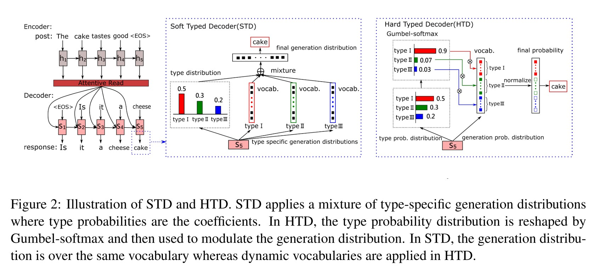

### 2.1 编码-解码器框架
在传统的编码-解码器框架中，编码器部分通过GRU模型将输入词向量进行编码得到隐层特征序列$h_t$：

$$
h_t = \text{GRU}(h_{t - 1}, e(x_t))
$$

解码器部分通过概率$P(y_t | y_{<t}, X)$生成单词序列，由下式计算得到：

$$
\begin{array}{cl}
&P(y_t | y_{<t}, X) = \text{MLP}(s_t, e(y_{t - 1}), c_t) \\\\
&s_t = \text{GRU}(s_{t - 1}, e(y_{t - 1}), c_t) \\\\
&c_t = \sum_{i = 1}^{T} \alpha_{ti} h_i \\\\
&\alpha_{ti} = \frac{\text{exp}(e_{ti})}{\sum_{k = 1}^{T} \text{exp}(e_{tk})} \\\\
&e_{ti} = \text{MLP}(s_{t - 1}, h_i)
\end{array}
$$

其中$s_t$是解码器在$t$时刻的隐层特征，$c_t$是$t - 1$时刻解码器隐层特征关于编码器在1至$t-1$时刻隐层特征的注意力特征。

### 2.2 软类型解码器(soft typed decoder, STD)
STD隐式地指示词的类型，其生成的概率分布$P(y_t | y_{<t}, X)$可表示为：

$$
\begin{array}{cl}
&P(y_t | y_{<t}, X) = \sum_{i = 1}^k P(y_t | ty_t = c_i, y_{<t}, X) \cdot P(ty_t = c_i | y_{<t}, X) \\\\
&P(ty_t | y_{<t}, X) = \text{softmax}(W_0 s_t + b_0) \\\\
&P(y_t | ty_t = c_i, y_{<t}, X) = \text{softmax}(W_{c_i} s_t + b_{c_i})
\end{array}
$$

其中，$ty_t$指$t$时刻的词类型，$c_i$是一个词类型（疑问词、话题词或普通词）；$W_0 \in R^{k \times d}$，$k$是词类型总数为3；$W_{c_i} \in R^{|V| \times d}$，$|V|$是整个单词表大小。

### 2.3 硬类型编码器(hard typed decoder, HTD)
HTD显示地指示词的类型，其生成的概率分布$P(y_t | y_{<t}, X)$可表示为：

$$
\begin{array}{cl}
&P(y_t | y_{<t}, X) = P(y_t | ty_t = c^\*, y_{<t}, X) \\\\
&c^\* = \underset{c_i}{\text{argmax}} P(ty_t = c_i | y_{<t}, X)
\end{array}
$$

为了使操作可微分，作者用Gumbel-Softmax来近似argmax，则所有单词的概率分布$P'(y_t | y_{<t}, X)$为：

$$
\begin{array}{cl}
&P'(y_t | y_{<t}, X) = P(y_t | y_{<t}, X) \cdot \text{Gumbel-Softmax}(P(ty_t = c(y_t) | y_{<t}, X)) \\\\
&P(y_t | y_{<t}, X) = \text{softmax}(W_0 s_t + b_0) \\\\
&P(ty_t | y_{<t}, X) = \text{softmax}(W_1 s_t + b_1) \\\\
&\text{Gumbel-Softmax}(\pi_i) = \frac{e^{(\text{log}(\pi_i) + g_i) / \tau}}{\sum_{j = 1}^k e^{(\text{log}(\pi_j) + g_j) / \tau}}
\end{array}
$$

其中，对于每个词会得到$k(k=3)$个Gumbel-Softmax预测值，但只将与该词类型对应的那一个概率作用在该词上。最终将$P'(y_t | y_{<t}, X)$进行归一化得到最终的词概率分布。

### 2.4 损失函数
作者采用预测词与预测词类型的联合交叉熵损失作为总损失函数$\Phi$，表示如下：

$$
\begin{array}{cl}
&\Phi_1 = \sum_t -\text{log} P(y_t = \tilde{y_t} | y_{<t}, X) \\\\
&\Phi_2 = \sum_t -\text{log} P(ty_t = \tilde{ty_t} | y_{<t}, X) \\\\
&\Phi = \Phi_1 + \lambda \Phi_2
\end{array}
$$

其中$\tilde{y_t}$和$\tilde{ty_t}$表示$t$时刻的参考词与参考词类型。

### 2.5 词类型划分
作者将句子里的词划分成3个类别：疑问词、话题词与普通词。在训练时，作者手工收集了20个疑问词，将问题中的动词和名词视为话题词，将其它词视为普通词。在测试时，由于HTD需要显示地指定词的类型，因此依然需要划分各个词的类别。疑问词和普通词划分方式与训练时一致，话题词通过PMI算法预测，每个提问词$k_i$与其对应输入帖子$X$的话题相关度$\text{Rel}(k_i, X)$可表示为：

$$
\begin{array}{cl}
&\text{Rel}(k_i, X) = \sum_{w_x \in X} e^{\text{PMI}(w_x, k_i)} \\\\
&\text{PMI}(w_x, w_y) = \text{log} \frac{p(w_x, w_y)}{p_1(w_x) \times p_2(w_y)}
\end{array}
$$

其中，$p1(w) / p2(w)$表示词$w$在一个输入帖子/提问语句中出现的概率，$p(w_x, w_y)$表示词$w_x$出现在一个输入帖子且词$w_y$出现在对应提问语句中的概率。在测试时，作者对于一个输入帖子预测至多20个话题词，太少的词会影响语法性，太多的词会导致更宽泛的提问。

---

# Interconnected Question Generation with Coreference Alignment and Conversation Flow Modeling
Yifan Gao, Piji Li, Irwin King, and Michael R. Lyu. [Interconnected Question Generation with Coreference Alignment and Conversation Flow Modeling](https://www.aclweb.org/anthology/P19-1480.pdf). ACL 2019.

## 1. 贡献
(1) 作者提出了一个对话问题生成(conversational question generation, CQG)的新任务，在该场景下，系统需要用问答对话的方式根据文章提出一系列相互关联的问题，在第一轮对话后的每个问题都与对话历史相关；

(2) 在对话问答数据集CoQA上，作者提出的框架效果超过了现有的一些基准模型；同时，作者提出的共指对齐(coreference alignment)方法可以极大地提升生成的代词指代(pronominal reference)的准确度与召回度。

## 2. 问题定义
对话问题生成任务的定义为，给定一个段落$P$，一个对话历史$C_{i - 1} = \\{(Q_1, A_1), ..., (Q_{i - 1}, A_{i - 1})\\}$，以及当前的答案$A_i$，CQG任务是生成下一轮对话的问题$\bar{Q_i}$，即：

$$
\bar{Q_i} = \underset{Q_i}{\text{argmax}} \text{Prob}(Q_i | P, A_i, C_{i - 1})
$$

作者将该问题定义为答案感知型(answer-aware)问题生成任务，即在生成问题之前，答案语句要事先给定，其中答案语句是段落中的若干文本片段(text fragment)。

## 3. 方法
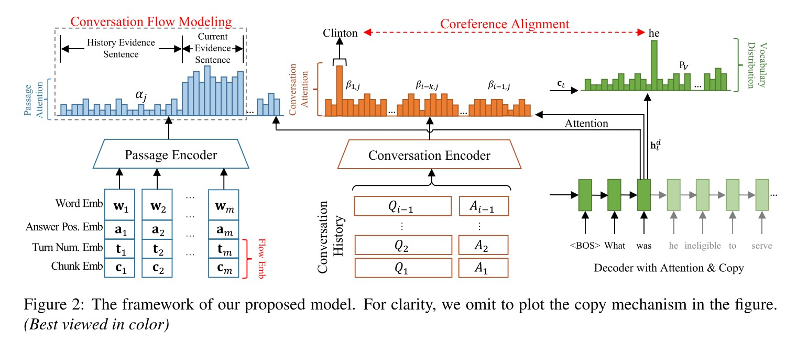

作者所提的框架主要包括4个部分：多源编码器(multi-source encoder)、带拷贝机制的解码器(decoder with copy mechanism)、共指对齐(coreference alignment)、以及对话流建模(conversation flow modeling)。

### 3.1 多源编码器
#### 3.1.1 段落编码器
段落编码器是一个双向LSTM模型，对段落中的词嵌入$w$与答案位置嵌入$a$拼接后的特征$x_i = [w_i; a_i]$进行编码。其中答案位置嵌入是通过传统的BIO标记方法得到的，对段落中的答案片段与非答案片段进行标记，每个词的类别为(B_ANS, I_ANS, O)。整个段落的特征可表示为$(h_1^p, ..., h_m^p)$，其中$m$为句子长度。

#### 3.1.2 对话编码器
作者用符号\<q\>\<a\>将对话历史中的每个问题答案对拼接成$(\<q\>, q_1, ..., q_m; \<a\>,  a_1, ..., a_m)$形式。首先用词级别(token level)的双向LSTM对每个问题答案对编码为$(h_{i - k, 1}^w, ..., h_{i - k, m}^w)$，其中$i - k$是对话轮数，$k \in [1, i)$。为了对对话历史不同轮数的依赖关系进行建模，作者采用了语境级别(context level)的双向LSTM得到不同轮数间的语境依赖特征$(h_1^c, ..., h_{i - 1}^c)$。

### 3.2 带注意力机制和拷贝机制的解码器
解码器采用另一个LSTM预测单词的概率分布。在每个解码时刻$t$，解码器读入词嵌入$w_t$和前一时刻的隐层特征$h_{t - 1}^d$生成当前隐层特征$h_t^d = \text{LSTM}(w_t, h_{t - 1}^d)$。之后通过下式计算得到段落注意力$\alpha_j$和对话注意力$\beta_{i - k, j}$，并由此确定段落特征与各个历史对话特征的相对重要程度：

$$
\begin{array}{cl}
&\alpha_j = \frac{e_j^p}{e_{total}} \\\\
&\beta_{i - k, j} = \frac{e_{i - k, j}^w \times e_{i - k}^c}{e_{total}} \\\\
&e_j^p = {h_j^p}^T W_p h_t^d \\\\
&e_{i - k, j}^w = {h_{i - k, j}^w}^T W_w h_t^d \\\\
&e_{i - k}^c = {h_{i - k}^c}^T W_c h_t^d
\end{array}
$$

其中$e_{total} = \sum_j e_j^p + \sum_{k, j} e_{i - k, j}^w \times e_{i - k}^c$。最后，语境向量$c_t$和最终单词概率分布$P_V$可表示为：

$$
\begin{array}{cl}
&c_t = \sum_j \alpha_j h_j^p + \sum_{j, k} \beta_{i - k, j} h_{i - k, j}^w \\\\
&P_V = \text{softmax}(W_v (\text{tanh}(W_a [h_t^d; c_t])) + b_v)
\end{array}
$$

作者还采用了拷贝机制，具体内容可参见：[Get To The Point: Summarization with Pointer-Generator Networks](https://www.aclweb.org/anthology/P17-1099.pdf)。

### 3.3 共指对齐
共指对齐建模可以让解码器在对话注意力分布中关注到正确的非代词共指对象(non-pronominal coreferent mention)，如Clinton，以生成对应的代词参考词(pronominal reference word)，如he。作者采用了两阶段方法：

(1) 在预处理阶段(pre-processing stage)，给定对话历史$C_{i - 1}$和包含代词参考词（如he）的问题$Q_i$，作者通过一个共指消解系统（可参考：[Deep reinforcement learning for mention-ranking coref- erence models](https://www.aclweb.org/anthology/D16-1245.pdf)）找到其在$C_{i - 1}$中对应的共指对象$(w_1^c, ..., w_m^c)$（如clinton）；

(2) 在训练阶段，作者设计了一个针对共指对象对话注意力$\beta_i^c$和其代词参考词概率$p_{coref} \in P_V$的损失函数，该共指损失$L_{coref}$为：

$$
L_{coref} = -(\lambda_1 \text{log} \frac{\sum_j \beta_j^c}{\sum_{k, j} \beta_{i - k, j}} + \lambda_2 \text{log} p_{coref}) \times s_c
$$

其中$s_c$是在预处理阶段非代词共指对象与其代词参考词之间的置信度得分(confidence score)。

### 3.4 对话流建模
另一个关键的CQG挑战是，在不同论对话间一定要有平滑的过渡词。作者发现，随着对话的进行，大部分问题的关注点从段落的开始渐渐地转移到段落的结尾。因此作者以这个方向对对话流建模以学习不同对话轮数间的过渡词。

#### 3.4.1 流嵌入(flow embedding)
在该部分作者为段落里面的每个词增加了2个嵌入：轮数嵌入$[t_1, ..., t_n]$，n是考虑的最大轮数；相对位置嵌入$[c_1, ..., c_L]$，段落被均匀地划分为L组句子。则最终的词嵌入特征为单词嵌入、答案位置嵌入和这两个流嵌入的拼接特征，即$x_i = [w_i; a_i; t_i; c_i]$。此外作者还引入了门控自注意力机制(gated self-attention mechanism)，先对加入流嵌入的新的段落特征$H^p = [h_1^p, ..., h_m^p]$进行自注意力操作：

$$
\begin{array}{cl}
&\alpha_j^p = \text{softmax}({H^p}^T W_s h_j^p) \\\\
&u_j^p = H^p \alpha_j^p \\\\
&f_j^p = \text{tanh}(W_f [h_j^p; u_j^p])
\end{array}
$$

之后最终的段落特征$\tilde{h}_j^p$由门控机制得到：

$$
\begin{array}{cl}
&\tilde{h}_j^p = g_t^p \odot f_j^p + (1 - g_t^p) \odot h_j^p \\\\
&g_t^p = \text{sigmoid}(W_g [h_j^p; u_j^p])
\end{array}
$$

#### 3.4.2 流损失(flow loss)
流损失用来显示地告诉模型哪些在答案周围的句子对生成当前轮问题更有帮助，含有更多有用信息。作者对段落中的句子定义了2种类型：如果一个句子会对当前问题提供有用信息，称之为当前依据句子(current evidence sentence, CES)；如果一个句子可以对对话历史提供有用信息，但与当前问题不相关，称之为历史依据句子(history evidence sentence, HES)。之后对于二者的段落注意力$\alpha_j$，通过流损失使得模型关注当前依据句子，而忽视历史依据句子。流损失$L_{flow}$可表示为：

$$
L_{flow} = -\lambda_3 \text{log} \frac{\sum_{j:w_j \in \text{CES}} \alpha_j}{\sum_j \alpha_j} + \lambda_4 \text{log} \frac{\sum_{j:w_j \in \text{HES}} \alpha_j}{\sum_j \alpha_j}
$$

则模型总损失$L$为seq2seq模型的交叉熵损失$L_{null}$、共指损失$L_{coref}$与流损失$L_{flow}$之和：

$$
\begin{array}{cl}
&L = L_{null} + L_{coref} + L_{flow} \\\\
&L_{null} = -\text{log} \text{Prob}(Q_i | P, A_i, C_{i - 1})
\end{array}
$$

---

# Learning to Ask More: Semi-Autoregressive Sequential Question Generation under Dual-Graph Interaction
Zi Chai, and Xiaojun Wan. [Learning to Ask More: Semi-Autoregressive Sequential Question Generation under Dual-Graph Interaction](https://www.aclweb.org/anthology/2020.acl-main.21.pdf). ACL 2020.

## 1. 贡献
(1) 当存在一个序列答案时，序列问题生成(sequential question generation, SQG)任务旨在生成一系列相互关联(interconnected)的问题。传统方法将该任务看作对话问题生成(conversational question generation, CQG)任务，即当前轮对话问题是以之前轮对话的输出自回归式(autoregressive)地生成。但这样的方式存在两个问题：首先，这些模型存在错误叠加(error cascade)的问题，越往后生成的问题长度越短、质量越低、与给定的答案越不相关；其次，模型很难捕捉长距离的共指关系(long-distance coreference)。本质上，SQG任务与CQG任务是不同的，其所有的答案是预先给定的，在文本生成过程中充当严格的语义约束(strict semantic constraint)。

**作者第一次没将SQG任务视为CQG任务**，通过半自回归式(semi-autoregressive)进行问题生成，抛弃了不同组问题间的递归依赖(recurrent dependency)，解决了错误叠加的问题，并提出了一种由粗到细的文本生成方式进行长距离共指消解(coreference resolution)；

(2) 之前的工作将SQG任务在CoQA上实验，但CoQA是对话问答数据集，很多数据不适用于SQG任务。一些工作直接删除掉了这些数据，但剩余的问题可能互不相关，很多代词指代的共指实体词并不明确。

**作者第一次为SQG任务构建了专门的数据集**，从CoQA中构建了包含7.2K段落、81.9K问题的数据集；

(3) 通过大量实验表明，作者所提模型的效果大幅度地超越了之前的工作。

## 2. 方法
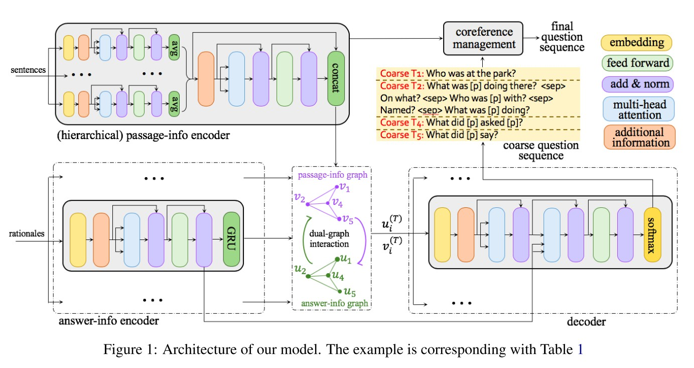

### 2.1 问题定义
在SQG任务中，输入是一个包含$n$个句子的段落$P = \\{S_i\\}\_{i = 1}^n$和一个包含$l$个答案的答案序列$\\{A_i\\}\_{i = 1}^l$，每个答案$A_i$是段落$P$里面的一个片段；输出是一系列问题$\\{Q_i\\}\_{i = 1}^l$，每个问题$Q_i$可以根据输入段落$P$和之前的问题答案对由答案$A_i$回答。

作者用半自回归的方式解决SQG任务，将目标问题划分成不同组，组内的问题紧密相关，组间的问题相互独立。划分的依据是，如果两个答案来自同一个句子，则这两个答案对应的问题可视为相互关联的。具体地，如果第$k$个句子$S_k$包含$p$个答案，则将其划分进第$k$个答案组$\mathbb{G}\_k^{ans} = \\{A_{j_1}, ..., A_{j_p}\\}$中，由此得到对应的第$k$个问题组$\mathbb{G}\_k^{ques} = \\{Q_{j_1}, ..., Q_{j_p}\\}$，并将其拼接成一个句子作为训练时生成句子的目标输出，即$"Q_{j_1} [sep] Q_{j_2} [sep] ... [sep] Q_{j_p}"$。以如下例子说明：

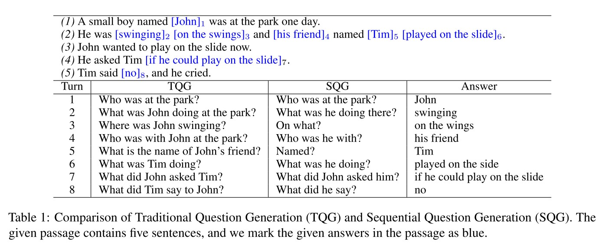

其中，前两个段落句子的答案组为：$\mathbb{G}_1^{ans}$ = "John"，$\mathbb{G}_2^{ans}$ = "swinging [sep] on the swings [sep] ... [sep] played on the side"；前两个段落句子的问题组为：$\mathbb{G}_1^{ques}$ = "Who was at the park?"，$\mathbb{G}_2^{ques}$ = "What was he doing there? [sep] On what? [sep] ... [sep] What was he doing?"。

### 2.2 段落信息编码器(passage-info encoder)
作者将段落中的每个句子看作一系列单词，将每个单词用其预训练词嵌入进行特征表示，并将每个句子的各个词嵌入送入Transformer编码器。之后将每个句子中所有单词的输出特征进行均值操作，得到段落中各个句子的局部表示(local representation) $s_i^{local} \in \mathbb{R}^{d_s}$。

得到句子局部表示后，将所有局部表示$\\{s_i^{local}\\}\_{i = 1}^n$送入另一个Transformer编码器，得到所有句子的全局表示$\\{s_i^{global}\\}\_{i = 1}^n$。最后将句子局部表示与全局表示拼接在一起，得到段落里每个句子的最终特征$s_i = [s_i^{local}; s_i^{global}] \in \mathbb{R}^{2d_s}$。

### 2.3 答案信息编码器(answer-info encoder)
如2.1所述，所有输入答案被划分为$m$个答案组，对于段落里第$k$个句子$S_k$，将$\\{\mathbb{G}_k^{ans}, S_k\\}$作为第$k$个依据组(rationale) $R_k$。

为了从$G_k^{ans}$得到更多信息，作者增加了2个额外部分。首先，对于段落句子$S_k$中的单词$w_i$，将其预训练词嵌入$x_i^w$与一个额外的答案标签特征(answer-tag feature) $x_i^a$进行拼接，得到$[x_i^w; x_i^a] \in \mathbb{R}^{d_r}$。具体地，对于单词$w_i$，作者将其从{O, B, I}三个类别中进行标注，分别表示该单词在$\mathbb{G}_k^{ans}$外部(outside)、开头(beginning)和内部(inside)。

其次，作者增加了一个额外的答案感知型注意力机制，即将一个段落句子中不是答案的单词在注意力操作时遮住。具体如下图所示：

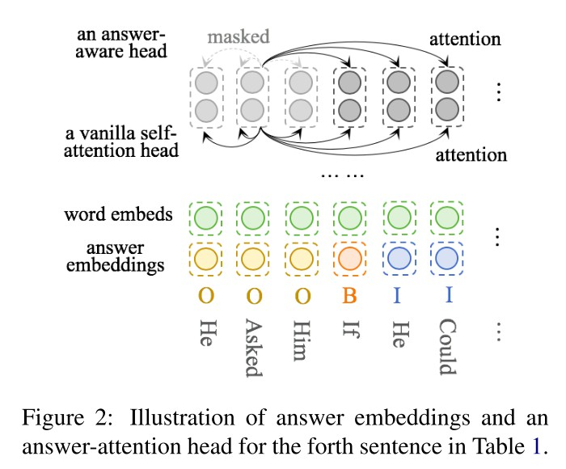

之后将Transformer编码器输出的特征送入一个双向GRU模型中，并取其最后一层隐层特征作为最终依据嵌入(rationale embedding)，第$k$个依据嵌入为$r_k \in \mathbb{R}^{2d_r}$。

### 2.4 图的构造(graph construction)
输入段落内包含$n$个句子，但只有$m$个句子包含答案（$m \leq n$），因此在构造图时，要将$m$个依据嵌入与其对应的$m$个段落句子特征进行对应来构造图。

作者构造了一个段落信息图$\mathcal{V}$和答案信息图$\mathcal{U}$。对于段落内第$k$个句子对应的答案信息图节点$u_k$，其初始特征为：

$$
u_k^{(0)} = \text{ReLU}(W_u [r_k; e_k] + b_u)
$$

其中$r_k$是依据特征，$e_k$是索引$k$的嵌入。同理，对于段落信息图节点$v_k$，其初始特征为：

$$
v_k^{(0)} = \text{ReLU}(W_v [s_k; e_k] + b_v)
$$

其中$s_k$是段落句子特征。在此之后，图$\mathcal{U}$和$\mathcal{V}$中各有$m$个节点。对于$u_i, u_j \in \mathcal{U}$，如果$|i - j| < \delta$，则在节点$u_i, u_j$之间增加一条边。

### 2.5 对偶图交互(dual-graph interaction)
对偶图交互过程使得图$\mathcal{U}$和$\mathcal{V}$通过彼此迭代地更新各自的节点特征。在时刻$t$，节点特征$u_i^{(t - 1)}, v_i^{(t - 1)}$通过3个步骤更新为$u_i^{(t)}, v_i^{(t)}$。

(1) **信息传递(information transfer)**：以图$\mathcal{U}$为例，每个节点$u_i^{(t - 1)}$的邻居节点聚合信息$a_i^{(t)}$为：

$$
a_i^{(t)} = \sum_{u_j \in \mathcal{N}(u_i)} W_{ij} u_j^{(t - 1)} + b_{ij}
$$

其中$\mathcal{N}(u_i)$是所有节点$u_i$的邻居节点。

对于节点$u_i, u_j$和$u_{i'}, u_{j'}$，如果$|i - j| = |i' - j'|$，则它们使用同一个$W$和$b$。具体实现时，可以先创建一系列矩阵$\\{W_1, W_2, ...\\} \in \mathbb{R}^{d_g \times d_g}$和$\\{b_1, b_2, ...\\} \in \mathbb{R}^{d_g}$，之后用$|i - j|$作为索引获取对应的$W_{ij}$和$b_{ij}$。

对于图$\mathcal{V}$，同理可得：

$$
\tilde{a}\_i^{(t)} = \sum_{v_j \in \mathcal{N}(v_i)} \tilde{W}\_{ij} v_j^{(t - 1)} + \tilde{b}\_{ij}
$$

(2) **计算多个门(compute multiple gates)**：对于图$\mathcal{U}$里的每个节点$u_i^{(t - 1)}$，计算一个更新门(update gate) $y_i^{(t)}$和复位门(reset gate) $z_i^{(t)}$：

$$
\begin{array}{cl}
&y_i^{(t)} = \sigma(W_y [a_i^{(t)}; u_i^{(t - 1)}]) \\\\
&z_i^{(t)} = \sigma(W_z [a_i^{(t)}; u_i^{(t - 1)}])
\end{array}
$$

对于图$\mathcal{V}$，同理可得：

$$
\begin{array}{cl}
&\tilde{y}_i^{(t)} = \sigma(\tilde{W}_y [\tilde{a}_i^{(t)}; v_i^{(t - 1)}]) \\\\
&\tilde{z}_i^{(t)} = \sigma(\tilde{W}_z [\tilde{a}_i^{(t)}; v_i^{(t - 1)}])
\end{array}
$$

(3) **信息交互(information interaction)**：每个图在另一个图内各个门的控制下，更新自己的节点特征，即：

$$
\begin{array}{cl}
&u_i^{(t)} = \tilde{z}_i^{(t)} \odot u_i^{(t - 1)} + (1 - \tilde{z}_i^{(t)}) \odot \text{tanh}(W_a [a_i^{(t)}; \tilde{y}_i^{(t)} \odot u_i^{(t - 1)}]) \\\\
&v_i^{(t)} = z_i^{(t)} \odot v_i^{(t - 1)} + (1 - z_i^{(t)}) \odot \text{tanh}(\tilde{W}_a [\tilde{a}_i^{(t)}; y_i^{(t)} \odot v_i^{(t - 1)}])
\end{array}
$$

迭代地将上述3个步骤进行$T$次，我们便可以得到各个图内最终的节点特征$u_i^{(T)}$和$v_i^{(T)}$。

### 2.6 解码器
解码器的结构与Transformer解码器类似，包含遮蔽自注意力层(masked self-attention layer)、编码器注意力层(encoder-attention layer)、前馈映射层(feed-forward projection layer)和softmax层。在编码器注意力层中，key和value来自答案信息编码器中双向GRU之前的最后一层Transformer编码器层。

此外，为了生成连贯的问题，还需要捕捉输入段落和答案的语境依赖。作者将图特征$u_k^{(T)}$和$v_k^{(T)}$也作为额外的输入信息，将其与自注意力层和编码器注意力层的特征进行拼接，之后将其与前馈映射层的输入特征进行拼接。

### 2.7 由粗到细的生成(coarse-to-fine generation)
半自回归式的生成方式使得处理问题间的共指任务更加困难，特别是在不同组的问题。因此，作者采用了一种由粗到细的生成方式，解码器只需要生成粗粒度的问题，即每个代词由一个占位符(placeholder) "[p]"替换。之后通过一个额外的预训练共指消解模型把代词填入到不同的占位符中。

---

# How to Ask Good Questions? Try to Leverage Paraphrases
Xin Jia, Wenjie Zhou, Xu Sun, and Yunfang Wu. [How to Ask Good Questions? Try to Leverage Paraphrases](https://www.aclweb.org/anthology/2020.acl-main.545.pdf). ACL 2020.

## 1. 贡献
传统的问题生成模型由于缺乏句子转述(paraphrase)知识，生成的句子只是简单地从输入句子里面拷贝某些词，因此生成句子的质量不高，很难达到人工设计问题的效果。因此，作者引入了句子转述知识，使得生成的问题更接近人类的设计。通过实验发现，作者引入的转述知识明显提高了问题生成的效果。

## 2. 方法
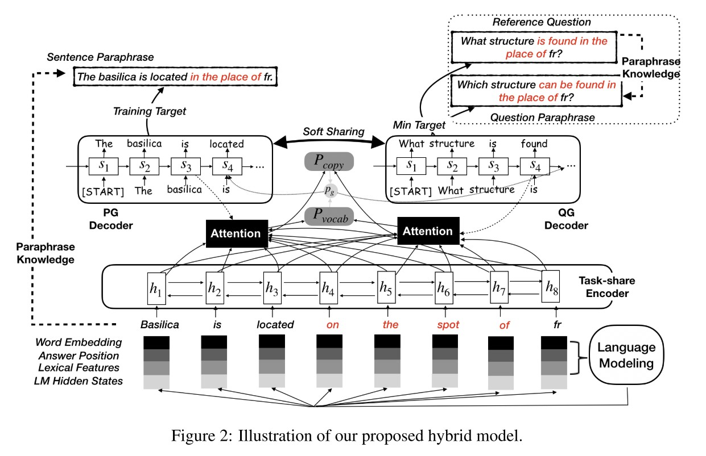

### 2.1 基准模型
#### 2.1.1 特征增强型指针-生成器(feature-enriched pointer-generator)
基准模型的编码器是一个双向LSTM模型，输入是特征增强后的嵌入$e_i = [w_i; a_i; n_i; p_i; u_i]$，其中$w_i, a_i, n_i, p_i, u_i$分别表示单词嵌入、答案位置、命名实体、词性、单词大小写。模型的解码器是带注意力机制的单向LSTM模型。之后，指针-生成器会同时计算生成词汇表单词的概率$P_{vocab}$与从源文本拷贝各个单词的概率$P_{copy}$，并通过一个生成概率$p_g$将两个单词预测概率结合起来，即：

$$
P(w) = p_g P_{vocab} + (1 - p_g) P_{copy}
$$

训练目标是最小化与目标句子$q$的对数似然函数：

$$
L_{qg} = -\frac{1}{T_{qp}} \sum_{t = 1}^{T_{qg}} \text{log} P(y_t^{qg} = q_t)
$$

#### 2.1.2 语言模型增强型问题生成(language modeling enhanced QG)
输入句子首先送入语言模型模块得到语义(semantic)隐层特征$h^{lm}$，之后该特征与输入进行拼接，得到语言模型增强型词嵌入$e_i = [w_i; a_i; n_i; p_i; u_i; h_i^{lm}]$。语言模型的损失函数$L_{lm}$被定义为：

$$
\begin{array}{cl}
L_{lm} &= -\frac{1}{T_{lm} - 1} \sum_{t = 1}^{T_{lm} - 1} \text{log}(P^{lm}(w_{t +1} | w_{<t + 1})) \\\\
&=-\frac{1}{T_{lm} - 1} \sum_{t = 2}^{T_{lm}} \text{log}(P^{lm}(w_{t - 1} | w_{>t - 1}))
\end{array}
$$

其中$P^{lm}(w_{t +1} | w_{<t + 1})$和$P^{lm}(w_{t - 1} | w_{>t - 1})$分别表示下一个词和前一个词的生成概率。则语言模型增强型问题生成的总损失$L_{lqg}$为：

$$
L_{lqg} = L_{qg} + \beta L_{lm}
$$

### 2.2 改述数据扩增(paraphrase expansion)
作者采用谷歌翻译将原始英文文本先翻译成德文，再翻译回英文，得到其改述文本。对于输入句子$s$和其标准参考问题(golden reference question) $q$，我们可以得到相应的改述句子$s'$和改述问题$q'$，如下图例子所示：

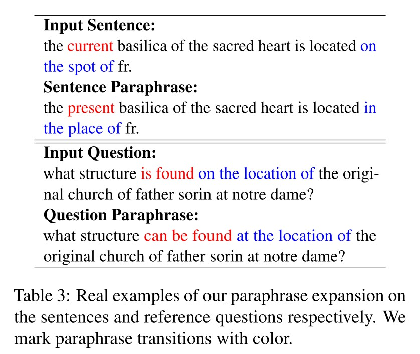

### 2.3 带改述文本生成的多任务学习(multi-task learning with paraphrase generation)
#### 2.3.1 辅助的改述文本生成任务(auxiliary PG task)
特征增强后的词嵌入先通过任务共享(task-share)编码器进行编码，之后分别送入PG和QG解码器。PG和QG解码器各有2层，其结构一致但参数不一致。在该任务中，输入是原始句子$s$，训练目标是最小化与扩展改述句子(expanded sentence paraphrase) $s'$间的交叉熵损失$L_{pg}$：

$$
L_{pg} = -\frac{1}{T_{pg}} \sum_{t = 1}^{T_{pg}} \text{log} P(y_t^{pg} = s_t')
$$

#### 2.3.2 软共享策略(soft sharing strategy)
作者仅对PG和QG解码器的第一层采用软共享策略，做法是最小化软共享层的模型参数，该软共享损失$L_{sf}$可定义为：

$$
L_{sf} = \sum_{d \in \mathcal{D}} || \theta_d - \phi_d ||_2
$$

### 2.4 通过最小损失函数进行多元化训练(diversity training with min-loss function)
为了提供多种生成模式，作者将训练目标从一个标准参考问题调整为含有扩展改述文本的多个参考问题，并在这些参考中采用了最小损失函数进行训练。则上述的问题生成损失$L_{qg}$可改写为：

$$
L_{qg} = \min_{q \in \mathcal{Q}} (-\frac{1}{T_{qg}} \sum_{t = 1}^{T_{qg}} \text{log} P(y_t^{qg} = q_t))
$$

其中$\mathcal{Q}$是参考问题集合$\\{q, q'\\}$，包括标准参考问题和扩展改述问题。每个生成的问题先分别和其各个参考问题计算负似然估计，再选择其中的最小值作为最终的损失。

### 2.5 混合模型(hybrid model)
将以上模块组合起来，即为最终的混合模型，其总的训练损失$L_{total}$可定义为：

$$
L_{total} = L_{lqg} + \alpha L_{pg} + \lambda L_{sf}
$$

---

## *III. Answer Selection & Summarization*

# Get To The Point: Summarization with Pointer-Generator Networks
Abigail See, Peter J. Liu, and Christopher D. Manning. [Get To The Point: Summarization with Pointer-Generator Networks](https://www.aclweb.org/anthology/P17-1099.pdf). ACL 2017.

## 1. 贡献
最近基于seq2seq的抽象型文本总结(abstractive summarization)模型取得了不错的效果，但是其存在一些问题，如：无法准确地复制事实细节(factual details)、无法处理超出词汇表(out-of-vocabulary, OOV)的词、多次重复自己等。在本文中，作者提出了一个介于抽取与抽象的文本摘要方法，解决了上述前两个问题；同时提出了一种覆盖机制(coverage mechanism)，解决了模型重复自身的问题。

## 2. 方法
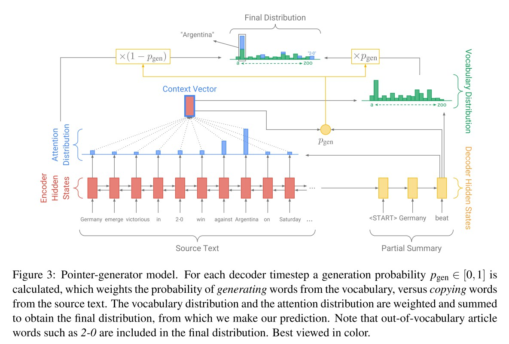

### 2.1 基准模型
本文的基准模型是带注意力机制的seq2seq模型，编码器为单层双向LSTM，将输入词$w_i$编码为$h_i$；解码器是单层单向LSTM，在每一时刻$t$接收前一个词的词嵌入（训练时是参考摘要的前一个词，测试时是前一时刻解码器预测得到的词），生成解码隐层特征$s_t$。将时刻$t$解码器隐层特征$s_t$与各个时刻编码器隐层特征$h_i$进行注意力操作，可得语境向量$h_t^\*$，即：

$$
\begin{array}{cl}
&h_t^\* = \sum_i a_i^t h_i \\\\
&a^t = \text{softmax}(e^t) \\\\
&e_i^t = v^T \text{tanh}(W_h h_i + W_s s_t + b_{attn})
\end{array}
$$

之后时刻$t$解码器的单词预测分布$P_{vocab} = \text{softmax}(V'(V[s_t, h_t^\*] + b) + b')$，损失为目标单词$w_t^\*$的负对数似然估计，整个句子的总损失$\text{loss}$为：

$$
\text{loss} = -\frac{1}{T} \sum_{t = 0}^T \text{log} P(w_t^\*)
$$

### 2.2 指针-生成器网络(pointer-generator network)
该网络是基准生成模型与一个指针网络的混合体，通过一个门控函数$p_{gen}$控制在时刻$t$时，以$P_{vocab}$从词汇表中生成一个词和以注意力分布$a^t$从输入句子拷贝一个词的相对重要程度，$p_{gen}$由下式计算得到：

$$
p_{gen} = \text{sigmoid}(w_{h^\*}^T h_t^\* + w_s^T s_t + w_x^T x_t + b_{ptr})
$$

其中$h_t^\*$是语境向量，$s_t$是解码器隐层特征，$x_t$是解码器输入。模型每次预测时从词汇表和所有源文档出现的单词所组成的扩展词汇表(extended vocabulary)进行预测，这样也缓解了OOV问题。每个单词的预测概率$P(w)$可表示为：

$$
P(w) = p_{gen} P_{vocab}(w) + (1 - p_{gen}) \sum_{i:w_i = w} a_i^t
$$

其中，如果$w$是一个OOV词，则$P_{vocab} = 0$；如果$w$未在源文档出现，则$\sum_{i:w_i = w} a_i^t = 0$。

### 2.3 覆盖机制
应用覆盖机制的模型维持一个覆盖向量$c^t = \sum_{t' = 0}^{t - 1} a^{t'}$，其为所有之前解码器时刻的注意力分布之和。将其作为注意力机制的额外输入，则时刻$t$的注意力分布$a^t$中的$e_i^t$可改写为：

$$
e_i^t = v^T \text{tanh}(W_h h_i + W_s s_t + w_c c_i^t + b_{attn})
$$

这样可以避免注意力机制重复注意到源文档中的同一个位置，避免生成重复性的文本。此外，作者还定义了一个覆盖损失对重复注意到同一位置的情形进行惩罚，时刻$t$的覆盖损失$\text{covloss}_t = \sum_i \min(a_i^t, c_i^t)$，且$\text{covloss}_t \leq \sum_i a_i^t = 1$。则模型的总损失$\text{loss}$可改写为：

$$
\text{loss} = \frac{1}{T} \sum_{t = 0}^T (-\text{log} P(w_t^*) + \lambda \sum_i \min(a_i^t, c_i^t))
$$

---

# Knowledge as A Bridge: Improving Cross-domain Answer Selection with External Knowledge
Yang Deng, Ying Shen, Min Yang, Yaliang Li, Nan Du, Wei Fan, and Kai Lei. [Knowledge as A Bridge: Improving Cross-domain Answer Selection with External Knowledge](https://www.aclweb.org/anthology/C18-1279.pdf). COLING 2018.

## 1. 贡献
作者将源领域有标签的文本数据与外部知识图谱相结合进行答案选择，这样做有两个好处：首先是引入了背景知识，扩充了原始的文本信息，可以提高系统的表现；其次，在不同领域或类型的问答数据集中，文本的句法与词汇特征可能会各不相同，但在同一个知识图谱内的句子知识之间的关系是一致的。因此，引入知识图谱的知识可以帮助系统从源领域迁移到新的目标领域中，特别是当目标领域只有有限的标注数据的时候。

## 2. 方法
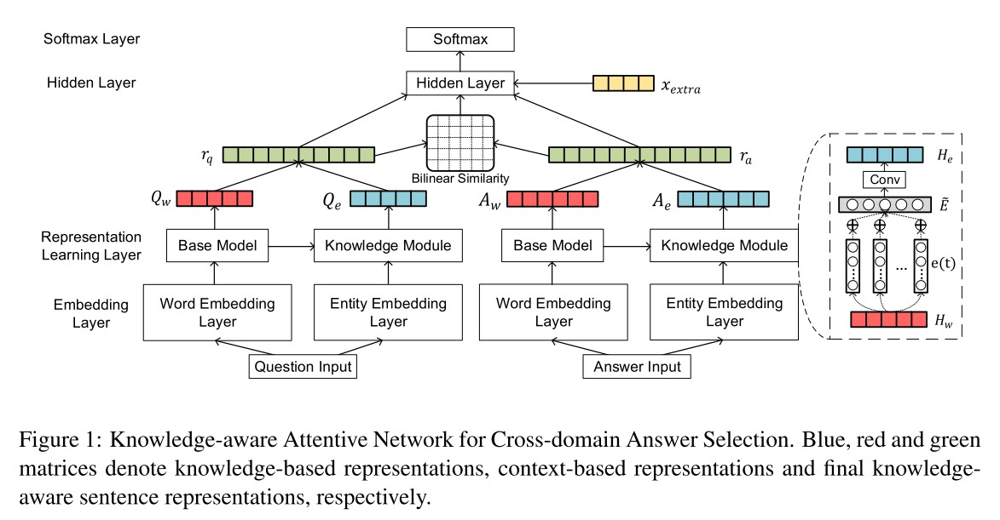

作者所提模型主要包括2个部分：基准模型(base model)与知识模块(knowledge module)。

### 2.1 基准模型
给定一个问题$q$和一系列候选答案$A = \\{a_1, ..., a_n\\}$，作者首先将其转换为对应的词嵌入，之后将嵌入特征送入基准模型中。可选的基准模型包括：(1) Bi-LSTM，即双向LSTM；(2) Att-LSTM，一个基于问题-答案注意力机制的LSTM模型；(3) AP-LSTM，一个基于注意力池化和两路注意力机制的LSTM模型；(4) Conv-RNN，一个基于注意力机制的卷积循环神经网络，该注意力机制与Att-LSTM类似，但作用在RNN的输入处。作者采用Bi-LSTM作为该RNN模型。问题语句与答案语句的基准模型特征分别表示为$Q_w$和$A_w$，二者可同时用$H_w$表示。

### 2.2 知识模块
作者首先采用n元文法匹配对句子里面的所有实体词组(entity mention)进行检测，之后对于每个实体词组从知识图谱中提取出相应的实体嵌入。但有些实体有多种词意，具有歧义性，比如Santiago可以是一个城市或者一个人，因此作者对于每个句子里的实体词组都从知识图谱中提取出top-K个实体候选，并采用一个注意力机制计算这K个候选实体与对应句子的语境相关得分，进行加权处理。对于句子里第$t$个词的候选实体嵌入$e(t) = \\{e_{t_1}, ..., e_{t_K}\\} \in \mathbb{R}^{K \times d_e}$，$d_e$是实体嵌入维度，第$t$个词的语境知识嵌入(context-guided knowledge embedding) $\tilde{e}_t$可由下式计算得到：

$$
\begin{array}{cl}
&\tilde{e}\_t = \sum_{e_{t_i} \in e(t)} \alpha_{t_i} e_{t_i} \\\\
&\alpha_{t_i} = \frac{\text{exp}(w_m^T m_{t_i})}{\sum_{m_{t_j} \in m(t)} \text{exp}(w_m^T m_{t_j})} \\\\
&m(t) = \text{tanh}(W_{em} e(t) + W_{hm} H_w)
\end{array}
$$

考虑到卷积通过卷积核滑窗提取特征的特性，作者又用一个卷积层进一步地捕捉局部n元文法的信息，并对每一时刻的卷积特征进行最大池化。由于各个实体的长度是不确定的，作者采用了多个不同大小的卷积核进行卷积操作，得到n元文法特征组$\\{y^{(1)}, ..., y^{(n)}\\}$，其中$y^{(i)}$表示通过卷积核大小为$i$的卷积操作得到的特征。之后将这些特征拼接起来，并通过一个全连接层得到最终的知识型句子嵌入$H_e \in \mathbb{R}^{L \times d_f}$，其中$d_f$是所有卷积核通道总数，$L$是句子长度。问题语句与答案语句的知识型句子嵌入$Q_e$和$A_e$可分别表示为：

$$
Q_e = [y_q^{(1)}; ...; y_q^{(n)}]; A_e = [y_a^{(1)}; ...; y_a^{(n)}]
$$

### 2.3 训练
作者将基准模型特征与知识型特征拼接起来，得到问题和答案的最终特征$r_q$和$r_a$：

$$
r_q = [Q_w; Q_e]; r_a = [A_w; A_e]
$$

此外，作者还添加了一些额外特征。首先是最终问题和答案特征$r_q$和$r_a$的双线性相似得分(bilinear similarity score) $s(r_q, r_a) = r_q^T W r_a$；其次是相同单词重叠特征$x_{extra} \in \mathbb{R}^4$。则最终用于分类的特征为$x = [r_q; s(r_q, r_a); r_a; x_{extra}]$，并通过一个softmax层进行二分类，训练目标为最小化交叉熵损失$L$：

$$
\begin{array}{cl}
&L = -\sum_{i = 1}^N [y_i \text{log} p_i + (1 - y_i) \text{log} (1 - p_i)] + \lambda ||\theta||_2^2 \\\\
&y(q, a) = softmax(W_s x + b_s)
\end{array}
$$

### 2.4 迁移学习
不同数据集之间的迁移学习可以分为两步：首先用在源数据集上预训练好的模型进行参数初始化，之后在目标数据集上进一步地微调。作者提出了3种方式进行微调：(1) 对整个网络进行微调；(2) 只对知识模块的参数进行微调；(3) 只对基准模型的参数进行微调。此外，预训练词向量与预训练知识嵌入的参数在训练时不进行更新。

---

# Multi-Task Learning with Multi-View Attention for Answer Selection and Knowledge Base Question Answering
Yang Deng, Yuexiang Xie, Yaliang Li, Min Yang, Nan Du, Wei Fan, Kai Lei, and Ying Shen. [Multi-Task Learning with Multi-View Attention for Answer Selection and Knowledge Base Question Answering](https://arxiv.org/pdf/1812.02354.pdf). AAAI 2019.

## 1. 贡献
作者提出了对答案选择和知识库问答(knowledge base question answering, KBQA)任务进行多任务学习的方法，答案选择任务可以由KBQA任务在知识层面提高效果，而KBQA任务可以由答案选择任务在单词层面提高效果。实验表明经过多任务学习后的模型在各自任务上的效果均超过了最好的单任务模型效果。

## 2. 方法
### 2.1 问题定义
答案选择任务和KBQA任务都可以看做排序问题。给定一个问题$q_i \in Q$，任务目标是通过一个函数$f(q, a) \in [0, 1]$对一系列候选答案句子或事实组$a_i \in A$进行排序。

在对答案选择和KBQA进行多任务学习时，首先要进行实体链接(entity linking)，对于每个问题和其候选答案的单词序列(word sequence) $W = \\{w_1, ..., w_L\\}$，得到其对应的知识序列(knowledge sequence) $K = \\{k_1, ..., k_L\\}$，如下图例子所示：

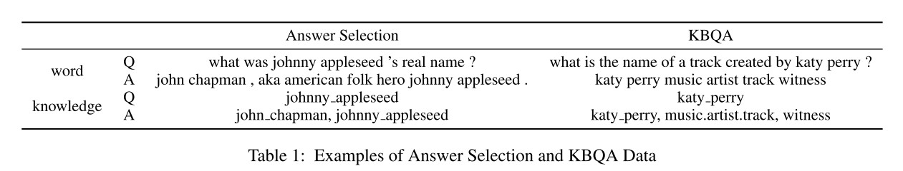

之后可以得到数据集$D_t = \\{(W_{q_i}^{(t)}, K_{q_i}^{(t)}, W_{a_i}^{(t)}, K_{a_i}^{(t)}, Y_i^{(t)})\\}_{i = 1}^{N_t}$，其中$Y_i^{(t)}$指第$t$个任务中第$i$个QA对的标签。

### 2.2 多任务学习基准模型
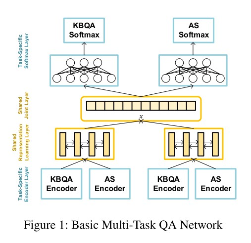

基准模型主要包含3个部分：特定任务编码层(task-specific encoder layer)、共享特征学习层(shared representation learning layer)、以及特定任务softmax层。

#### 2.2.1 特定任务编码层
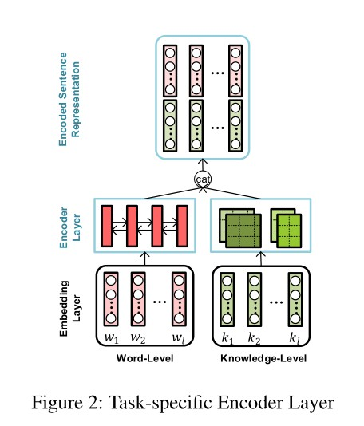

(1) **单词编码器**，其输入是词嵌入序列$E_W = \\{e_{w_1}, ..., e_{w_L}\\}$，通过双向LSTM进行特征编码，得到问题和答案的单词特征$H_{W_q}$和$H_{W_a}$：

$$
H_{W_q} = \text{Bi-LSTM}(E_{W_q}); H_{W_a} = \text{Bi-LSTM}(E_{W_a})
$$

(2) **知识编码器**，其采用卷积神经网络捕捉局部n元文法特征，并用一系列不同大小的卷积核进行特征提取，以解决实体长度不确定的问题。问题和答案的知识特征$H_{K_q}$和$H_{K_a}$可表示为：

$$
H_{K_q} = [H_{K_q}^{(1)}; ...; H_{K_q}^{(n)}]; H_{K_a} = [H_{K_a}^{(1)}; ...; H_{K_a}^{(n)}]
$$

其中$H^{(i)}$表示卷积核大小为$i$的卷积特征。最后将问题和答案各自的单词特征和知识特征拼接起来，得到最终的特定任务编码$H_q$和$H_a$：

$$
H_q = [H_{W_q}; H_{K_q}]; H_a = [H_{W_a}; H_{K_a}]
$$

#### 2.2.2 共享特征学习层
作者采用了一个共享孪生(siamese)双向LSTM网络对不同任务的特定任务编码进行进一步地特征提取，不同任务孪生网络的权重是共享的。不同任务问题和答案的共享特征$S_q$和$S_a$可表示为：

$$
S_q = \text{Bi-LSTM}(H_q); S_a = \text{Bi-LSTM}(H_a)
$$

之后对Bi-LSTM的输出进行平均池化，得到$s_q = \text{Average}(S_q), s_a = \text{Average}(S_a)$。此外，作者还加入了单词和知识重叠特征$x_{ol} \in \mathbb{R}^6$，包括：单词重叠得分、非终止单词重叠得分、加权单词重叠得分、非终止加权单词重叠得分、知识重叠得分、加权知识重叠得分。最终可得到不同任务的共享联合特征为$x = [s_q; s_a; x_{ol}]$。

#### 2.2.3 特定任务softmax层
对于第$t$个任务的问题答案对$(q_i^{(t)}, a_i^{(t)})$和其标签$y_i^{(t)}$，其最终的共享联合特征被送入特定任务softmax层进行二分类，即：

$$
p^{(t)} = \text{softmax}(W_s^{(t)} x + b_s^{(t)})
$$

总体的多任务训练目标是最小化如下的交叉熵损失：

$$
L = -\sum_{t = 1}^T \lambda_t \sum_{i = 1}^{N_t} [y_i^{(t)} \text{log} p_i^{(t)} + (1 - y_i^{(t)}) \text{log} (1 - p_i^{(t)})]
$$

其中$\lambda_t$决定了第$t$个任务的权重。

### 2.3 带多视角注意力(multi-view attention)的多任务模型
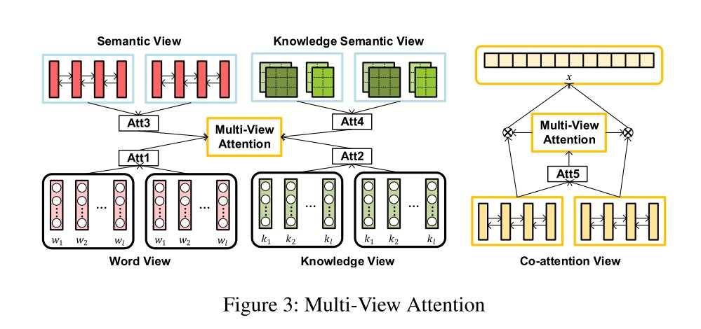

作者计算了5个视角的注意力，分别是：单词视角、知识视角、文本语义视角、知识语义视角和共同注意力(co-attention)视角。

#### 2.3.1 单词和知识视角
作者首先采用了一个两路注意力机制，交互地为一对QA句子建模，得到单词和知识嵌入的注意力权重$M_W$和$M_K$：

$$
M_W = \text{tanh}(E_{W_q}^T U_W E_{W_a}); M_K = \text{tanh}(E_{K_q}^T U_K E_{K_a})
$$

之后对$M_W$和$M_K$的行和列做最大池化，得到问题和答案不同视角的注意力权重。具体地，问题和答案的单词视角注意力权重$\alpha_q^{(1)}$和$\alpha_a^{(1)}$可表示为：

$$
\alpha_q^{(1)} = \text{softmax}(\text{Max}(M_W)); \alpha_a^{(1)} = \text{softmax}(\text{Max}(M_W^T))
$$

相应地，问题和答案的知识视角注意力权重$\alpha_q^{(2)}$和$\alpha_a^{(2)}$可表示为：

$$
\alpha_q^{(2)} = \text{softmax}(\text{Max}(M_K)); \alpha_a^{(2)} = \text{softmax}(\text{Max}(M_K^T))
$$

#### 2.3.2 文本语义和知识语义视角
作者对特定任务编码层的输出采用最大/平均池化，得到句子总体的语义信息。其中问题和答案的文本总体语义信息$o_{w_q}, o_{w_a}$与各自的知识总体语义信息$o_{k_q}, o_{k_a}$可表示为：

$$
\begin{array}{cl}
&o_{w_q} = \text{Average}(H_{W_q}); o_{w_a} = \text{Average}(H_{W_a}) \\\\
&o_{k_q} = \text{Max}(H_{K_q}); o_{k_a} = \text{Max}(H_{K_a})
\end{array}
$$

之后计算问题与答案的交互语义注意力，即将问题和答案的总体语义信息分别与答案和问题原始的特定任务编码层的输出计算注意力。问题和答案的文本语义视角注意力权重$\alpha_q^{(3)}$和$\alpha_a^{(3)}$可表示为：

$$
\begin{array}{cl}
&\alpha_q^{(3)} = \text{softmax}(w_{w_q}^T \text{tanh}(W_{w_a} o_{w_a} + W_{w_q} H_{W_q})) \\\\
&\alpha_a^{(3)} = \text{softmax}(w_{w_a}^T \text{tanh}(W_{w_q} o_{w_q} + W_{w_a} H_{W_a}))
\end{array}
$$

相应地，问题和答案的知识语义视角注意力权重$\alpha_q^{(4)}$和$\alpha_a^{(4)}$可表示为：

$$
\begin{array}{cl}
&\alpha_q^{(4)} = \text{softmax}(w_{k_q}^T \text{tanh}(W_{k_a} o_{k_a} + W_{k_q} H_{K_q})) \\\\
&\alpha_a^{(4)} = \text{softmax}(w_{k_a}^T \text{tanh}(W_{k_q} o_{k_q} + W_{k_a} H_{K_a}))
\end{array}
$$

#### 2.3.3 共同注意力视角
与单词和知识视角注意力类似，作者采用了一个两路注意力机制生成问题和答案共享特征$S_q$和$S_a$的共同注意力。问题和答案的共同注意力视角权重$\alpha_q^{(5)}$和$\alpha_a^{(5)}$可表示为：

$$
\begin{array}{cl}
&\alpha_q^{(5)} = \text{softmax}(\text{Max}(M_{co})); \alpha_a^{(5)} = \text{softmax}(\text{Max}(M_{co}^T)) \\\\
&M_{co} = \text{tanh}(S_q^T U_S S_a)
\end{array}
$$

#### 2.3.4 多视角注意力特征
结合上述5种视角的注意力机制，问题和答案的多视角注意力权重$\alpha_q$和$\alpha_a$可表示为：

$$
\alpha_q = \text{softmax}(\sum_{i = 1}^5 \lambda_q^{(i)} \alpha_q^{i}); \alpha_a = \text{softmax}(\sum_{i = 1}^5 \lambda_a^{(i)} \alpha_a^{(i)})
$$

其中$\lambda^{(i)}$是控制各个视角注意力的权重，作者将不同视角的权重设为一致。则问题和答案最终的注意力共享特征$S_q'$和$S_a'$为：

$$
S_q' = \alpha_q S_q; S_a' = \alpha_a S_a
$$

---

# Joint Learning of Answer Selection and Answer Summary Generation in Community Question Answering
Yang Deng, Wai Lam, Yuexiang Xie, Daoyuan Chen, Yaliang Li, Min Yang, and Ying Shen. [Joint Learning of Answer Selection and Answer Summary Generation in Community Question Answering](https://arxiv.org/pdf/1911.09801.pdf). AAAI 2020.

## 1. 贡献
(1) 作者为社区问答(community question answering, CQA)领域的答案选择和答案摘要生成任务设计了一个联合学习模型，问题可以指导抽象型摘要(abstractive summarization)的生成，同时生成的答案摘要可以减少答案中的噪声，提高答案选择的效果；

(2) 作者为CQA中的答案摘要生成任务构建了一个新的数据集WikiHowQA，其也可以用于答案选择任务。实验表明，作者提出的多任务联合学习方法不仅在答案选择任务上超过了效果最好的方法，还可以生成比当前摘要方法更准确的答案摘要；

(3) 为了处理资源受限的CQA任务，作者设计了一个迁移学习策略，使得那些没有参考答案摘要的任务也可以进行多任务联合学习，大幅提高预测效果。

## 2. 方法
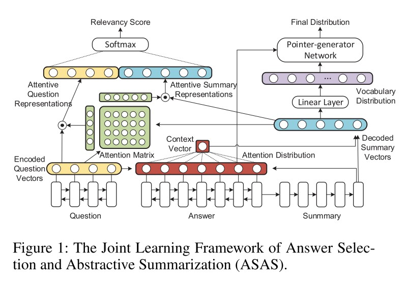

### 2.1 问题定义
给定一个问题$q_i$，首先从一系列答案$A_i = \\{a_i^{(1)}, ..., a_i^{(j)\\}$中选出若干正确答案，之后对于每个所选答案$a_i^{(\*)}$生成其抽象型摘要$\beta_i^{(\*)}$。

数据集$D$中包含一系列问题$Q$，数目是$N$，对于每个问题$q_i \in Q$，有$M_i$个候选答案$A_i$、对应的人工所写的参考摘要$\beta_i^{(j)}$、以及指示答案$a_i^{(j)}$是否可以回答问题$q_i$的标签$y_i^{(j)}$。数据集$D$可表示为：

$$
D = \{(q_i, \{(a_i^{(j)}, \beta_i^{(j)}, y_i^{(j)})\}_{j = 1}^{M_i})\}_{i = 1}^{N}
$$

### 2.2 模型
作者所提的ASAS模型主要包括4个部分：(1) 对比-聚合(compare-aggregate)编码器；(2) 带问题感知注意力(question-aware attention)的seq2seq模型；(3) 通过摘要特征进行问题答案对齐(question answer alignment)；(4) 问题驱动型指针-生成网络(question-driven pointer-generator netowrk)。

#### 2.2.1 对比-聚合编码器
以答案的对比-聚合过程为例。首先对原始的问题嵌入$Q$和答案嵌入$A$进行门控计算，得到问题和答案门控向量$\bar{Q}$和$\bar{A}$：

$$
\begin{array}{cl}
&\bar{Q} = \sigma(W^i Q + b^i) \odot \text{tanh}(W^u Q + b^u) \\\\
&\bar{A} = \sigma(W^i A + b^i) \odot \text{tanh}(W^u A + b^u)
\end{array}
$$

接着进行注意力计算，得到答案的注意力加权特征$H$：

$$
\begin{array}{cl}
&H = \bar{Q}G \\\\
&G = \text{softmax}((W^g \bar{Q} + b^g)^T \bar{A})
\end{array}
$$

之后进行对比计算，将答案的注意力加权特征$H$与答案向量$\bar{A}$进行对比，对比方式有如下几种：

$$
\begin{array}{cl}
&\text{NeuralNet}: t_j = f(\bar{a}_j, h_j) = \text{ReLU}(W \begin{bmatrix} \bar{a}_j \\\ h_j \end{bmatrix} + b) \\\\
&\text{NeuralTensorNet}: t_j = f(\bar{a}_j, h_j) = \text{ReLU}(\bar{a}_j^T T^{[1...l]} h_j + b) \\\\
&\text{Euclidean+Cosine}: t_j = f(\bar{a}_j, h_j) = \begin{bmatrix} ||\bar{a}_j - h_j||_2 \\\ \text{cos}(\bar{a}_j, h_j) \end{bmatrix} \\\\
&\text{Subtraction}: t_j = f(\bar{a}_j, h_j) = (\bar{a}_j - h_j) \odot (\bar{a}_j - h_j) \\\\
&\text{Multiplication}: t_j = f(\bar{a}_j, h_j) = \bar{a}_j \odot h_j \\\\
&\text{SubMult+NN}: t_j = f(\bar{a}_j, h_j) = \text{ReLU}(W \begin{bmatrix} (\bar{a}_j - h_j) \odot (\bar{a}_j - h_j) \\\ \bar{a}_j \odot h_j \end{bmatrix} + b)
\end{array}
$$

最后通过一个双向LSTM对答案的对比特征进行整合，得到答案的对比-整合特征$H_a$，即：

$$
H_a = \text{Bi-LSTM}([t_1, ..., t_A])
$$

对于问题的对比-聚合过程与上述类似，以类似方法可得问题的对比-聚合特征$H_q$。

#### 2.2.2 带问题感知注意力的seq2seq模型
作者采用一个单向LSTM作为解码器，在时刻$t$，解码器通过前一时刻单词$w_{t - 1}$生成当前时刻隐层特征$s_t = \text{LSTM}(s_{t - 1}, w_{t - 1})$。$t$时刻的隐层特征与源文本各个时刻隐层特征的注意力加权语境向量$\hat{h}_t$可表示为：

$$
\begin{array}{cl}
&\hat{h}_t = \sum_i \alpha^t h_i^a \\\\
&\alpha^t = \text{softmax}(e^t) \\\\
&e_i^t = m^t \text{tanh}(W_h h_i^a + W_s s_t + W_q o_q + b) \\\\
&o_q = \text{Average}(H_q)
\end{array}
$$

其中的语境向量同时包含了问题信息与源文本信息。则$t$时刻的答案摘要特征$h_t^s$可表示为：

$$
h_t^s = W_1 [s_t; \hat{h}_t] + b_1
$$

#### 2.2.3 通过摘要特征进行问题答案对齐
作者采用了一个两路注意力机制计算问题编码特征$H_q$和答案摘要解码特征$H_s$的共同注意力，其中问题和答案摘要注意力$\alpha_q$和$\alpha_a$由下式计算得到：

$$
\begin{array}{cl}
&\alpha_q = \text{softmax}(\text{Max}(M_{qa})) \\\\
&\alpha_a = \text{softmax}(\text{Max}(M_{qa}^T)) \\\\
&M_{qa} = \text{tanh}(H_q^T U H_s)
\end{array}
$$

则问题和答案摘要的注意力特征$r_q$和$r_a$可表示为：

$$
r_q = H_q^T \alpha_q, r_a = H_s^T \alpha_a
$$

与答案编码特征相比，答案摘要解码特征更加准确精练，使得答案选择模型可以更好地捕捉问题和答案之间的交互信息。

#### 2.2.4 问题驱动型指针-生成网络
词汇表的概率分布$P_{vocab}$为：

$$
P_{vocab} = \text{softmax}(W_2 h_t^s + b_2)
$$

结合问题信息的指针网络的重要程度$p_{gen} \in [0, 1]$为：

$$
p_{gen} = \text{sigmoid}(w_h^T h_t^s + w_x^T x_t + w_q^T o_q + b_p)
$$

其中$h_t^s$是摘要解码特征，$x_t$是解码器输入，$o_q$是问题聚合特征。最终，基于词汇表与源文章单词的预测概率分布$P$为：

$$
P = p_{gen} P_{vocab} + (1 - p_{gen}) \sum_{i: w_i = w} \alpha_i^t
$$

### 2.3 联合训练过程
#### 2.3.1 答案选择损失
首先将问题和答案摘要的注意力特征$r_q$和$r_a$进行拼接并送入一个softmax层进行二分类，即：

$$
y(q, a) = \text{softmax}(W_s [r_q; r_a] + b_s)
$$

之后训练目标为最小化如下交叉熵损失$L_{qa}$：

$$
L_{qa} = -\sum_{i = 1}^N [y_i \text{log} p_i + (1 - y_i) \text{log}(1 - p_i)]
$$

#### 2.3.2 摘要损失
摘要任务训练目标为最小化如下负对数似然估计损失$L_{sum}$：

$$
L_{sum} = -\frac{1}{T} \sum_{t = 0}^T \text{log} P(w_t^\*)
$$

#### 2.3.3 覆盖损失
在每一个解码时刻$t$，覆盖向量$c^t = \sum_{t' = 0}^{t - 1} \alpha^{t'}$对到目前为止的覆盖程度进行评估，之后通过如下覆盖损失$L_{cov}$对注意力权重$\alpha^t$的重复进行惩罚：

$$
L_{cov} = \frac{1}{T} \sum_{t = 1}^T \sum_i \min(\alpha_i^t, c_i^t)
$$

综合以上3种损失，模型的总体训练损失$L$为：

$$
L = \lambda_1 L_{qa} + \lambda_2 L_{sum} + \lambda_3 L_{cov}
$$

### 2.4 处理资源受限数据集
对于没有参考答案摘要的数据集，作者采用了一种迁移学习的策略进行处理，使得其也能受益于多任务学习的训练方式。首先将整个模型在源数据集上进行多任务联合训练，之后在资源受限的目标数据集上只微调答案选择模块的权重，包括对比-聚合编码器与问题答案对齐。
